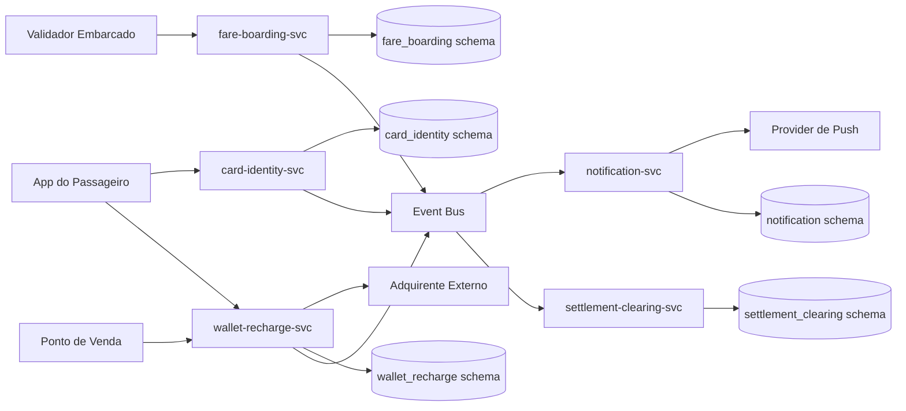

# C4 Level 2 - Container Diagram

```mermaid
flowchart LR
    Validador[Validador Embarcado] --> FareSvc[fare-boarding-svc]
    App[App do Passageiro] --> WalletSvc[wallet-recharge-svc]
    App --> CardSvc[card-identity-svc]
    PDV[Ponto de Venda] --> WalletSvc
    FareSvc --> EventBus[Event Bus]
    WalletSvc --> EventBus
    CardSvc --> EventBus
    EventBus --> SettlementSvc[settlement-clearing-svc]
    EventBus --> NotificationSvc[notification-svc]
    FareSvc --> FareDb[(fare_boarding schema)]
    WalletSvc --> WalletDb[(wallet_recharge schema)]
    SettlementSvc --> SettlementDb[(settlement_clearing schema)]
    CardSvc --> CardDb[(card_identity schema)]
    NotificationSvc --> NotificationDb[(notification schema)]
    WalletSvc --> Adquirente[Adquirente Externo]
    NotificationSvc --> PushProvider[Provider de Push]
```

Nota: cada serviço possui seu próprio schema — não há um `core_db` compartilhado entre os cinco serviços (ver `docs/product/data-model/data-model.md`).
