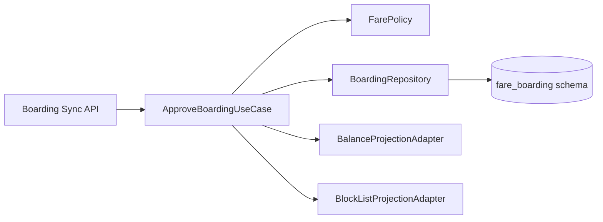
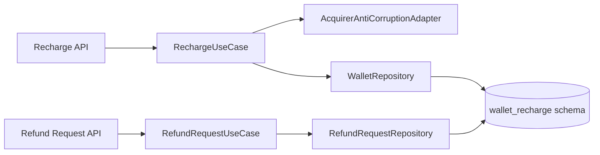

# C4 Level 3 - Component Diagram

## Fare & Boarding Service (Core Domain, fluxo crítico)

```mermaid
flowchart LR
    API[Boarding Sync API] --> UseCase[ApproveBoardingUseCase]
    UseCase --> Policy[FarePolicy]
    UseCase --> Repo[BoardingRepository]
    UseCase --> BalanceAdapter[BalanceProjectionAdapter]
    UseCase --> BlockAdapter[BlockListProjectionAdapter]
    Repo --> FareDb[(fare_boarding schema)]
```

## Wallet & Recharge Service (Core Domain, fluxo financeiro)

```mermaid
flowchart LR
    RechargeApi[Recharge API] --> RechargeUseCase[RechargeUseCase]
    RefundApi[Refund Request API] --> RefundUseCase[RefundRequestUseCase]
    RechargeUseCase --> AcquirerAcl[AcquirerAntiCorruptionAdapter]
    RechargeUseCase --> WalletRepo[WalletRepository]
    RefundUseCase --> RefundRepo[RefundRequestRepository]
    WalletRepo --> WalletDb[(wallet_recharge schema)]
    RefundRepo --> WalletDb
```
