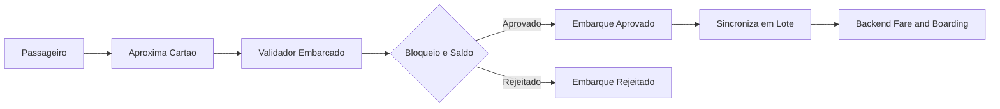

# Event Storming Analítico — Tarifa Viva

## 2.1 Atores
| Código | Ator | Tipo | Descrição | Fonte |
|---|---|---|---|---|
| ACT-01 | Passageiro | Humano | Portador do cartão | PRD |
| ACT-02 | Validador embarcado | Sistema | Decide embarque offline | PRD |
| ACT-03 | Operadora | Organização | Dona da linha | PRD |
| ACT-04 | Gestor do consórcio | Humano | Audita clearing | PRD |
| ACT-05 | Adquirente | Sistema externo | Antifraude/tokenização | PRD |

## 2.2 Comandos
| Código | Comando | Ator/Sistema Origem | Resultado Esperado | Fonte |
|---|---|---|---|---|
| CMD-01 | AprovarEmbarque | Validador embarcado | Embarque aprovado e tarifa debitada | FR-01 |
| CMD-02 | SincronizarLoteEmbarques | Validador embarcado | Embarques offline enviados ao backend | FR-02 |
| CMD-03 | RecarregarPeloApp | Passageiro | Solicitação de recarga via cartão de crédito | FR-04 |
| CMD-04 | RegistrarRecargaPDV | Ponto de venda | Recarga em dinheiro registrada | FR-05 |
| CMD-05 | BloquearCartao | Passageiro/Gestor | Cartão marcado como bloqueado | FR-06 |
| CMD-06 | ApurarClearingDiario | Sistema (job) | Arquivo de repasse gerado | FR-07 |
| CMD-07 | SolicitarEstornoRecarga | Passageiro | Estorno solicitado — **transição pós-solicitação não definida (FR-11 pendente)** | FR-11 |
| CMD-08 | AutenticarPassageiro | Passageiro | Sessão autenticada | FR-09 |

## 2.3 Eventos de domínio
| Código | Evento | Descrição | Comando Origem | Fonte |
|---|---|---|---|---|
| EVT-01 | EmbarqueAprovado | Embarque validado e tarifa debitada localmente | CMD-01 | FR-01 |
| EVT-02 | EmbarqueRejeitado | Cartão bloqueado ou saldo insuficiente | CMD-01 | FR-01 |
| EVT-03 | LoteEmbarquesSincronizado | Backend recebeu embarques offline | CMD-02 | FR-02 |
| EVT-04 | IntegracaoTarifariaAplicada | Segunda viagem cobrada com desconto de 50% | CMD-01 | FR-03 |
| EVT-05 | RecargaAprovada | Antifraude do adquirente aprovou; saldo creditado | CMD-03 | FR-04 |
| EVT-06 | RecargaRegistradaPDV | Recarga em dinheiro creditada | CMD-04 | FR-05 |
| EVT-07 | CartaoBloqueado | Cartão entra na lista de bloqueio | CMD-05 | FR-06 |
| EVT-08 | ArquivoClearingPublicado | Repasse diário apurado e imutável | CMD-06 | FR-07/NFR-05 |
| EVT-09 | SaldoBaixoDetectado | Saldo abaixo de 2 tarifas | EVT-01/EVT-05 | FR-08 |
| EVT-10 | EstornoSolicitado | Solicitação registrada; **sem evento de decisão definido** | CMD-07 | FR-11 (pendente) |
| EVT-11 | PassageiroAutenticado | Login validado | CMD-08 | FR-09 |

## 2.4 Entidades, Agregados e Value Objects candidatos
| Código | Nome | Tipo Candidato | Descrição | Evidência/Fonte |
|---|---|---|---|---|
| ENT-01 | Card | Aggregate | Cartão físico/virtual, estado de bloqueio | FRD |
| ENT-02 | Balance | Value Object (dentro de Card/Wallet) | Saldo disponível | FRD |
| ENT-03 | Boarding | Aggregate | Registro de embarque | FRD |
| ENT-04 | Recharge | Aggregate | Recarga de crédito | FRD |
| ENT-05 | RefundRequest | Aggregate (stub) | Solicitação de estorno — regras de transição TBD | FR-11 (pendente) |
| ENT-06 | Fare | Value Object | Valor da tarifa por linha, com regra de integração | FRD |
| ENT-07 | ClearingBatch | Aggregate | Lote diário de repasse, imutável após publicado | FRD/NFRD |
| ENT-08 | Passenger | Aggregate | Identidade do passageiro, credenciais | FRD |

## 2.5 Regras e invariantes
| Código | Regra/Invariante | Aplica-se a | Tipo | Fonte |
|---|---|---|---|---|
| INV-01 | Embarque só aprovado sem bloqueio e com saldo suficiente | Boarding | Invariante | FR-01 |
| INV-02 | Segunda viagem em <60 min paga 50% | Fare | Regra de Negócio | FR-03 |
| INV-03 | Recarga só é creditada após aprovação antifraude | Recharge | Invariante | FR-04 |
| INV-04 | ClearingBatch publicado é imutável | ClearingBatch | Invariante | NFR-05 |
| INV-05 | Dado de cartão de crédito nunca persiste na Tarifa Viva | Recharge | Invariante | NFR-03 |
| INV-06 (Ponto a Validar) | Condições e prazo de estorno de recarga | RefundRequest | Regra de Negócio ausente | FR-11 |

## 3. Fluxo: Embarque (offline-first)
| Ordem | Ator/Sistema | Comando | Política/Regra | Evento Resultante | Entidade/Aggregate | Observações |
|---|---|---|---|---|---|---|
| 1 | Validador embarcado | AprovarEmbarque | INV-01, INV-02 | EmbarqueAprovado / EmbarqueRejeitado | Boarding | Decisão local em até 300 ms (NFR-01), usa cache local de saldo/bloqueio |
| 2 | Validador embarcado | SincronizarLoteEmbarques | — | LoteEmbarquesSincronizado | Boarding | Consistência eventual entre validador e backend (TEC-01) |

## 4. Business Capability Map
| Código | Capacidade | Descrição | Comandos Relacionados | Eventos Relacionados | Evidências |
|---|---|---|---|---|---|
| CAP-01 | Boarding Decision | Decidir e registrar embarque, inclusive offline | CMD-01, CMD-02 | EVT-01, EVT-02, EVT-03 | PRD/FRD/NFRD |
| CAP-02 | Fare Integration | Aplicar desconto de integração temporal | CMD-01 | EVT-04 | FRD |
| CAP-03 | Wallet & Recharge | Gerir saldo e recarga (app e PDV) | CMD-03, CMD-04 | EVT-05, EVT-06 | PRD/FRD/NFRD |
| CAP-04 | Refund Handling | Processar estorno de recarga | CMD-07 | EVT-10 | FRD (pendente) |
| CAP-05 | Card Lifecycle | Emitir, ativar e bloquear cartão | CMD-05 | EVT-07 | FRD |
| CAP-06 | Passenger Identity | Autenticar passageiro | CMD-08 | EVT-11 | FRD |
| CAP-07 | Settlement & Clearing | Apurar e publicar repasse diário por operadora | CMD-06 | EVT-08 | PRD/FRD/NFRD |
| CAP-08 | Balance Notification | Notificar saldo baixo | — | EVT-09 | FRD |
