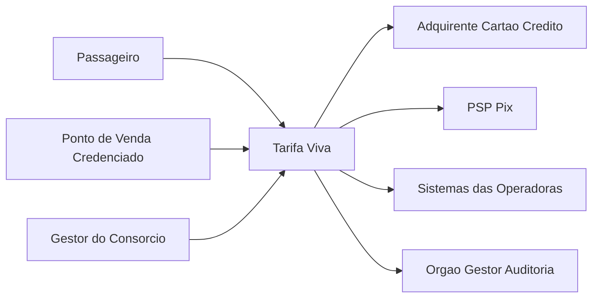

# C4 Level 1 - System Context

O sistema Tarifa Viva atende passageiros (embarque, recarga inclusive via Pix, consulta de saldo), pontos de venda credenciados (recarga em dinheiro) e gestores do consórcio (bloqueio de cartão, ajustes de clearing). Depende externamente do adquirente de cartão de crédito, do PSP Pix (novo na v1.1 — FR-10) e publica arquivos de repasse para as operadoras.
