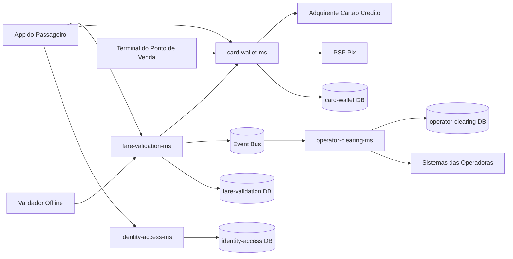

# C4 Level 2 - Container Diagram

O `card-wallet-ms` ganha, na v1.1, uma nova integração de saída com o PSP Pix (via webhook), sem alterar os demais containers. A comunicação entre `fare-validation-ms` e `operator-clearing-ms` permanece assíncrona via barramento de eventos.
