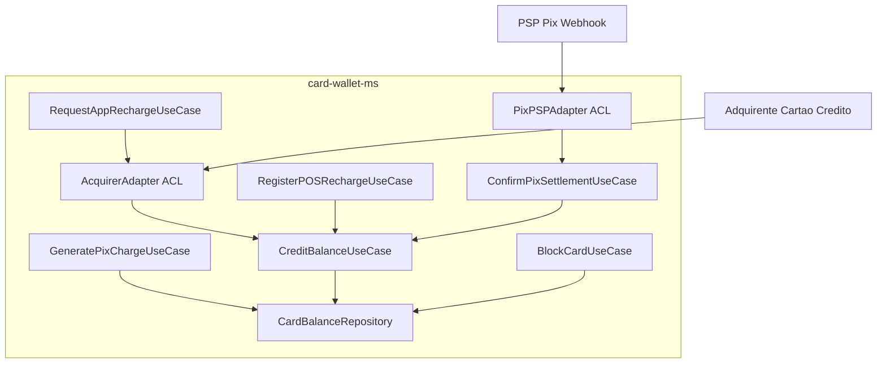

# C4 Level 3 - Component Diagram (card-wallet-ms)

Prioridade neste nível: `card-wallet-ms`, por concentrar a mudança da v1.1 (FR-10, recarga via Pix) e por ser o contexto com maior número de integrações externas assíncronas.

O `PixPSPAdapter` é a Anti-Corruption Layer que traduz o payload do webhook do PSP para o evento interno `PixSettlementConfirmed`, mantendo o mesmo `CreditBalanceUseCase` usado pelos demais canais de recarga.
