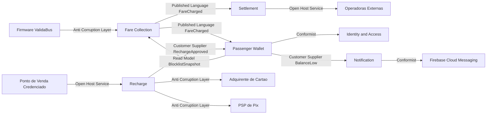

# Diagrama do Context Map

```mermaid
flowchart LR
    ValidaBus[Firmware ValidaBus] -->|Anti Corruption Layer| FareCollection[Fare Collection]
    FareCollection -->|Published Language FareCharged| PassengerWallet[Passenger Wallet]
    PassengerWallet -->|Read Model BlocklistSnapshot| FareCollection
    FareCollection -->|Published Language FareCharged| Settlement[Settlement]
    Settlement -->|Open Host Service| Operadoras[Operadoras Externas]
    Recharge[Recharge] -->|Anti Corruption Layer| Acquirer[Adquirente de Cartao]
    Recharge -->|Anti Corruption Layer| PixPsp[PSP de Pix]
    PosNetwork[Ponto de Venda Credenciado] -->|Open Host Service| Recharge
    Recharge -->|Customer Supplier RechargeApproved| PassengerWallet
    PassengerWallet -->|Conformist| IdentityAccess[Identity and Access]
    PassengerWallet -->|Customer Supplier BalanceLow| Notification[Notification]
    Notification -->|Conformist| Fcm[Firebase Cloud Messaging]
```

Legenda: setas representam a direção da dependência de contrato (upstream → downstream), não necessariamente a direção do fluxo de dados.
