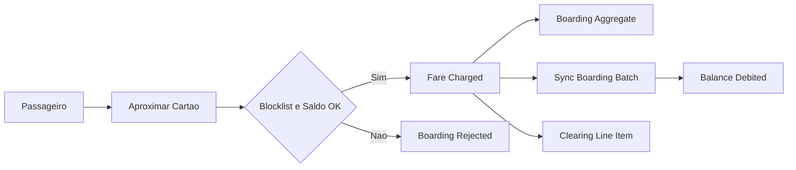

# Segmentação DDD — Tarifa Viva

## Controle de Versão
| Versão | Data | Descrição |
|---|---|---|
| v1.0 | 2026-09-26 | Segmentação inicial a partir de PRD v1.0, FRD v1.2, NFRD v1.1 e TRD |

## 0. Escopo da análise

Insumos lidos integralmente: `docs/product/prd/prd.md`, `docs/product/frd-nfrd/frd.md`, `docs/product/frd-nfrd/nfrd.md`, `docs/product/trd/trd.md`. Não havia `discovery-notes.md`, ADRs, data model ou diagramas DDD prévios — esta é a primeira segmentação (execução "do zero").

---

## 1. Consolidação do Domínio

### 1.1 Objetivos do Produto
| Código | Objetivo | Fonte |
|---|---|---|
| OBJ-01 | Reduzir o tempo médio de embarque para menos de 2 segundos por passageiro | PRD §2 |
| OBJ-02 | Permitir recarga do cartão pelo app e em pontos de venda credenciados | PRD §2 |
| OBJ-03 | Aplicar integração tarifária temporal (segunda viagem com desconto dentro de 60 minutos) | PRD §2 |
| OBJ-04 | Repassar a receita às 3 operadoras do consórcio (clearing diário) com trilha auditável | PRD §2 |

### 1.2 Subdomain Classification Matrix

> Fonte de verdade da idempotência §4.0 do agente `ddd-architect`. Cada linha com classificação `Core \| Supporting \| Generic` deve ter `docs/product/ddd/subdomains/<tipo>/<slug>/README.md`.

| Capacidade | Classificação | Justificativa | Evidências | Pontos a Validar |
|---|---|---|---|---|
| Fare Collection (Bilhetagem/Embarque) | Core Domain | Diferenciação direta (OBJ-01, tempo de embarque), regras complexas (blocklist + saldo + integração tarifária, decisão offline), risco operacional altíssimo (falha aqui para o ônibus), sem solução de prateleira que cubra o protocolo proprietário do validador | PRD OBJ-01/JRN-01/JRN-03; FRD FR-01/FR-02/FR-03; NFRD NFR-01; TRD TEC-03 | — |
| Passenger Wallet (Carteira e Saldo) | Core Domain | Saldo é o ativo central do modelo de negócio pré-pago; conciliação entre débito provisório (offline, no validador) e débito autoritativo (no backend) é regra de negócio própria e de alto risco financeiro | FRD FR-01/FR-06; NFRD NFR-04 | VAL-01 — quem é a fonte autoritativa do saldo no instante do embarque offline |
| Settlement (Apuração e Repasse) | Core Domain | Diferenciador de modelo de negócio de consórcio multi-operadora; regra de atribuição por linha, imutabilidade pós-publicação e trilha auditória são específicas do domínio e de alto risco financeiro/regulatório | PRD OBJ-04/JRN-04; FRD FR-07; NFRD NFR-04/NFR-05 | — |
| Recharge (Recarga) | Supporting Subdomain | Necessário para alimentar a carteira, mas a diferenciação está na carteira e no embarque, não na captura de recarga em si; a parte sensível (antifraude, tokenização) é delegada ao adquirente/PSP externos | PRD OBJ-02/JRN-02; FRD FR-04/FR-05; NFRD NFR-02/NFR-03 | — |
| Identity and Access (Autenticação) | Generic Subdomain | Login CPF/senha com MFA opcional é capacidade comum a qualquer app, substituível por IdP de mercado | FRD FR-09 | VAL-02 — avaliar compra de IdP (Auth0/Cognito/Keycloak) em vez de construir |
| Notification (Notificação) | Generic Subdomain | Envio de push por saldo baixo é capacidade genérica, já delegada a provedor terceirizado (FCM) | PRD JRN-05; FRD FR-08; TRD TEC-04 | — |

### 1.3 Problemas de Negócio
| Código | Problema | Impacto | Fonte |
|---|---|---|---|
| PROB-01 | Embarque precisa decidir bloqueio + saldo em até 300ms mesmo sem conectividade | Se lento ou indisponível, compromete a operação de toda a frota | NFRD NFR-01 |
| PROB-02 | Bloqueio de cartão só chega ao validador na próxima sincronização | Janela de risco de uso de cartão bloqueado entre o bloqueio e a sincronização | FRD FR-06 |
| PROB-03 | Modelo de dados do firmware ValidaBus é instável entre versões | Acoplamento indevido do domínio interno ao contrato de terceiro | TRD TEC-03 |
| PROB-04 | Clearing precisa ser imutável após publicado, mas correções acontecem | Necessidade de modelo de ajuste sem violar auditabilidade | NFRD NFR-05 |

### 1.4 Personas e Atores
| Código | Ator | Tipo | Descrição | Fonte |
|---|---|---|---|---|
| ACT-01 | Passageiro | Humano | Usa cartão físico ou virtual (app) para embarcar e recarregar | PRD §3 |
| ACT-02 | Validador Embarcado | Sistema (firmware de terceiro) | Equipamento no ônibus, opera offline, sincroniza em lote; firmware ValidaBus | PRD §3; TRD TEC-03 |
| ACT-03 | Operadora de Ônibus | Organização (3: Viação Serrana, Expresso Vale, TransSereno) | Recebe repasse diário por linha operada | PRD §3 |
| ACT-04 | Gestor do Consórcio | Humano (backoffice) | Bloqueia cartões, acompanha clearing | PRD §3 |
| ACT-05 | Adquirente de Cartão de Crédito | Sistema externo | Processa e tokeniza pagamento de recarga no app | PRD §3; NFRD NFR-03 |
| ACT-06 | PSP de Pix | Sistema externo | Processa pagamento de recarga via Pix (inferido do domínio de meios de pagamento brasileiro) | Inferência Arquitetural |
| ACT-07 | Ponto de Venda Credenciado | Sistema/organização externa | Registra recarga em dinheiro | PRD JRN-02; FRD FR-05 |

> **Inferência Arquitetural:** o PSP de Pix (ACT-06) não é citado literalmente no PRD/FRD, mas Pix é meio de pagamento onipresente no varejo brasileiro e a NFRD (NFR-03) já fala em tokenização/adquirente para cartão — mantenho o Pix como integração candidata do Recharge, marcada como Ponto a Validar (VAL-03).

### 1.5 Jornadas
| Código | Jornada | Ator Principal | Descrição | Fonte |
|---|---|---|---|---|
| JRN-01 | Embarque | Passageiro | Aproxima o cartão; validador confere blocklist + saldo e debita a tarifa | PRD §4 |
| JRN-02 | Recarga | Passageiro | Compra créditos no app (cartão) ou em ponto de venda (dinheiro) | PRD §4 |
| JRN-03 | Integração Tarifária | Passageiro | Segunda viagem em até 60 minutos paga 50% da tarifa | PRD §4 |
| JRN-04 | Clearing | Gestor do Consórcio | Ao fim do dia, apura quanto cada operadora recebe | PRD §4 |
| JRN-05 | Notificação de Saldo Baixo | Passageiro | Recebe push quando o saldo está baixo | PRD §4 |

### 1.6 Requisitos Funcionais Relevantes
| Código | Requisito | Descrição | Fonte |
|---|---|---|---|
| FR-01 | Validar embarque | Verifica blocklist + saldo; se aprovado, debita a tarifa vigente da linha | FRD |
| FR-02 | Operar offline | Guarda até 5.000 embarques sem conexão; sincroniza em lote na garagem | FRD |
| FR-03 | Aplicar integração temporal | Segunda viagem em <60min em linha diferente paga 50% | FRD |
| FR-04 | Recarregar pelo app | Compra com cartão de crédito; crédito só após validação antifraude do adquirente | FRD |
| FR-05 | Recarregar no ponto de venda | Registro de recarga em dinheiro | FRD |
| FR-06 | Bloquear cartão | Passageiro ou gestor bloqueia cartão perdido; propaga na próxima sincronização | FRD |
| FR-07 | Apurar clearing diário | Atribui cada embarque à operadora dona da linha; gera arquivo de repasse diário | FRD |
| FR-08 | Notificar saldo baixo | Push quando saldo < 2 tarifas | FRD |
| FR-09 | Autenticar passageiro | Login CPF/senha com MFA opcional | FRD |

### 1.7 Requisitos Não Funcionais Relevantes para DDD
| Código | Categoria | Requisito | Impacto na Modelagem | Fonte |
|---|---|---|---|---|
| NFR-01 | Performance | Decisão de embarque em até 300ms, inclusive offline | Decisão precisa ser local ao validador; backend não pode estar no caminho crítico do embarque | NFRD |
| NFR-02 | Disponibilidade | Recarga com 99,9% de disponibilidade mensal | Recharge é um contexto com SLA próprio, isolável em deployable dedicado | NFRD |
| NFR-03 | Segurança | Dados de cartão nunca trafegam/armazenam na Tarifa Viva (tokenização no adquirente) | Recharge nunca modela PAN; delega ao adquirente via Anti-Corruption Layer | NFRD |
| NFR-04 | Compliance | Registros de embarque e recarga retidos por 5 anos | Fare Collection e Recharge precisam de política de retenção explícita no data model | NFRD |
| NFR-05 | Auditoria | Arquivo de clearing imutável após publicado; correções via arquivo de ajuste | Settlement precisa de modelo append-only com evento de ajuste, nunca update destrutivo | NFRD |

### 1.8 Restrições Técnicas Relevantes
| Código | Restrição | Impacto | Fonte |
|---|---|---|---|
| TEC-01 | Comunicação interna gRPC; superfície externa REST | Context Map usa REST/fila para operadoras, adquirente e PSP; gRPC apenas entre serviços internos da Tarifa Viva | TRD |
| TEC-02 | PostgreSQL transacional + RabbitMQ para mensageria | Ownership de dados via schema por contexto; integração assíncrona via eventos na fila | TRD |
| TEC-03 | Firmware ValidaBus com protocolo proprietário e modelo de dados instável | Exige Anti-Corruption Layer dedicada em Fare Collection para isolar o domínio interno do contrato do fornecedor | TRD |
| TEC-04 | Push via Firebase Cloud Messaging (FCM) | Notification é Conformist ao contrato do FCM | TRD |

### 1.9 Integrações
| Código | Sistema Externo | Tipo | Finalidade | Fonte |
|---|---|---|---|---|
| INT-01 | Firmware ValidaBus (validador embarcado) | Fornecedor/terceiro | Executa a decisão local de embarque e sincroniza lotes | TRD TEC-03 |
| INT-02 | Adquirente de cartão de crédito | PSP externo | Antifraude e tokenização da recarga via app | PRD; NFRD NFR-03 |
| INT-03 | PSP de Pix | PSP externo | Recarga via Pix (Ponto a Validar VAL-03) | Inferência Arquitetural |
| INT-04 | Ponto de Venda Credenciado | Rede externa | Registro de recarga em dinheiro | FRD FR-05 |
| INT-05 | Firebase Cloud Messaging | Provedor externo | Envio de push de saldo baixo | TRD TEC-04 |
| INT-06 | Sistemas das Operadoras | Organizações do consórcio | Consomem o arquivo de repasse diário | PRD OBJ-04; FRD FR-07 |

### 1.10 Entidades e Conceitos Mencionados
| Código | Conceito | Descrição Inicial | Fonte |
|---|---|---|---|
| CON-01 | Cartão (Card) | Meio físico ou virtual associado a um passageiro e a um saldo | PRD |
| CON-02 | Embarque (Boarding) | Evento de uso do cartão em um ônibus, com débito de tarifa | FRD FR-01 |
| CON-03 | Saldo (Balance) | Crédito disponível do passageiro | PRD; FRD |
| CON-04 | Tarifa (Fare) | Valor cobrado por embarque, variável por linha e por integração | PRD; FRD |
| CON-05 | Integração Tarifária (Transfer Discount) | Desconto de 50% em segunda viagem dentro de 60 minutos | PRD OBJ-03 |
| CON-06 | Linha (Route) | Rota operada por uma operadora específica | FRD FR-07 |
| CON-07 | Clearing / Repasse | Apuração diária de receita por operadora | PRD OBJ-04 |
| CON-08 | Lista de Bloqueio (Blocklist) | Conjunto de cartões bloqueados consultado no embarque | FRD FR-01/FR-06 |

### 1.11 Regras, Políticas e Invariantes
| Código | Regra/Política/Invariante | Tipo | Fonte |
|---|---|---|---|
| RULE-01 | Um embarque só é aprovado se o cartão não estiver bloqueado e houver saldo suficiente | Invariante | FRD FR-01 |
| RULE-02 | O validador deve decidir em até 300ms, mesmo offline | Invariante | NFRD NFR-01 |
| RULE-03 | Segunda viagem em outra linha dentro de 60 minutos custa 50% da tarifa | Regra de Negócio | PRD OBJ-03; FRD FR-03 |
| RULE-04 | Recarga por cartão de crédito só é creditada após aprovação antifraude do adquirente | Regra de Negócio | FRD FR-04 |
| RULE-05 | Bloqueio de cartão só propaga na próxima sincronização do validador | Invariante conhecida (limitação aceita) | FRD FR-06 |
| RULE-06 | Cada embarque é atribuído a exatamente uma operadora, dona da linha | Invariante | FRD FR-07 |
| RULE-07 | Arquivo de clearing publicado é imutável; correções exigem arquivo de ajuste separado | Invariante | NFRD NFR-05 |
| RULE-08 | Push de saldo baixo dispara quando saldo < 2 tarifas | Política | FRD FR-08 |
| RULE-09 | Dados de cartão de crédito (PAN) nunca são armazenados nem trafegam pela Tarifa Viva | Invariante de segurança | NFRD NFR-03 |
| RULE-10 | Registros de embarque e recarga são retidos por 5 anos | Política de retenção | NFRD NFR-04 |

---

## 2. Extração Analítica (Event Storming)

### 2.1 Comandos e Eventos por Fluxo

| Ordem | Ator/Sistema | Comando | Política/Regra | Evento Resultante | Agregado | Observações |
|---|---|---|---|---|---|---|
| 1 | Passageiro → Validador | RecordBoarding | RULE-01, RULE-02, RULE-03 | FareCharged | Boarding | Decisão local, offline-first |
| 2 | Passageiro → Validador | RecordBoarding (reprovado) | RULE-01 | BoardingRejected | Boarding | Cartão bloqueado ou saldo insuficiente |
| 3 | Validador → Fare Collection | SyncBoardingBatch | FR-02 | BoardingBatchSynced | Boarding | Lote de até 5.000 embarques |
| 4 | Passageiro (app) | RequestAppRecharge | RULE-04 | RechargeApproved / RechargeRejected | RechargeRequest | Depende do adquirente (antifraude) |
| 5 | Ponto de Venda | RegisterPosRecharge | — | RechargeApproved | RechargeRequest | Dinheiro, sem antifraude externa |
| 6 | Recharge → Wallet | (consome RechargeApproved) | — | BalanceCredited | Wallet | Published Language |
| 7 | Fare Collection → Wallet | (consome FareCharged) | — | BalanceDebited | Wallet | Reconciliação do débito provisório |
| 8 | Passageiro ou Gestor | BlockCard | RULE-05 | CardBlocked | Wallet | Propaga via snapshot ao validador |
| 9 | Wallet → Fare Collection | PublishBlocklistSnapshot | — | BlocklistSnapshotPublished | Wallet | Consumida pela ACL do validador |
| 10 | Wallet (interno) | — | RULE-08 | BalanceLow | Wallet | Dispara Notification |
| 11 | Gestor / Scheduler | RunDailyClearing | RULE-06, RULE-07 | ClearingPublished | ClearingBatch | Consome FareCharged do dia |
| 12 | Gestor | IssueClearingAdjustment | RULE-07 | ClearingAdjustmentIssued | ClearingBatch | Nunca sobrescreve o arquivo original |
| 13 | Notification (consome BalanceLow) | SendLowBalancePush | RULE-08 | PushNotificationSent | — | Via FCM (Conformist) |
| 14 | Passageiro | Authenticate | — | PassengerAuthenticated | — | CPF/senha + MFA opcional |

### 2.2 Diagrama do fluxo principal (Embarque)

### 2.3 Entidades, Agregados e Value Objects candidatos
| Código | Nome | Tipo Candidato | Descrição | Evidência/Fonte |
|---|---|---|---|---|
| ENT-01 | Boarding | Aggregate | Registro de um embarque, com decisão e tarifa aplicada | FRD FR-01 |
| ENT-02 | Card | Entity | Meio de acesso do passageiro (físico ou virtual) | PRD |
| ENT-03 | Wallet / Balance | Aggregate | Saldo do passageiro e seu ledger de créditos/débitos | FRD FR-01/FR-06 |
| ENT-04 | RechargeRequest | Aggregate | Solicitação de recarga (app ou POS) | FRD FR-04/FR-05 |
| ENT-05 | ClearingBatch | Aggregate | Apuração diária consolidada por operadora | FRD FR-07 |
| ENT-06 | ClearingLineItem | Entity | Atribuição de um embarque a uma operadora dentro do batch | FRD FR-07 |
| VO-01 | Fare | Value Object | Valor monetário da tarifa aplicada, em centavos | PRD/FRD |
| VO-02 | Money | Value Object | Valor monetário genérico (saldo, recarga, repasse) | Padrão do domínio financeiro |
| VO-03 | BlocklistSnapshot | Value Object | Fotografia do estado de bloqueio consumida offline | FRD FR-06 |

---

## 3. Business Capability Map

| Código | Capacidade | Descrição | Comandos Relacionados | Eventos Relacionados | Evidências |
|---|---|---|---|---|---|
| CAP-01 | Fare Collection | Decidir e registrar embarques, inclusive offline | RecordBoarding, SyncBoardingBatch | FareCharged, BoardingRejected, BoardingBatchSynced | FRD FR-01/FR-02/FR-03 |
| CAP-02 | Passenger Wallet | Manter saldo autoritativo e blocklist do passageiro | BlockCard, ReconcileFareCharge | BalanceCredited, BalanceDebited, CardBlocked, BalanceLow | FRD FR-06; regra de saldo |
| CAP-03 | Recharge | Capturar recarga via app (cartão) ou POS (dinheiro) | RequestAppRecharge, RegisterPosRecharge | RechargeApproved, RechargeRejected | FRD FR-04/FR-05 |
| CAP-04 | Settlement | Apurar e publicar clearing diário por operadora | RunDailyClearing, IssueClearingAdjustment | ClearingPublished, ClearingAdjustmentIssued | FRD FR-07 |
| CAP-05 | Identity and Access | Autenticar o passageiro no app | Authenticate | PassengerAuthenticated | FRD FR-09 |
| CAP-06 | Notification | Notificar saldo baixo | SendLowBalancePush | PushNotificationSent | FRD FR-08 |

---

## 4. Bounded Context Candidates

### 4.1 Bounded Context Candidates

| Código | Bounded Context | Subdomínio Relacionado | Tipo | Justificativa | Status |
|---|---|---|---|---|---|
| BC-01 | Fare Collection | Fare Collection | Core Domain | Linguagem, regras, ciclo de vida e ownership próprios; NFR de latência exclusivo | Confirmar |
| BC-02 | Passenger Wallet | Passenger Wallet | Core Domain | Saldo e blocklist com ownership de dados exclusivo, regras de conciliação próprias | Confirmar |
| BC-03 | Settlement | Settlement | Core Domain | Regras de atribuição e imutabilidade próprias, integração externa própria (operadoras) | Confirmar |
| BC-04 | Recharge | Recharge | Supporting Subdomain | Ciclo de vida e integrações externas próprias (adquirente, Pix, POS); linguagem distinta (RechargeRequest) | Confirmar |
| BC-05 | Identity and Access | Identity and Access | Generic Subdomain | Ciclo de vida próprio (credenciais), mas candidato a Conformist futuro de um IdP de mercado | Confirmar |
| BC-06 | Notification | Notification | Generic Subdomain | Regras mínimas, mas ciclo de vida, integração externa (FCM) e ownership de log de envio próprios | Confirmar |

### 4.2 Boundary Validation Matrix

| Bounded Context | Linguagem Própria | Regras Próprias | Ciclo de Vida Próprio | Ownership de Dados | Integrações Próprias | NFRs Específicos | Decisão |
|---|---|---|---|---|---|---|---|
| Fare Collection | Sim | Sim | Sim | Sim | Sim (ValidaBus) | Sim (300ms, offline) | Confirmar |
| Passenger Wallet | Sim | Sim | Sim | Sim | Não (interna) | Sim (retenção 5 anos) | Confirmar |
| Settlement | Sim | Sim | Sim | Sim | Sim (operadoras) | Sim (imutabilidade) | Confirmar |
| Recharge | Sim | Sim | Sim | Sim | Sim (adquirente, Pix, POS) | Sim (99,9%, PCI-reduzido) | Confirmar |
| Identity and Access | Parcial | Fraca | Sim | Sim | Não hoje | Não específico | Confirmar (ponto a validar: candidato a buy) |
| Notification | Fraca | Fraca | Sim | Sim (log de envio) | Sim (FCM) | Não específico | Confirmar (contexto fino, genérico) |

**Ponto a validar (VAL-04):** Identity and Access e Notification têm linguagem e regras fracas — mantidos como bounded contexts separados apenas porque têm integrações externas e ownership de dados próprios (credenciais; log de notificações), não porque tenham complexidade tática relevante. São bons candidatos a `buy` (IdP de mercado) ou a serviço genérico reaproveitável entre produtos do mesmo grupo, não a investimento de modelagem tática aprofundada.

---

## 5. Pontos a Validar (consolidado)

| Código | Ponto | Motivo | Impacto |
|---|---|---|---|
| VAL-01 | Fonte autoritativa do saldo durante o embarque offline | O validador decide localmente com uma fotografia (snapshot) do saldo; o saldo autoritativo só é reconciliado no backend após sincronização — existe janela de saldo negativo possível | Alto — pode gerar saldo negativo transitório; precisa de política de negócio explícita (permitir saldo negativo até o limite de 1 tarifa? bloquear preventivamente?) |
| VAL-02 | Construir vs. comprar Identity and Access | Login CPF/senha + MFA é capacidade genérica | Médio — decisão de arquitetura e custo, não bloqueia a segmentação |
| VAL-03 | Existência real de integração com PSP de Pix | Inferido, não citado explicitamente no PRD/FRD | Médio — confirmar com produto antes de fechar o Context Map do Recharge |
| VAL-04 | Profundidade de modelagem tática de Identity and Access e Notification | Contextos com linguagem/regras fracas | Baixo — contextos finos, evitar sobre-investimento |
| VAL-05 | Termo "validação" ambíguo entre FR-01 (ato de embarque) e FR-04 (antifraude do adquirente) | Mesmo termo em português com dois significados de domínio distintos | Médio — risco de confusão entre times; ver `docs/product/glossary/ubiquitous-language.md` |
| VAL-06 | Retenção de 30 dias do histórico exibido ao passageiro (PRD §5) vs. retenção regulatória de 5 anos (NFRD NFR-04) | PRD fala de janela de exibição ao usuário; NFRD fala de retenção para auditoria — não são a mesma política, mas o PRD não deixa isso explícito | Baixo — modelado como read model de 30 dias sobre um armazenamento de 5 anos; confirmar com produto |

---

## 6. Checklist de Inventário Final

| Tipo | Esperado (segmentation) | Encontrado (filesystem) | Faltando (slugs) |
|---|---|---|---|
| Subdomínios Core | 3 | 3 | `[]` |
| Subdomínios Supporting | 1 | 1 | `[]` |
| Subdomínios Generic | 2 | 2 | `[]` |
| Bounded Contexts (decisão `Confirmar`) | 6 | 6 | `[]` |

| Artefato | Esperado | Presente? |
|---|---|---|
| `docs/product/ddd/subdomains/core/` (dir) | Sim | Sim |
| `docs/product/ddd/subdomains/supporting/` (dir) | Sim | Sim |
| `docs/product/ddd/subdomains/generic/` (dir) | Sim | Sim |
| `docs/product/ddd/bounded-contexts/` (dir) | Sim | Sim |
| `docs/product/ddd/context-map/README.md` | Sim | Sim |
| `docs/product/ddd/context-map/relations.md` | Sim | Sim |
| `docs/product/ddd/context-map/patterns.md` | Sim | Sim |
| `docs/product/ddd/context-map/diagram.md` | Sim | Sim |
| `docs/product/ddd/diagrams/c4-level-1-system-context.md` | Sim | Sim |
| `docs/product/ddd/diagrams/c4-level-2-containers.md` | Sim | Sim |
| `docs/product/ddd/diagrams/c4-level-3-components.md` | Sim | Sim |
| `docs/product/ddd/diagrams/index.html` | Sim | Sim |

Nenhum item foi pulado por remoção (não há itens riscados `~~BC-XX~~` nesta primeira rodada). Nenhum excedente (README sem correspondência na matriz) encontrado.

---

## 7. Resultado da Segmentação DDD (Resumo Executivo)

### 7.1 Subdomínios Identificados
| Subdomínio | Classificação | Justificativa |
|---|---|---|
| Fare Collection | Core Domain | Diferenciador direto, regra complexa, offline-first, risco operacional alto |
| Passenger Wallet | Core Domain | Saldo é o ativo central; conciliação offline/online é regra própria |
| Settlement | Core Domain | Atribuição multi-operadora e imutabilidade são específicas do modelo de consórcio |
| Recharge | Supporting Subdomain | Necessário, mas a captura de pagamento é delegada a terceiros |
| Identity and Access | Generic Subdomain | Login comum, candidato a IdP de mercado |
| Notification | Generic Subdomain | Push comum, já delegado ao FCM |

### 7.2 Bounded Contexts Propostos
| Bounded Context | Tipo | Status | Justificativa |
|---|---|---|---|
| Fare Collection | Core Domain | Confirmar | Linguagem, regras, ciclo de vida e NFR próprios |
| Passenger Wallet | Core Domain | Confirmar | Ownership de dados e regra de conciliação próprios |
| Settlement | Core Domain | Confirmar | Integração externa e imutabilidade próprias |
| Recharge | Supporting Subdomain | Confirmar | Integrações externas e ciclo de vida próprios |
| Identity and Access | Generic Subdomain | Confirmar | Ownership de credenciais próprio, apesar de linguagem fraca |
| Notification | Generic Subdomain | Confirmar | Ownership de log de envio e integração externa próprios, contexto fino |

### 7.3 Módulos Candidatos
| Módulo | Bounded Context | Deployable Candidato |
|---|---|---|
| Fare Collection API | Fare Collection | fare-collection-service |
| ValidaBus Sync Adapter | Fare Collection | fare-collection-service |
| Passenger Wallet API | Passenger Wallet | passenger-wallet-service |
| Recharge API | Recharge | recharge-service |
| Payment Provider Adapters | Recharge | recharge-service |
| Settlement API | Settlement | settlement-service |
| Identity API | Identity and Access | identity-service |
| Notification Worker | Notification | notification-worker |
| Passenger App | (transversal) | passenger-app |
| Consortium Backoffice Web | (transversal) | backoffice-web |

### 7.4 Deployables Candidatos
| Deployable | Bounded Contexts Incluídos | Tipo | Justificativa | Riscos |
|---|---|---|---|---|
| fare-collection-service | Fare Collection | Microservice | Alta criticidade, NFR de latência e offline exclusivo | Acoplamento acidental ao protocolo ValidaBus se a ACL não for mantida |
| passenger-wallet-service | Passenger Wallet | Microservice | Ativo financeiro central, ciclo próprio | Janela de saldo negativo transitório (VAL-01) |
| recharge-service | Recharge | Microservice | SLA de disponibilidade e escopo PCI reduzido isoláveis | Dependência de disponibilidade do adquirente/PSP externos |
| settlement-service | Settlement | Microservice | Criticidade financeira/regulatória e imutabilidade próprias | Embarques sem operadora atribuível bloqueiam a apuração |
| identity-service | Identity and Access | Microservice | Isolamento para permitir substituição futura por IdP (VAL-02) | Baixo — subdomínio genérico |
| notification-worker | Notification | Worker | Consumidor de fila, escalabilidade independente | Baixo — contexto fino (VAL-04) |
| passenger-app | (transversal, BFF de apresentação) | Mobile App | Ciclo de release mobile independente | Nenhuma regra de negócio deve vazar para cá |
| backoffice-web | (transversal, BFF de apresentação) | Frontend SPA | Interface administrativa consolidada | Acoplamento de navegação entre contextos |

### 7.5 Principais Decisões
- Fare Collection, Passenger Wallet e Settlement são três Core Domains distintos, não um único "Bilhetagem" monolítico — cada um tem ciclo de vida, ownership de dados e risco próprios.
- A comunicação entre Fare Collection e o firmware ValidaBus exige Anti-Corruption Layer obrigatória (TEC-03); nenhum tipo do fornecedor deve vazar para o domínio interno.
- O saldo/blocklist consumido offline pelo validador é um Read Model (BlocklistSnapshot) publicado pelo Passenger Wallet, nunca uma leitura direta do banco do Wallet.
- Identity and Access e Notification foram mantidos como bounded contexts (ownership de dados e integração externa próprios), mas classificados como Generic e tratados como candidatos a "buy" ou a serviço compartilhado — não merecem investimento de modelagem tática profunda.
- O termo "validação" do FRD foi desambiguado em dois termos canônicos distintos por contexto: "Boarding" (Fare Collection) e "Fraud Check" (Recharge).

### 7.6 Principais Pontos a Validar
- VAL-01 — política de negócio para a janela de saldo transitório negativo entre embarque offline e reconciliação.
- VAL-02 — build vs. buy de Identity and Access.
- VAL-03 — confirmar com produto a existência real da integração com PSP de Pix.
- VAL-05 — termo "validação" ambíguo entre Fare Collection e Recharge (já desambiguado no glossário; validar com o time de produto se a nomenclatura proposta será adotada nos próximos FRDs).
- VAL-06 — confirmar que a janela de 30 dias de exibição ao passageiro é uma visão sobre a retenção de 5 anos, não uma política de retenção distinta.

### 7.7 Arquivos Criados ou Atualizados
| Arquivo | Ação |
|---|---|
| docs/product/ddd/ddd-segmentation.md | Criado |
| docs/product/ddd/subdomains/core/{fare-collection,passenger-wallet,settlement}/README.md | Criado |
| docs/product/ddd/subdomains/supporting/recharge/README.md | Criado |
| docs/product/ddd/subdomains/generic/{identity-and-access,notification}/README.md | Criado |
| docs/product/ddd/bounded-contexts/{fare-collection,passenger-wallet,settlement,recharge,identity-and-access,notification}/README.md | Criado |
| docs/product/ddd/context-map/{README,relations,patterns,diagram}.md | Criado |
| docs/product/glossary/ubiquitous-language.md | Criado |
| docs/product/glossary/domain-glossary.md | Criado |
| docs/product/modules/README.md | Criado |
| docs/product/modules/{fare-collection-api,validabus-sync-adapter,passenger-wallet-api,recharge-api,payment-provider-adapters,settlement-api,identity-api,notification-worker,passenger-app,consortium-backoffice-web}/README.md | Criado |
| docs/product/ddd/diagrams/{c4-level-1-system-context,c4-level-2-containers,c4-level-3-components}.md | Criado |
| docs/product/ddd/diagrams/index.html | Criado |
| docs/product/data-model/data-model.md | Criado |
