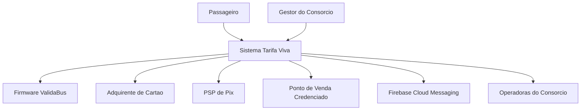

# C4 Level 1 — System Context — Tarifa Viva

## Descrição

O sistema **Tarifa Viva** é a plataforma de bilhetagem eletrônica do consórcio de ônibus de Vale do Sereno. Os atores humanos são o **Passageiro** (embarca, recarrega, consulta saldo) e o **Gestor do Consórcio** (bloqueia cartões, acompanha o clearing). Os sistemas externos são o firmware **ValidaBus** (validador embarcado, com protocolo proprietário instável), o **Adquirente de Cartão de Crédito** e o **PSP de Pix** (processam recarga), a rede de **Pontos de Venda Credenciados** (recarga em dinheiro), o **Firebase Cloud Messaging** (push) e os sistemas das três **Operadoras** (consomem o repasse diário).
