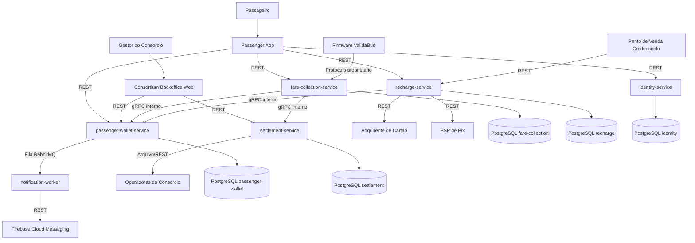

# C4 Level 2 — Container Diagram — Tarifa Viva

## Descrição

Comunicação interna entre os serviços da Tarifa Viva é **gRPC** (TEC-01); a superfície externa (app, backoffice, adquirente, Pix, ponto de venda, operadoras, FCM) é **REST** ou arquivo. Eventos assíncronos internos (ex.: `BalanceLow` para o `notification-worker`) trafegam por **fila RabbitMQ** (TEC-02). Cada serviço possui seu próprio schema **PostgreSQL** — não há banco compartilhado entre bounded contexts.
