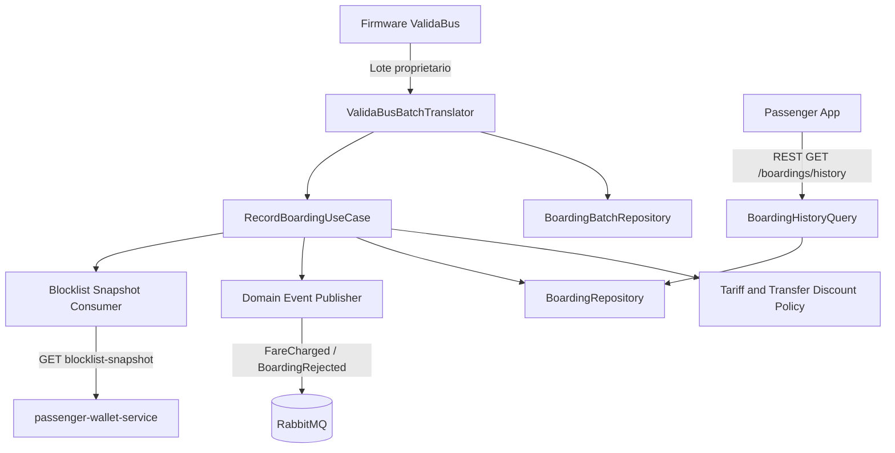

# C4 Level 3 — Component Diagram — fare-collection-service

> Priorizado por ser Core Domain com maior risco operacional e maior complexidade de integração externa (TEC-03).

## Descrição

O componente `ValidaBusBatchTranslator` é a **Anti-Corruption Layer** obrigatória (TEC-03): nenhum tipo do protocolo do firmware atravessa essa fronteira. `RecordBoardingUseCase` aplica a política de tarifa e integração temporal (RULE-01, RULE-03) consultando o `Blocklist Snapshot Consumer`, que lê a fotografia publicada pelo `passenger-wallet-service` — nunca o banco do Wallet diretamente. Eventos de domínio são publicados na fila interna consumida por Passenger Wallet e Settlement.
