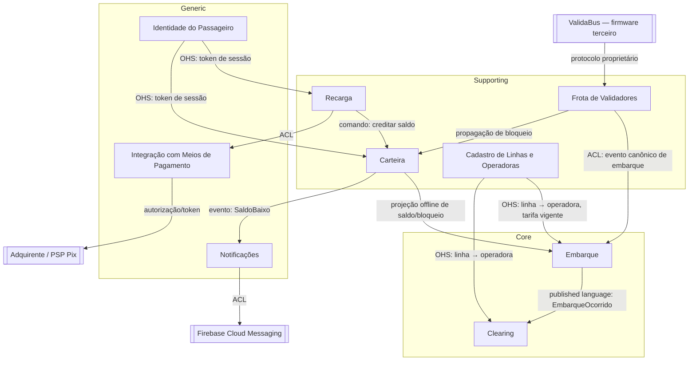

# Context Map — Tarifa Viva

## Controle de Versão
| Versão | Data | Descrição |
|---|---|---|
| v1.0 | 2026-09-26 | Segmentação DDD inicial |

## 1. Diagrama

## 2. Padrões de relacionamento (DDD)

| De → Para | Padrão | Justificativa |
|---|---|---|
| Frota de Validadores → Embarque | Anticorruption Layer (ACL) + Published Language | O modelo de dados do ValidaBus é instável entre firmwares (TEC-03); Frota traduz para um evento canônico próprio antes de expor a Embarque, então uma mudança de firmware nunca vaza para a regra de tarifação. |
| Carteira → Embarque | Customer-Supplier (Carteira upstream) | Embarque só lê; precisa de uma projeção replicada e tolerante a offline (NFR-01, FR-02) porque o validador decide sem rede. Carteira é quem define o formato dessa projeção. |
| Frota de Validadores → Carteira | Customer-Supplier | Bloqueio de cartão originado no app ou no backoffice chega ao validador via Frota; Carteira é a fonte de verdade do bloqueio, Frota só propaga. |
| Cadastro de Linhas e Operadoras → Embarque, Clearing | Open Host Service (OHS) | Dado de referência (linha, operadora, tarifa vigente) consumido por dois contextos core sem que nenhum dos dois precise conhecer o modelo interno do Cadastro. |
| Embarque → Clearing | Customer-Supplier via Published Language | Clearing depende de um contrato de evento versionado (`EmbarqueOcorrido`) que Embarque publica; a imutabilidade do clearing (NFR-05) exige que esse contrato seja estável e auditável, não um acoplamento direto a tabelas. |
| Recarga → Carteira | Customer-Supplier | Recarga não guarda saldo; emite comando de crédito e Carteira decide se aplica (idempotência por id de recarga). |
| Recarga → Integração com Meios de Pagamento | Anticorruption Layer | Isola Recarga da API específica do adquirente/PSP e, junto com NFR-03, garante que dado de cartão nunca entra no domínio. |
| Carteira → Notificações | Conformist (evento simples) | Notificações apenas reage a `SaldoBaixo`; não há negociação de contrato, o evento é trivial. |
| Notificações → FCM | Anticorruption Layer | Isola o domínio do SDK/contrato do provedor de push. |
| Identidade do Passageiro → Recarga, Carteira | Open Host Service | Autenticação é consumida como serviço padrão (token), sem lógica de negócio de bilhetagem dentro de Identidade. |

## 3. Onde a fronteira dói mais

A dupla Frota de Validadores ↔ Embarque é a relação de maior risco técnico do mapa: o validador decide offline em até 300 ms (NFR-01) e só sincroniza em lote (FR-02), então a ACL de Frota precisa reconciliar embarques feitos com uma projeção de saldo/bloqueio que pode estar desatualizada em relação à Carteira central — esse é um ponto de eventual consistency que o design técnico do módulo Embarque tem que tratar explicitamente (ex.: permitir saldo negativo controlado, ou não).

A dupla Embarque ↔ Clearing é a de maior risco de negócio: como o contrato (`EmbarqueOcorrido`) alimenta diretamente o repasse financeiro entre três operadoras concorrentes (OBJ-04), qualquer campo ausente ou ambíguo nesse evento vira disputa comercial, não só bug técnico — por isso o padrão aqui é Published Language versionada, não um simples "Clearing lê a tabela de Embarque".
