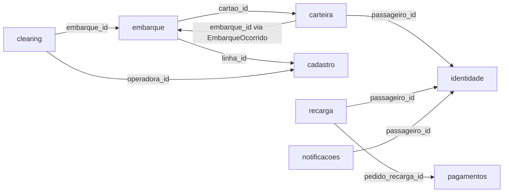

# Data Model por Ownership — Tarifa Viva

## Controle de Versão
| Versão | Data | Descrição |
|---|---|---|
| v1.0 | 2026-09-26 | Segmentação DDD inicial |

## 1. Regra geral

Cada entidade tem exatamente um contexto dono; qualquer outro contexto que precise dela guarda só o identificador (nunca copia o registro inteiro) e, quando precisa de mais dado, ou chama o dono via gRPC ou consome uma projeção publicada por evento — nunca lê a tabela do dono diretamente. Dinheiro é sempre inteiro em centavos, conforme convenção do repositório.

## 2. Embarque (dono: `embarque-svc`)

| Entidade | Campos-chave | Observação |
|---|---|---|
| `embarques` | id, cartao_id (ref. Carteira), linha_id (ref. Cadastro), tarifa_cobrada_centavos, decisao, ocorrido_em, integracao_aplicada (bool) | Fonte de verdade do que aconteceu no embarque; publica `EmbarqueOcorrido` para Clearing. |
| `janelas_integracao` | cartao_id (ref.), linha_anterior_id (ref.), expira_em | Estado efêmero para calcular o desconto de 60 minutos; TTL curto. |

## 3. Clearing (dono: `clearing-svc`)

| Entidade | Campos-chave | Observação |
|---|---|---|
| `apuracoes_diarias` | id, data_referencia, status (rascunho/publicado) | Uma por dia. |
| `lancamentos_repasse` | id, apuracao_id, operadora_id (ref. Cadastro), valor_centavos, embarque_id (ref. Embarque, só id) | Nunca editado após publicação. |
| `arquivos_ajuste` | id, apuracao_original_id, motivo, valor_centavos | Corrige sem reescrever (NFR-05). |

## 4. Carteira (dono: `carteira-svc`)

| Entidade | Campos-chave | Observação |
|---|---|---|
| `carteiras` | id, passageiro_id (ref. Identidade), saldo_centavos | Uma por passageiro. |
| `bloqueios` | id, carteira_id, motivo, criado_por, ativo_desde | Histórico completo, não só o estado atual. |
| `lancamentos_saldo` | id, carteira_id, origem (recarga/debito_embarque), valor_centavos, origem_id | Ledger append-only; saldo é derivado ou cacheado a partir daqui. |
| `historico_viagens` (projeção de leitura) | carteira_id, embarque_id (ref.), retido até 30 dias no app | Projeção construída a partir de `EmbarqueOcorrido`, não é o dado transacional. |

## 5. Recarga (dono: `recarga-svc`)

| Entidade | Campos-chave | Observação |
|---|---|---|
| `pedidos_recarga` | id, passageiro_id (ref.), canal (app/pdv), valor_centavos, status | Não guarda saldo — só o processo de aquisição. |
| `recargas_dinheiro` | id, pedido_id, ponto_venda_id | Registrada pelo PDV credenciado. |

## 6. Frota de Validadores (dono: `frota-validadores-svc`)

| Entidade | Campos-chave | Observação |
|---|---|---|
| `validadores` | id, onibus_id, versao_firmware, ultima_sincronizacao_em | — |
| `lotes_sincronizacao` | id, validador_id, quantidade_registros (até 5.000), recebido_em, status | Rastro de auditoria da sincronização batch. |
| dado bruto ValidaBus | formato proprietário | Nunca persistido em schema próprio fora da fila de ingestão; traduzido e descartado. |

## 7. Cadastro de Linhas e Operadoras (dono: `cadastro-linhas-svc`)

| Entidade | Campos-chave | Observação |
|---|---|---|
| `operadoras` | id, nome (Viação Serrana / Expresso Vale / TransSereno) | — |
| `linhas` | id, operadora_id, nome | Cada linha pertence a exatamente uma operadora. |
| `tabela_tarifas` | id, linha_id, valor_centavos, vigente_desde | Histórico de vigência, não só valor atual. |

## 8. Identidade do Passageiro (dono: `identidade-svc`)

| Entidade | Campos-chave | Observação |
|---|---|---|
| `contas` | id, cpf, senha_hash, mfa_habilitado | CPF é PII — acesso restrito por contrato gRPC, nunca replicado para outros módulos. |

## 9. Notificações (dono: `notificacoes-svc`)

| Entidade | Campos-chave | Observação |
|---|---|---|
| `notificacoes_enviadas` | id, passageiro_id (ref.), tipo, enviado_em | Log de entrega, não estado de negócio. |

## 10. Integração com Meios de Pagamento (dono: `pagamentos-svc`)

| Entidade | Campos-chave | Observação |
|---|---|---|
| `autorizacoes` | id, pedido_recarga_id (ref.), token_cartao (opaco, do adquirente), resultado | Nunca guarda PAN, CVV ou validade — só o token do adquirente (NFR-03). |

## 11. Mapa de referências cross-context (quem referencia quem, só por id)

