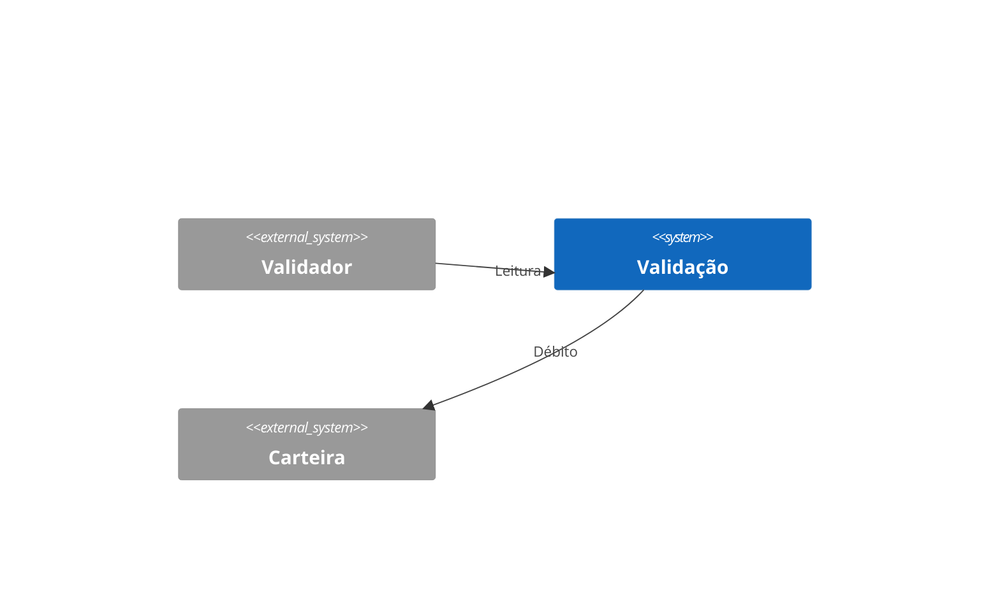

# VAL — Validação

Design Técnico

- Versão: 1.0.0
- Data: 2026-09-22
- Status: Aprovado para desenvolvimento
- Base: `docs/product/modules/validacao/requirements.md` v1.0.0
- ADRs aplicáveis: ADR-0001, ADR-0002, ADR-0003
- Rules aplicáveis: `.forge/rules/architecture`, `.forge/rules/data`

## Histórico de Versões

| Versão | Data | Autor | Mudança |
|--------|------|-------|---------|
| 1.0.0 | 2026-09-22 | design-writer | Versão inicial derivada do PRD 2.1.0 (OBJ-01, OBJ-02) |

## Visão Geral

A Validação recebe a leitura do cartão NFC ou QR Code pelo validador embarcado, consulta a Tarifação, pede o débito à Carteira e devolve a decisão de embarque (liberado/negado) em até 300 ms ponta a ponta.

## Princípios e Decisões Macro

Clean Architecture (ADR-0001), valores em centavos (ADR-0002), outbox e envelope padrão (ADR-0003).

## Estrutura da Solução

`VAL.Domain`, `VAL.Application`, `VAL.Infrastructure`, `VAL.Api`, `VAL.Contracts`, `VAL.Architecture.Tests`.

## Modelo de Domínio

- Aggregate `Embarque` (raiz), com objeto de valor `Money` (centavos) e state machine `Lido → Tarifado → Debitado → Liberado | Negado`.
- Evento de domínio `EmbarqueLiberado`.

## Application Layer

| Caso de uso | Tipo | Handler | Origem |
|-------------|------|---------|--------|
| DecidirEmbarque | Command | DecidirEmbarqueHandler | PRD OBJ-01 |
| ConsultarEmbarquesDoCartao | Query | ConsultarEmbarquesHandler | PRD OBJ-02 |

`DecidirEmbarque` é idempotente por `leitura_id` (gerado pelo validador).

## Infrastructure Layer

Cliente HTTP da Tarifação com timeout de 50 ms e circuit breaker; cliente da Carteira com timeout de 100 ms, retry 1x; outbox na tabela `val.outbox`.

## Schema / Modelo de Persistência

```sql
CREATE TABLE embarque (
  id UUID PRIMARY KEY,
  tenant_id UUID NOT NULL,
  leitura_id UUID NOT NULL UNIQUE,
  cartao_hash CHAR(64) NOT NULL,
  linha_id UUID NOT NULL,
  tarifa_centavos BIGINT NOT NULL,
  status VARCHAR(12) NOT NULL,
  criado_em TIMESTAMPTZ NOT NULL
);
CREATE INDEX ix_embarque_cartao ON embarque (tenant_id, cartao_hash, criado_em DESC);
```

## API Contracts

| Método | Path | Auth | Request | Response | Erros |
|--------|------|------|---------|----------|-------|
| POST | /v1/embarques | mTLS validador | `{ leitura_id, cartao_hash, linha_id }` | 200 `{ decisao, saldo_restante_centavos }` | VAL-ERR-001, VAL-ERR-002 |

## AsyncAPI / Eventos Publicados e Consumidos

Publicado `validacao.embarque-liberado` v1 com envelope ADR-0003 (`event_version`, `correlation_id`, `causation_id`, `tenant_id`, `idempotency_key`), via outbox; DLQ `validacao.dlq`.

## Segurança

mTLS entre validador e API; cartão identificado só por hash SHA-256; sem PII no módulo.

## Observabilidade

Logs estruturados com `correlation_id`; histograma de latência por etapa; alerta quando p95 > 250 ms por 5 minutos.

## Catálogo de Erros

| Código | Mensagem | HTTP Status | Quando ocorre | Ação recomendada |
|--------|----------|-------------|---------------|------------------|
| VAL-ERR-001 | Embarque negado | 200 | Saldo insuficiente ou cartão bloqueado | Exibir tela de negado |
| VAL-ERR-002 | Linha desconhecida | 422 | `linha_id` não cadastrada | Atualizar firmware do validador |

## Testes

Domínio (state machine), aplicação (idempotência por `leitura_id`), contrato (Pact com Carteira e Tarifação), arquitetura (NetArchTest), carga (k6, 2.000 embarques/s).

## Multi-tenancy

`tenant_id` em todas as tabelas e no envelope de eventos; filtro global por tenant.

## Performance e Escalabilidade

Meta de 300 ms ponta a ponta (PRD OBJ-01); cache de tarifa na borda.

## Diagramas



## Decisões Inline

Não aplicável nesta versão.

## Riscos

| Risco | Impacto | Mitigação |
|-------|---------|-----------|
| Carteira indisponível no pico | Embarque negado em massa | Circuit breaker e modo offline no validador |

## Definition of Done

Requisitos implementados, testes verdes, contratos publicados, observabilidade entregue.

## Referências

- `docs/product/prd/prd.md` v2.1.0
