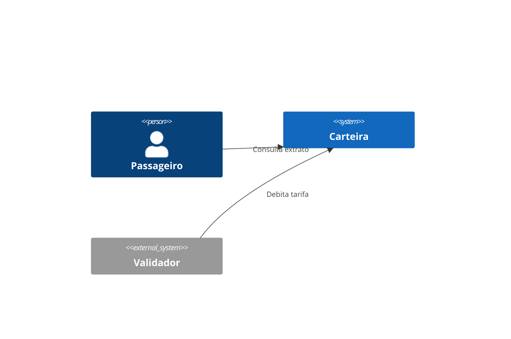
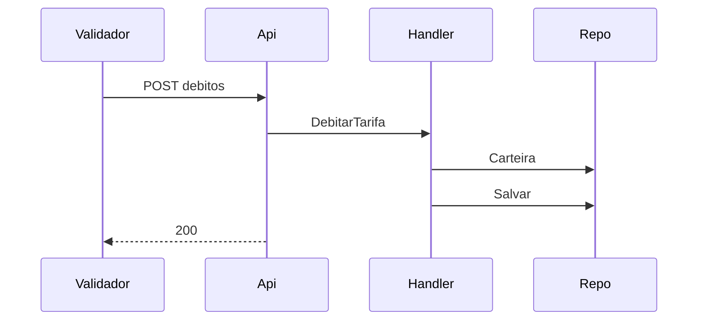

# CRT — Carteira

Design Técnico

- Versão: 0.3.0
- Data: 2026-09-18
- Status: Rascunho para revisão
- Base: `docs/product/modules/carteira/requirements.md` v1.2.0
- ADRs aplicáveis: ADR-0001, ADR-0002, ADR-0003
- Rules aplicáveis: `.forge/rules/architecture`, `.forge/rules/data`

## Histórico de Versões

| Versão | Data | Autor | Mudança |
|--------|------|-------|---------|
| 0.1.0 | 2026-09-12 | design-writer | Versão inicial |
| 0.2.0 | 2026-09-15 | design-writer | Contratos de API |
| 0.3.0 | 2026-09-18 | design-writer | Eventos e persistência |

## Visão Geral

A Carteira mantém o saldo pré-pago do passageiro, recebe créditos de recarga e débitos de tarifa vindos do validador.

## Princípios e Decisões Macro

Clean Architecture conforme ADR-0001; mensageria conforme ADR-0003.

## Estrutura da Solução

- `CRT.Domain`
- `CRT.Application`
- `CRT.Infrastructure`
- `CRT.Api`
- `CRT.Contracts`
- `CRT.Architecture.Tests`

## Modelo de Domínio

### Aggregate `Carteira`

```csharp
namespace CRT.Domain;

using Microsoft.EntityFrameworkCore;

[Table("carteira")]
public class Carteira
{
    [Key] public Guid Id { get; set; }
    public string Cpf { get; set; }
    public double Saldo { get; set; }
    public DbSet<Movimentacao> Movimentacoes { get; set; }

    public void Debitar(double valor) { Saldo -= valor; }
    public void Creditar(double valor) { Saldo += valor; }
}
```

O aggregate usa as anotações do EF Core diretamente para simplificar o mapeamento e evitar configuração duplicada na infraestrutura.

### Eventos de domínio

- `CarteiraDebitada`
- `CarteiraCreditada`

## Application Layer

| Caso de uso | Tipo | Handler | Requisito |
|-------------|------|---------|-----------|
| CriarCarteira | Command | CriarCarteiraHandler | REQ-01 |
| CreditarRecarga | Command | CreditarRecargaHandler | REQ-02 |
| DebitarTarifa | Command | DebitarTarifaHandler | REQ-03 |
| ConsultarExtrato | Query | ConsultarExtratoHandler | REQ-05 |

`DebitarTarifaHandler` verifica o saldo antes de chamar `Carteira.Debitar`. Se insuficiente, retorna `CRT-ERR-002`.

## Infrastructure Layer

- `CarteiraRepository` (EF Core, PostgreSQL 16).
- `RecargaConfirmadaConsumer` (MassTransit/RabbitMQ): lê o evento e chama `CreditarRecargaHandler`.
- Timeout de 2 s nas chamadas ao banco.

## Schema / Modelo de Persistência

```sql
CREATE TABLE carteira (
  id UUID PRIMARY KEY,
  tenant_id UUID NOT NULL,
  cpf VARCHAR(11) NOT NULL,
  saldo FLOAT NOT NULL DEFAULT 0,
  criado_em TIMESTAMPTZ NOT NULL
);

CREATE TABLE movimentacao (
  id UUID PRIMARY KEY,
  carteira_id UUID NOT NULL REFERENCES carteira(id),
  tipo VARCHAR(10) NOT NULL,
  valor FLOAT NOT NULL,
  criado_em TIMESTAMPTZ NOT NULL
);
```

Migrations via EF Core Migrations.

## API Contracts

| Método | Path | Auth | Request | Response | Erros |
|--------|------|------|---------|----------|-------|
| POST | /v1/carteiras | JWT passageiro | `{ cpf }` | 201 `{ id, saldo }` | CRT-ERR-001 |
| POST | /v1/carteiras/{id}/debitos | mTLS validador | `{ valor, linha_id }` | 200 `{ saldo }` | CRT-ERR-002, CRT-ERR-003 |
| GET | /v1/carteiras/{id}/extrato | JWT passageiro | `?page&size` | 200 `{ itens[], page }` | CRT-ERR-003 |

## AsyncAPI / Eventos Publicados e Consumidos

### Publicado: `carteira.debitada`

```json
{ "carteira_id": "uuid", "valor": 4.4, "saldo": 10.6 }
```

### Consumido: `recarga.confirmada`

Payload `{ recarga_id, carteira_id, valor }`. O consumidor credita o valor ao receber a mensagem.

## Segurança

JWT para o app do passageiro, mTLS para o validador. CPF armazenado em claro para facilitar suporte.

## Observabilidade

Logs estruturados em JSON com `carteira_id` e `cpf`. Métricas de débitos por minuto.

## Catálogo de Erros

| Código | Mensagem | HTTP Status | Quando ocorre | Ação recomendada |
|--------|----------|-------------|---------------|------------------|
| CRT-ERR-001 | CPF já possui carteira nesta operadora | 409 | CPF duplicado no tenant | Usar a carteira existente |
| CRT-ERR-002 | Saldo insuficiente | 422 | Saldo menor que a tarifa | Recarregar |
| CRT-ERR-003 | Carteira não encontrada | 404 | Id inexistente | Verificar o id |

## Testes

- Testes unitários de `Carteira.Debitar` e `Carteira.Creditar`.
- Testes de integração do repositório com Testcontainers.
- Testes de API com WebApplicationFactory.

## Multi-tenancy

`tenant_id` na tabela `carteira`, filtro global do EF Core por tenant.

## Performance e Escalabilidade

Meta de p95 < 150 ms no débito; índice primário em `carteira.id`.

## Diagramas





## Decisões Inline

### DD-001 - Anotações EF Core no domínio

**Contexto:** mapeamento duplicado entre domínio e infraestrutura.
**Decisão:** usar `[Table]` e `[Key]` direto no aggregate.
**Justificativa:** menos código.
**Impacto:** domínio acoplado ao EF Core.

## Riscos

| Risco | Impacto | Mitigação |
|-------|---------|-----------|
| Pico de embarques às 7h | Latência | Escalar pods |

## Definition of Done

- Código implementado e testado.
- PR aprovado.

## Referências

- `docs/product/modules/carteira/requirements.md`
- ADR-0001, ADR-0002, ADR-0003
