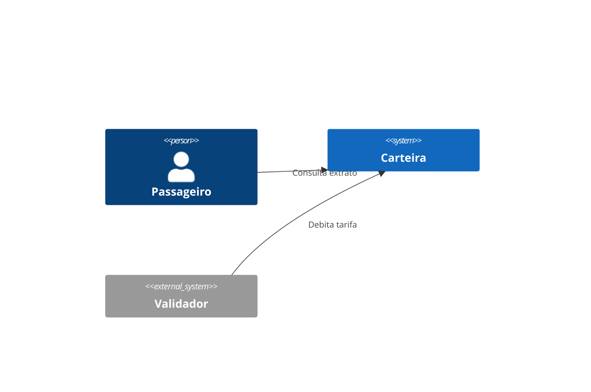
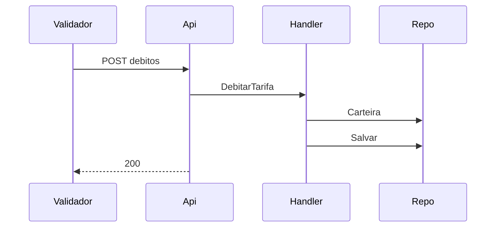

# CRT — Carteira

Design Técnico

- Versão: 0.3.1
- Data: 2026-09-26
- Status: Rascunho para revisão
- Base: `docs/product/modules/carteira/requirements.md` v1.2.0
- ADRs aplicáveis: ADR-0001, ADR-0002, ADR-0003
- Rules aplicáveis: `.forge/rules/architecture`, `.forge/rules/data`, `.forge/rules/domain`

## Histórico de Versões

| Versão | Data | Autor | Mudança |
|--------|------|-------|---------|
| 0.1.0 | 2026-09-12 | design-writer | Versão inicial |
| 0.2.0 | 2026-09-15 | design-writer | Contratos de API |
| 0.3.0 | 2026-09-18 | design-writer | Eventos e persistência |
| 0.3.1 | 2026-09-26 | design-validator | Revisão arquitetural: corrige `double`/anotações EF no domínio (ADR-0001, ADR-0002), `tenant_id` ausente em `movimentacao` (RNF-02) e CPF sem mascaramento em log (RNF-03). Achados maiores (REQ-04 ausente; outbox/inbox e envelope de evento incompletos — ADR-0003) apontados na seção "Achados da Revisão Arquitetural" para decisão antes do `/forge:tasks`.

## Visão Geral

A Carteira mantém o saldo pré-pago do passageiro, recebe créditos de recarga e débitos de tarifa vindos do validador.

## Princípios e Decisões Macro

Clean Architecture conforme ADR-0001; mensageria conforme ADR-0003.

## Estrutura da Solução

- `CRT.Domain`
- `CRT.Application`
- `CRT.Infrastructure`
- `CRT.Api`
- `CRT.Contracts`
- `CRT.Architecture.Tests`

## Modelo de Domínio

### Aggregate `Carteira`

```csharp
namespace CRT.Domain;

public class Carteira
{
    private Carteira() { }

    public Guid Id { get; private set; }
    public string Cpf { get; private set; }
    public Money Saldo { get; private set; }
    private readonly List<Movimentacao> _movimentacoes = new();
    public IReadOnlyList<Movimentacao> Movimentacoes => _movimentacoes;

    public static Carteira Create(string cpf, Guid tenantId) =>
        new() { Id = Guid.NewGuid(), Cpf = cpf, Saldo = Money.Zero };

    public void Debitar(Money valor)
    {
        if (Saldo.Centavos < valor.Centavos)
            throw new SaldoInsuficienteException(Id);
        Saldo = Saldo.Subtrair(valor);
    }

    public void Creditar(Money valor) => Saldo = Saldo.Somar(valor);
}
```

O aggregate não referencia EF Core (ADR-0001): sem `[Table]`/`[Key]`, sem `DbSet` exposto no domínio e sem invariantes no `Infrastructure`. O mapeamento (`carteira` → `Carteira`, coluna `saldo_cents`, etc.) é responsabilidade exclusiva de `CarteiraEntityTypeConfiguration : IEntityTypeConfiguration<Carteira>` em `CRT.Infrastructure`. `Saldo` e os parâmetros de `Debitar`/`Creditar` usam o objeto de valor `Money` (`long Centavos`), conforme ADR-0002 — nunca `double`.

### Eventos de domínio

- `CarteiraDebitada`
- `CarteiraCreditada`

## Application Layer

| Caso de uso | Tipo | Handler | Requisito |
|-------------|------|---------|-----------|
| CriarCarteira | Command | CriarCarteiraHandler | REQ-01 |
| CreditarRecarga | Command | CreditarRecargaHandler | REQ-02 |
| DebitarTarifa | Command | DebitarTarifaHandler | REQ-03 |
| ConsultarExtrato | Query | ConsultarExtratoHandler | REQ-05 |

`DebitarTarifaHandler` verifica o saldo antes de chamar `Carteira.Debitar`. Se insuficiente, retorna `CRT-ERR-002`.

## Infrastructure Layer

- `CarteiraRepository` (EF Core, PostgreSQL 16).
- `RecargaConfirmadaConsumer` (MassTransit/RabbitMQ): lê o evento e chama `CreditarRecargaHandler`.
- Timeout de 2 s nas chamadas ao banco.

## Schema / Modelo de Persistência

```sql
CREATE TABLE carteira (
  id UUID PRIMARY KEY,
  tenant_id UUID NOT NULL,
  cpf VARCHAR(11) NOT NULL,
  saldo_cents BIGINT NOT NULL DEFAULT 0,
  criado_em TIMESTAMPTZ NOT NULL
);

CREATE TABLE movimentacao (
  id UUID PRIMARY KEY,
  carteira_id UUID NOT NULL REFERENCES carteira(id),
  tenant_id UUID NOT NULL,
  tipo VARCHAR(10) NOT NULL,
  valor_cents BIGINT NOT NULL,
  criado_em TIMESTAMPTZ NOT NULL
);
```

`saldo_cents`/`valor_cents` em `BIGINT` (ADR-0002; nunca `FLOAT`/`DECIMAL`). `movimentacao.tenant_id` adicionado — RNF-02 exige segregação por operadora em **todas** as tabelas, e a versão anterior a omitia nesta tabela.

Migrations via EF Core Migrations.

## API Contracts

| Método | Path | Auth | Request | Response | Erros |
|--------|------|------|---------|----------|-------|
| POST | /v1/carteiras | JWT passageiro | `{ cpf }` | 201 `{ id, saldo }` | CRT-ERR-001 |
| POST | /v1/carteiras/{id}/debitos | mTLS validador | `{ valor, linha_id }` | 200 `{ saldo }` | CRT-ERR-002, CRT-ERR-003 |
| GET | /v1/carteiras/{id}/extrato | JWT passageiro | `?page&size` | 200 `{ itens[], page }` | CRT-ERR-003 |

## AsyncAPI / Eventos Publicados e Consumidos

### Publicado: `carteira.debitada`

```json
{
  "event_version": 1,
  "correlation_id": "uuid",
  "causation_id": "uuid",
  "tenant_id": "uuid",
  "idempotency_key": "uuid",
  "carteira_id": "uuid",
  "valor_cents": 440,
  "saldo_cents": 1060
}
```

### Consumido: `recarga.confirmada`

Payload `{ event_version, correlation_id, causation_id, tenant_id, idempotency_key, recarga_id, carteira_id, valor_cents }`. Valores monetários em `valor_cents`/`saldo_cents` (inteiro, BRL), nunca ponto flutuante — ADR-0002.

> **Achado maior (ver "Achados da Revisão Arquitetural"):** esta seção só descreve o payload; o mecanismo de outbox/inbox e a garantia de exatamente-um-crédito por `recarga_id` (REQ-02, PBT-02, ADR-0003) ainda não estão desenhados e não foram corrigidos nesta revisão por exigirem decisão de design, não apenas ajuste mecânico.

## Segurança

JWT para o app do passageiro, mTLS para o validador.

## Observabilidade

Logs estruturados em JSON com `carteira_id` e `cpf_mascarado` (últimos 3 dígitos, ex.: `***.***.**1-90`). CPF em claro nunca é emitido em log — RNF-03/`.forge/rules/architecture/pii-pci-classification.md`. Métricas de débitos por minuto.

## Catálogo de Erros

| Código | Mensagem | HTTP Status | Quando ocorre | Ação recomendada |
|--------|----------|-------------|---------------|------------------|
| CRT-ERR-001 | CPF já possui carteira nesta operadora | 409 | CPF duplicado no tenant | Usar a carteira existente |
| CRT-ERR-002 | Saldo insuficiente | 422 | Saldo menor que a tarifa | Recarregar |
| CRT-ERR-003 | Carteira não encontrada | 404 | Id inexistente | Verificar o id |

## Testes

- Testes unitários de `Carteira.Debitar` e `Carteira.Creditar`.
- Testes de integração do repositório com Testcontainers.
- Testes de API com WebApplicationFactory.

## Multi-tenancy

`tenant_id` na tabela `carteira`, filtro global do EF Core por tenant.

## Performance e Escalabilidade

Meta de p95 < 150 ms no débito; índice primário em `carteira.id`.

## Diagramas





## Decisões Inline

### DD-001 - Anotações EF Core no domínio (revogada em 0.3.1)

**Contexto:** mapeamento duplicado entre domínio e infraestrutura.
**Decisão original (v0.3.0):** usar `[Table]` e `[Key]` direto no aggregate.
**Por que foi revertida:** viola diretamente ADR-0001/`clean-architecture.md` (`Domain` nunca referencia EF Core; mapeamento é responsabilidade da `Infrastructure` via `IEntityTypeConfiguration<T>`). "Menos código" não é justificativa aceita para quebrar a regra de dependência — é o anti-pattern listado explicitamente na rule. Ver Modelo de Domínio e `CarteiraEntityTypeConfiguration` em Infrastructure Layer.

## Achados da Revisão Arquitetural

Revisão do design v0.3.0 contra `requirements.md` v1.2.0, ADR-0001/0002/0003 e as rules de `architecture`/`data`/`domain`. Ajustes mecânicos (sem decisão de design em aberto) já foram aplicados nesta v0.3.1: `Money`/`long Centavos` no lugar de `double` no domínio e no schema (ADR-0002), remoção das anotações EF Core do aggregate (ADR-0001, DD-001 revogada), `tenant_id` em `movimentacao` (RNF-02) e mascaramento de CPF em log (RNF-03). Os itens abaixo exigem decisão de design antes de seguir para `/forge:tasks` — não foram corrigidos por engano nem por omissão, mas porque a correção correta envolve desenho novo, não apenas ajuste do texto existente.

1. **REQ-04 (bloqueio de carteira) sem cobertura no design — bloqueante.** Não há caso de uso, endpoint, campo de estado (`status`/`bloqueada_em`) nem trilha de auditoria para o bloqueio da carteira por perda/roubo. `DebitarTarifaHandler` também não verifica esse estado antes de debitar. Precisa de: novo comando `BloquearCarteira`, coluna de status na tabela `carteira`, tabela `audit_carteira_bloqueio` (append-only, conforme `.forge/rules/domain/audit-immutability.md`, já que é trilha de auditoria com autor/data/motivo) e checagem de status em `DebitarTarifaHandler`.
2. **ADR-0003 (outbox/inbox e envelope de evento) incompleto.** O design agora usa o envelope correto no payload (`event_version`, `correlation_id`, `causation_id`, `tenant_id`, `idempotency_key`), mas não descreve: (a) a tabela `outbox` no schema da Carteira para publicação transacional de `carteira.debitada`/`carteira.creditada`; (b) a tabela/mecanismo de `inbox` no consumidor de `recarga.confirmada` que garante o crédito exatamente uma vez por `recarga_id` (REQ-02, PBT-02); (c) política de DLQ/retry exponencial (máx. 5 tentativas). Sem isso, reprocessar `RecargaConfirmada` credita duas vezes — falha direta de PBT-02.
3. **Multi-tenancy no filtro de aplicação.** A seção "Multi-tenancy" cita apenas a coluna `tenant_id`; falta confirmar o `Global Query Filter` do EF Core na `Infrastructure` (regra 15 de `clean-architecture.md`) cobrindo também a nova tabela `movimentacao` e o outbox/inbox a desenhar no item 2.

**Recomendação:** não seguir para `/forge:tasks` antes de o design-writer endereçar os itens 1 e 2 (bloqueantes) — são lacunas de requisito e de garantia transacional, não polimento. O item 3 pode ser resolvido como nota de esclarecimento no mesmo ciclo.

## Riscos

| Risco | Impacto | Mitigação |
|-------|---------|-----------|
| Pico de embarques às 7h | Latência | Escalar pods |

## Definition of Done

- Código implementado e testado.
- PR aprovado.

## Referências

- `docs/product/modules/carteira/requirements.md`
- ADR-0001, ADR-0002, ADR-0003
