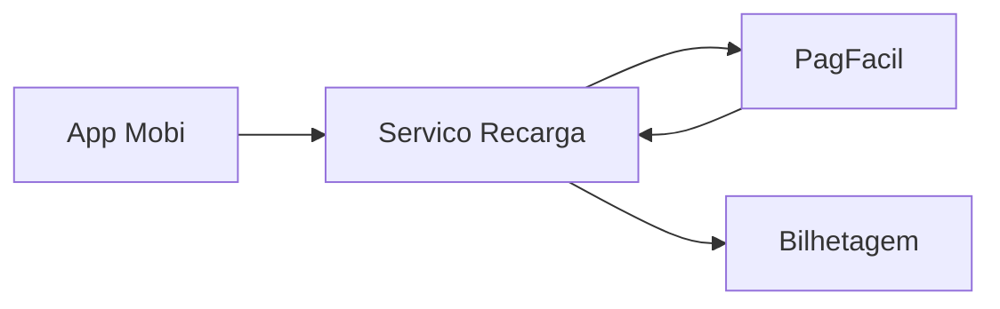
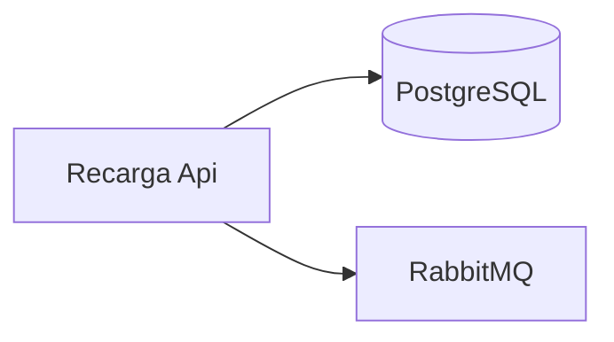
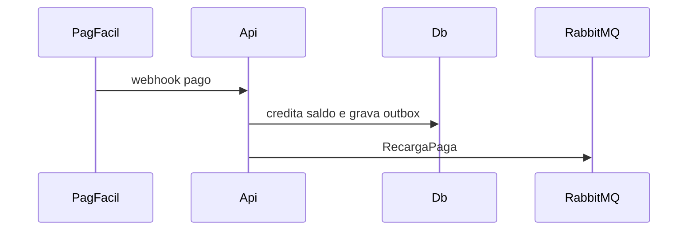
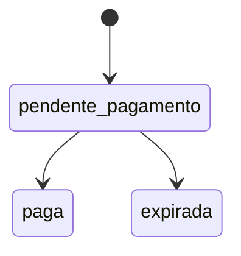

# RCG — Recarga de Cartão de Transporte
**Design Técnico**

- Versão: 1.0.0
- Data: 2026-09-20
- Status: Aprovado para desenvolvimento
- Referência base: docs/product/modules/recarga/requirements.md v1.2.0
- ADRs aplicáveis: ADR-0001, ADR-0002, ADR-0003, ADR-0004
- Rules aplicáveis: `.forge/rules/`

## Histórico de Versões

| Versão | Data | Status | Descrição da alteração |
|--------|------|--------|------------------------|
| 1.0.0 | 2026-09-20 | Aprovado para desenvolvimento | Criação inicial do documento, aprovado por @joao-reis |

## 1. Visão Geral

Serviço `Recarga` que cria cobranças no PagFacil, confirma pagamento por webhook, credita saldo uma única vez e notifica a bilhetagem embarcada (RF-01 a RF-05).

## 2. Princípios e Decisões Macro

Clean Architecture (ADR-0001), eventos via Outbox no RabbitMQ (ADR-0002), REST para o app e para o webhook do PagFacil (ADR-0003), tenant = operadora (ADR-0004).

## 3. Estrutura da Solução

`Recarga.Domain`, `Recarga.Application`, `Recarga.Infrastructure`, `Recarga.Api`, `Recarga.Contracts`, com projetos de teste correspondentes e `Recarga.Architecture.Tests` (NetArchTest).

## 4. Modelo de Domínio

### 4.1 Aggregates

`Recarga` (raiz): id, tenant_id, numero_cartao, valor (Objeto de valor `Dinheiro` em centavos), meio_pagamento, status, cobranca_id. Invariante: crédito de saldo só na transição `pendente_pagamento → paga` (RF-03). `SaldoCartao` (raiz): numero_cartao, saldo_centavos, versao (concorrência otimista).

### 4.2 Entidades

`TentativaWebhook` (dentro de `Recarga`): payload_hash, recebido_em.

### 4.3 Objetos de valor

`Dinheiro` (long centavos, valida RF-02), `NumeroCartao`, `CobrancaId`.

### 4.4 Domain Events

`RecargaSolicitada`, `RecargaPaga`, `RecargaExpirada`.

### 4.5 State Machines

`pendente_pagamento → paga | expirada`. Estados terminais: `paga`, `expirada`.

### 4.6 Policies / Specifications

`ValorRecargaPermitidoSpecification` (RF-02, PBT-02).

## 5. Application Layer

### 5.1 Commands

`SolicitarRecargaCommand` (RF-01), `ConfirmarPagamentoCommand` (RF-03), `ExpirarRecargasCommand` (RF-04, job a cada minuto).

### 5.2 Queries

`ListarRecargasQuery` (RF-05), paginação por cursor.

### 5.3 Handlers

Um handler MediatR por command/query.

### 5.4 Pipeline Behaviors

Validation, Logging, Transaction, Idempotency.

### 5.5 Validações de Aplicação

FluentValidation na borda; RF-02 no domínio.

## 6. Infrastructure Layer

### 6.1 Persistência

EF Core 8 + PostgreSQL 16.

### 6.2 Cache

Não aplicável nesta versão.

### 6.3 Mensageria

RabbitMQ, exchange `mobi.eventos`, routing key `<tenant>.recarga.<evento>` (ADR-0002).

### 6.4 Integrações Externas

`PagFacilClient` (REST): timeout 3 s, 2 retries com backoff, circuit breaker Polly (5 falhas / 30 s).

### 6.5 Idempotência

Webhook deduplicado por `cobranca_id` + status; header `Idempotency-Key` em RF-01.

### 6.6 Outbox / Inbox

Tabela `outbox_mensagens`, publicador em background a cada 1 s.

## 7. Schema / Modelo de Persistência

`recargas` (id uuid pk, tenant_id uuid, numero_cartao char(16), valor_centavos bigint, meio_pagamento text, status text, cobranca_id text unique, criado_em, atualizado_em, criado_por); índice (tenant_id, numero_cartao, criado_em desc). `saldos_cartao` (tenant_id, numero_cartao pk composta, saldo_centavos bigint, versao int). `auditoria_recargas` (id, tenant_id, recarga_id, status_anterior, status_novo, autor, origem, instante), retenção 5 anos (RNF-03).

## 8. API Contracts

- `POST /v1/recargas` — JWT do app; body `{numero_cartao, valor_centavos, meio_pagamento}`; 201; erros RCG-ERR-001, 002, 003, 010.
- `GET /v1/recargas?cursor=&limite=` — JWT do app; 200; erros RCG-ERR-004.
- `POST /v1/webhooks/pagfacil` — assinatura HMAC do PagFacil; 204; erros RCG-ERR-005, 006.

## 9. AsyncAPI / Eventos Publicados e Consumidos

Publicado: `RecargaPagaIntegrationEvent` v1 (`recarga_id`, `numero_cartao`, `valor_centavos`, `event_version`, `correlation_id`, `causation_id`, `idempotency_key`), routing key `<tenant>.recarga.paga`, consumido pela bilhetagem embarcada (RNF-04).

## 10. Segurança

JWT com claim `tenant` e `sub`; o cartão precisa estar vinculado ao `sub` (RNF-02); webhook validado por HMAC-SHA256 com segredo no Vault; `numero_cartao` mascarado em logs (últimos 4).

## 11. Observabilidade

Logs estruturados com `correlation_id`; métricas `recarga_solicitada_total`, `recarga_paga_total`, `webhook_duplicado_total`, `outbox_atraso_segundos`; alerta se `outbox_atraso_segundos` > 30 por 5 min.

## 12. Catálogo de Erros

| Código | Mensagem | HTTP Status | Quando ocorre | Ação recomendada |
|--------|----------|-------------|---------------|------------------|
| `RCG-ERR-001` | Valor de recarga fora da faixa permitida | 422 | RF-02 violado | Informar valor entre R$ 5,00 e R$ 500,00 múltiplo de R$ 0,50 |
| `RCG-ERR-002` | Cartão não encontrado | 404 | Cartão inexistente ou não vinculado ao usuário | Verificar o cartão |
| `RCG-ERR-003` | Meio de pagamento indisponível | 503 | PagFacil fora ou circuito aberto | Tentar novamente mais tarde |
| `RCG-ERR-004` | Parâmetro de paginação inválido | 400 | Cursor ou limite inválido | Corrigir parâmetros |
| `RCG-ERR-005` | Assinatura do webhook inválida | 401 | HMAC não confere | Nenhuma (log de segurança) |
| `RCG-ERR-006` | Cobrança desconhecida | 404 | cobranca_id sem recarga | Conciliação manual |
| `RCG-ERR-010` | Requisição duplicada com corpo divergente | 409 | Idempotency-Key reutilizada | Gerar nova chave |

## 13. Testes

Domínio: xUnit + FsCheck para PBT-01 e PBT-02. Aplicação: handlers com fakes. Infraestrutura: Testcontainers PostgreSQL e RabbitMQ. API: WebApplicationFactory. Arquitetura: NetArchTest. Contrato: Pact com a bilhetagem.

## 14. Multi-tenancy

Filtro global EF por `tenant_id` do claim `tenant` (ADR-0004); routing keys prefixadas pelo tenant.

## 15. Performance e Escalabilidade

RNF-01: p95 < 400 ms medido por histograma `recarga_solicitar_duracao_ms`; 3 réplicas com HPA por CPU 70 %.

## 16. Diagramas

### 16.1 C4 Level 1 - System Context

App, Recarga, PagFacil e Bilhetagem.

### 16.2 C4 Level 2 - Container

### 16.3 C4 Level 3 - Component

Não aplicável nesta versão.

### 16.4 Sequence Diagrams

### 16.5 State Diagrams

## 17. Decisões Inline

### DD-001 - Concorrência otimista no saldo

**Contexto:** webhooks repetidos e concorrentes (RF-03).

**Decisão:** coluna `versao` em `saldos_cartao` com retry de 3 tentativas.

**Justificativa:** evita lock pessimista na tabela mais acessada.

**Alternativas:** `SELECT FOR UPDATE` (rejeitado por contenção em pico).

**Impacto:** conflito raro gera retry e latência extra.

## 18. Riscos

Webhook do PagFacil fora de ordem; mitigado por máquina de estados e conciliação diária.

## 19. Definition of Done

Todos os RF/RNF/PBT com teste verde, NetArchTest verde, contrato Pact publicado, dashboards criados.

## 20. Referências

requirements.md v1.2.0; ADR-0001 a ADR-0004.
