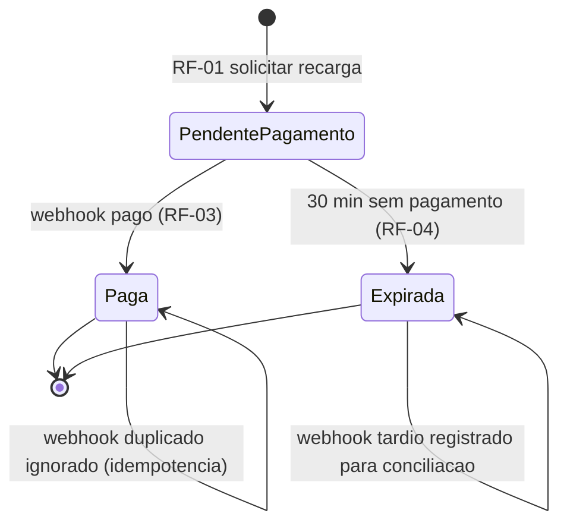
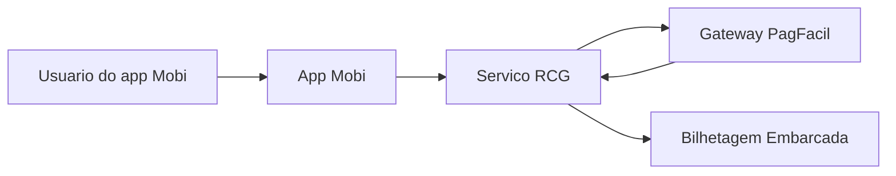
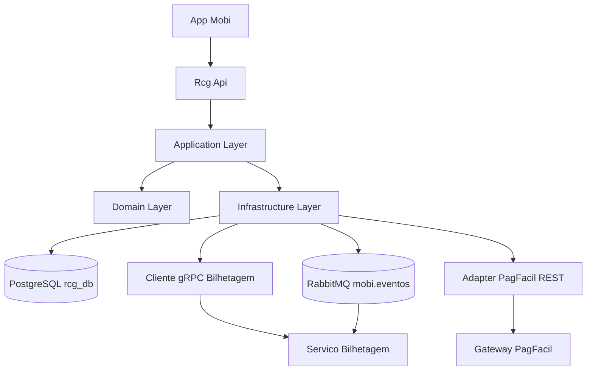
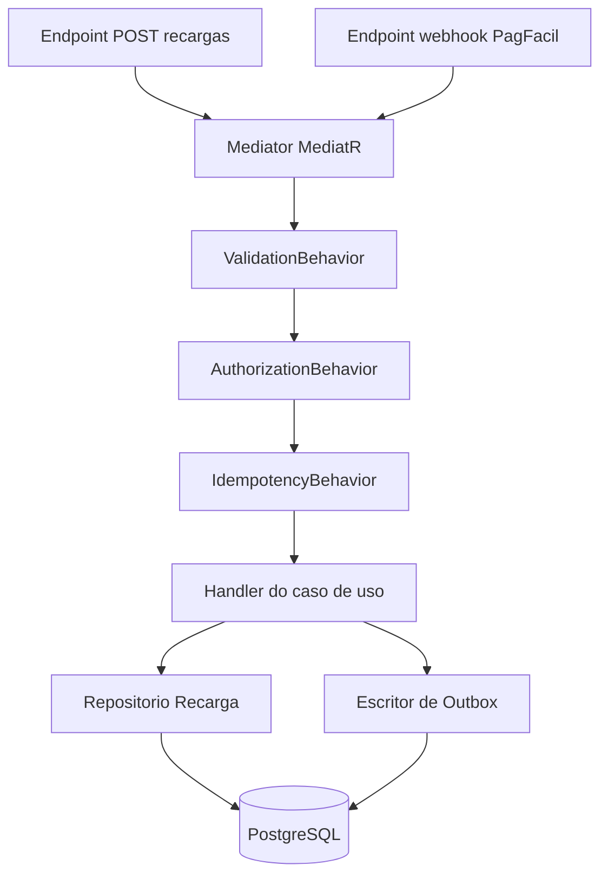
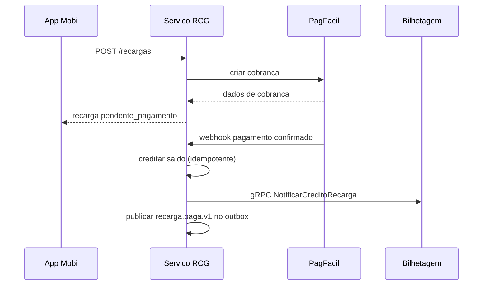

# RCG — Recarga de Cartão de Transporte
**Design Técnico**

- Versão: 1.0.0
- Data: 2026-09-26
- Status: Rascunho para revisão
- Referência base: docs/product/modules/recarga/requirements.md v1.2.0
- ADRs aplicáveis: ADR-0001, ADR-0002, ADR-0003, ADR-0004
- Rules aplicáveis: `.forge/rules/domain/money-as-cents.md`, `.forge/rules/domain/audit-immutability.md`, `.forge/rules/domain/nbr-5891-rounding.md`, `.forge/rules/architecture/clean-architecture.md`, `.forge/rules/architecture/internal-grpc-communication.md`, `.forge/rules/architecture/api-and-contracts.md`, `.forge/rules/architecture/jwt-authentication.md`, `.forge/rules/architecture/jwt-permissions.md`, `.forge/rules/architecture/observability.md`, `.forge/rules/data/schema-evolution.md`, `.forge/rules/conventions/database-naming.md`

## Histórico de Versões

| Versão | Data | Status | Descrição da alteração |
|--------|------|--------|------------------------|
| 1.0.0 | 2026-09-26 | Rascunho para revisão | Criação inicial do documento a partir do requirements.md v1.2.0 aprovado por Carla Mendes e João Reis |

## 1. Visão Geral

O módulo RCG (Recarga de Cartão de Transporte) permite que o usuário do app Mobi credite saldo no cartão de transporte da sua operadora. O fluxo é assíncrono por natureza: o serviço RCG cria a recarga em estado `pendente_pagamento`, devolve ao app os dados de cobrança do gateway PagFacil (Pix ou checkout de cartão de crédito) e aguarda a confirmação por webhook. Ao confirmar, credita o saldo exatamente uma vez e notifica a bilhetagem embarcada, que precisa atualizar a lista de créditos pendentes nos validadores físicos.

O design cobre RF-01 a RF-05, RNF-01 a RNF-04 e as propriedades PBT-01/PBT-02 do requirements.md v1.2.0, seguindo a stack .NET 8 + PostgreSQL 16 (ADR-0001), RabbitMQ com Outbox/Inbox (ADR-0002), gRPC interno / REST externo (ADR-0003) e multi-tenancy por operadora (ADR-0004).

## 2. Princípios e Decisões Macro

- O serviço RCG é dono do agregado `Recarga`; PagFacil é integração externa síncrona (webhook) e a bilhetagem embarcada é consumidora interna via gRPC (comando síncrono) com fallback assíncrono via evento (ver DD-002).
- Toda transição de estado da recarga passa por uma única fronteira transacional no Application Layer, que persiste o novo estado e o registro de auditoria na mesma transação (outbox incluso).
- Dinheiro é tratado como objeto de valor `Money` em centavos (regra `money-as-cents.md`); nunca `decimal`/`float` em domínio.
- Toda tabela de negócio carrega `tenant_id` (operadora), conforme ADR-0004.
- A expiração de recarga (RF-04) é um processo ativo (job de varredura), não apenas uma checagem lazy, para permitir consulta consistente (RF-05) e notificação de conciliação previsível.

## 3. Estrutura da Solução

```text
Rcg.Domain
Rcg.Application
Rcg.Infrastructure
Rcg.Api
Rcg.Contracts

Rcg.Domain.Tests
Rcg.Application.Tests
Rcg.Infrastructure.Tests
Rcg.Api.Tests
Rcg.Architecture.Tests
```

Dependências seguem Clean Architecture (`.forge/rules/architecture/clean-architecture.md`):

```text
Rcg.Api -> Rcg.Application
Rcg.Api -> Rcg.Infrastructure
Rcg.Api -> Rcg.Contracts
Rcg.Application -> Rcg.Domain
Rcg.Application -> Rcg.Contracts
Rcg.Infrastructure -> Rcg.Application
Rcg.Infrastructure -> Rcg.Domain
Rcg.Domain -> ∅
Rcg.Contracts -> ∅
```

`Rcg.Architecture.Tests` valida essas regras de dependência via NetArchTest.

## 4. Modelo de Domínio

### 4.1 Aggregates

**Aggregate `Recarga`** (raiz: `Recarga`). Protege a invariante central de RF-03/PBT-01: o saldo do cartão só é creditado exatamente uma vez por recarga, independentemente de quantos webhooks de pagamento cheguem.

### 4.2 Entidades

- **Recarga** (raiz do agregado): `RecargaId` (Guid), `TenantId`, `NumeroCartao`, `Valor` (Objeto de valor `Money`), `MeioPagamento`, `Status`, `ReferenciaExterna` (id da cobrança no PagFacil), `CriadaEm`, `ExpiraEm`, `PagaEm` (nullable), `CreditadaEm` (nullable), `ExpiradaEm` (nullable).

### 4.3 Objetos de valor

- **Money**: `ValorEmCentavos` (long), `Moeda` (fixo `BRL` nesta versão). Imutável, igualdade por valor. Rejeita construção fora de `[500, 50000]` centavos e fora de múltiplos de 50 (RF-02/PBT-02).
- **NumeroCartao**: string de 16 dígitos (PAN interno da bilhetagem, conforme glossário). Objeto de valor com validação de formato; não confundir com PAN de meio de pagamento.
- **StatusRecarga**: enumeração fechada `PendentePagamento | Paga | Expirada`.

### 4.4 Domain Events

- **RecargaSolicitada**: emitido ao criar a recarga (RF-01).
- **RecargaPaga**: emitido quando o webhook confirma pagamento e o saldo é creditado (RF-03).
- **RecargaExpirada**: emitido quando o job de expiração transiciona a recarga (RF-04).
- **PagamentoTardioRegistrado**: emitido quando um webhook chega para uma recarga já `Expirada` (RF-04) — evento de conciliação, não credita saldo.

### 4.5 State Machines



Transições permitidas: `PendentePagamento -> Paga`, `PendentePagamento -> Expirada`. Nenhuma transição sai de `Paga` ou `Expirada` de volta a `PendentePagamento`. Webhook repetido em `Paga` é idempotente (mesma transição, sem efeito colateral adicional). Webhook em `Expirada` não muda estado, apenas registra `PagamentoTardioRegistrado`.

### 4.6 Policies / Specifications

- **PoliticaValorPermitido**: especifica que um valor de recarga é aceitável se e somente se `500 <= v <= 50000` (centavos) e `v mod 50 = 0` (RF-02, PBT-02). Vive no objeto de valor `Money` como invariante de construção, não como validação solta.
- **PoliticaExpiracao**: especifica que uma recarga `PendentePagamento` é elegível a expirar quando `agora - CriadaEm > 30 minutos` (RF-04).
- **PoliticaIsolamentoTenant**: especifica que toda leitura/escrita de `Recarga` é filtrada por `tenant_id` da operadora do cartão e por `usuario_id` dono do cartão (RNF-02).

## 5. Application Layer

### 5.1 Commands

- **SolicitarRecargaCommand** `{ TenantId, UsuarioId, NumeroCartao, ValorEmCentavos, MeioPagamento }` → RF-01.
- **ConfirmarPagamentoRecargaCommand** `{ ReferenciaExterna, StatusPagamento, PayloadWebhookBruto }` → RF-03/RF-04 (roteado pelo webhook do PagFacil).
- **ExpirarRecargasVencidasCommand** `{ }` (disparado por job agendado) → RF-04.

### 5.2 Queries

- **ListarRecargasDoUsuarioQuery** `{ TenantId, UsuarioId, Pagina, TamanhoPagina }` → RF-05, ordenado por `criada_em desc`.

### 5.3 Handlers

- **SolicitarRecargaHandler**: valida `Money` (RF-02), cria `Recarga` em `PendentePagamento`, chama o adapter PagFacil para gerar cobrança, persiste agregado + outbox (`RecargaSolicitada`) numa única transação, devolve dados de cobrança (QR Pix ou URL de checkout).
- **ConfirmarPagamentoRecargaHandler**: idempotente por `idempotency_key` derivada de `ReferenciaExterna` + `EventoWebhookId` (RF-03/PBT-01); busca a recarga por `ReferenciaExterna` com lock otimista (`xmin`/`RowVersion`); se `PendentePagamento` e dentro da janela, credita saldo, transiciona para `Paga`, grava outbox (`RecargaPaga`); se `Expirada`, apenas grava `PagamentoTardioRegistrado` sem creditar; se já `Paga`, é no-op idempotente.
- **ExpirarRecargasVencidasHandler**: varre recargas `PendentePagamento` com `ExpiraEm < agora`, transiciona em lote para `Expirada`, grava outbox (`RecargaExpirada`) por item.
- **ListarRecargasDoUsuarioHandler**: aplica filtro de tenant + usuário, pagina e ordena.

### 5.4 Pipeline Behaviors

Usa MediatR (ADR-0001) com os seguintes behaviors, na ordem: `ValidationBehavior` (FluentValidation, sintaxe de borda) → `AuthorizationBehavior` (verifica que o `NumeroCartao`/`UsuarioId` pertence ao `TenantId` do token) → `IdempotencyBehavior` (aplica apenas a `ConfirmarPagamentoRecargaCommand`, checando `idempotency_key` na tabela de inbox antes de invocar o handler) → `TransactionBehavior` (abre transação, persiste agregado + outbox) → `LoggingBehavior` (log estruturado com `correlation_id`).

### 5.5 Validações de Aplicação

- Sintáticas na borda (`SolicitarRecargaCommand`): `NumeroCartao` com 16 dígitos, `ValorEmCentavos` inteiro positivo, `MeioPagamento` em `{Pix, CartaoCredito}`.
- De regra de negócio no domínio: faixa e múltiplo de RF-02/PBT-02 (objeto de valor `Money`), elegibilidade de transição de estado (state machine em 4.5).
- Autorização: usuário só solicita/consulta recarga de cartão que possui, dentro do tenant do token (RNF-02).

## 6. Infrastructure Layer

### 6.1 Persistência

PostgreSQL 16 via EF Core 8 (ADR-0001). Ver seção 7 para schema completo.

### 6.2 Cache

Nenhum cache de leitura nesta versão — RF-05 é paginado e de baixo volume por usuário; RNF-01 mira apenas RF-01. Reavaliar cache de listagem se RNF-01 for estendido a RF-05 em versão futura (registrar DD se ocorrer).

### 6.3 Mensageria

RabbitMQ 3.13, exchange topic `mobi.eventos` (ADR-0002). Publicação via Transactional Outbox na mesma transação do agregado; worker de despacho de outbox roda em background no próprio serviço. Consumo da bilhetagem via Inbox com deduplicação por `idempotency_key`. DLQ `rcg.bilhetagem.dlq` após 5 tentativas com backoff exponencial.

### 6.4 Integrações Externas

- **PagFacil (saída, síncrona REST)**: chamada para criar cobrança (Pix/checkout) ao processar `SolicitarRecargaCommand`. Timeout de 3 s (RNF-01), retry único com backoff curto (500 ms) apenas para erros de rede/5xx, sem retry para 4xx. Circuit breaker (Polly) abre após 5 falhas consecutivas em 30 s, half-open a cada 15 s.
- **PagFacil (entrada, webhook REST)**: endpoint público valida assinatura HMAC do payload contra segredo compartilhado (ver seção 10), sob risco de replay mitigado por `idempotency_key`.
- **Bilhetagem Embarcada (saída, gRPC interno)**: comando `NotificarCreditoRecarga` via gRPC com contrato `.proto` versionado no serviço RCG (dono do contrato, ADR-0003), chamado de forma síncrona logo após persistir `Paga`; se a chamada gRPC falhar, o evento `RecargaPaga` publicado no outbox garante entrega ao menos uma vez em até 60 s (RNF-04) via consumidor assíncrono da bilhetagem — ver DD-002.

### 6.5 Idempotência

Tabela `rcg_webhook_inbox` registra `idempotency_key` (derivada da `ReferenciaExterna` do PagFacil + hash do payload) antes de processar qualquer webhook. Reprocessamento do mesmo `idempotency_key` retorna o resultado já registrado sem reexecutar a lógica de crédito (RF-03/PBT-01).

### 6.6 Outbox / Inbox

- **Outbox** (`rcg_outbox`): grava `RecargaSolicitada`, `RecargaPaga`, `RecargaExpirada`, `PagamentoTardioRegistrado` na mesma transação do agregado; worker publica no RabbitMQ e marca `despachado_em`.
- **Inbox** (`rcg_webhook_inbox`): grava toda chamada de webhook recebida, com `processado_em` e resultado, antes de qualquer efeito colateral.

## 7. Schema / Modelo de Persistência

Banco relacional PostgreSQL 16, `snake_case`, EF Core Migrations versionadas no repositório (ADR-0001).

**Tabela `rcg_recargas`**

| Coluna | Tipo | Constraints |
|--------|------|-------------|
| `id` | `uuid` | PK |
| `tenant_id` | `uuid` | not null, FK lógica para operadora |
| `usuario_id` | `uuid` | not null |
| `numero_cartao` | `char(16)` | not null |
| `valor_em_centavos` | `bigint` | not null, check `>= 500 and <= 50000 and valor_em_centavos % 50 = 0` |
| `meio_pagamento` | `varchar(20)` | not null, check in `('pix','cartao_credito')` |
| `status` | `varchar(20)` | not null, check in `('pendente_pagamento','paga','expirada')` |
| `referencia_externa` | `varchar(64)` | not null, unique |
| `criada_em` | `timestamptz` | not null |
| `expira_em` | `timestamptz` | not null |
| `paga_em` | `timestamptz` | null |
| `creditada_em` | `timestamptz` | null |
| `expirada_em` | `timestamptz` | null |
| `criado_por` | `varchar(120)` | not null (auditoria) |
| `atualizado_por` | `varchar(120)` | null (auditoria) |
| `atualizado_em` | `timestamptz` | null (auditoria) |
| `xmin` | interno | usado como token de concorrência otimista |

Índices: `idx_rcg_recargas_tenant_usuario` em `(tenant_id, usuario_id, criada_em desc)` para RF-05; `idx_rcg_recargas_expira_em` parcial em `(expira_em) where status = 'pendente_pagamento'` para RF-04; `uq_rcg_recargas_referencia_externa` único em `referencia_externa`.

**Tabela `rcg_auditoria`** (append-only, `.forge/rules/domain/audit-immutability.md`)

| Coluna | Tipo | Constraints |
|--------|------|-------------|
| `id` | `uuid` | PK |
| `tenant_id` | `uuid` | not null |
| `recarga_id` | `uuid` | not null |
| `status_anterior` | `varchar(20)` | null |
| `status_novo` | `varchar(20)` | not null |
| `autor` | `varchar(120)` | not null (usuário, webhook PagFacil ou job) |
| `origem` | `varchar(40)` | not null (`api`, `webhook`, `job-expiracao`) |
| `ocorrido_em` | `timestamptz` | not null |

Retenção: 5 anos (RNF-03). Privilégio de UPDATE/DELETE revogado do role de aplicação; trigger `BEFORE UPDATE OR DELETE` bloqueia qualquer alteração, conforme `audit-immutability.md`.

**Tabela `rcg_webhook_inbox`**

| Coluna | Tipo | Constraints |
|--------|------|-------------|
| `idempotency_key` | `varchar(128)` | PK |
| `tenant_id` | `uuid` | not null |
| `payload_hash` | `varchar(64)` | not null |
| `recebido_em` | `timestamptz` | not null |
| `processado_em` | `timestamptz` | null |
| `resultado` | `varchar(20)` | null (`credito_aplicado`, `duplicado_ignorado`, `tardio_registrado`) |

**Tabela `rcg_outbox`**

| Coluna | Tipo | Constraints |
|--------|------|-------------|
| `id` | `uuid` | PK |
| `tenant_id` | `uuid` | not null |
| `tipo_evento` | `varchar(60)` | not null |
| `payload` | `jsonb` | not null |
| `correlation_id` | `uuid` | not null |
| `causation_id` | `uuid` | null |
| `event_version` | `int` | not null |
| `criado_em` | `timestamptz` | not null |
| `despachado_em` | `timestamptz` | null |
| `tentativas` | `int` | not null default 0 |

Estratégia de migration: EF Core Migrations versionadas, aplicadas via pipeline de deploy, nunca manualmente em produção. Particionamento não é necessário nesta versão (volume projetado: pico de 400 eventos/s conforme ADR-0002, distribuído entre todos os módulos, não apenas RCG).

## 8. API Contracts

Superfície REST (ADR-0003), OpenAPI 3.1, autenticação JWT (`.forge/rules/architecture/jwt-authentication.md`).

**POST /api/v1/recargas** (RF-01)
- Autenticação: JWT de usuário do app Mobi.
- Request: `{ "numeroCartao": "string(16)", "valorEmCentavos": "integer", "meioPagamento": "pix|cartao_credito" }`
- Response 201: `{ "recargaId": "uuid", "status": "pendente_pagamento", "expiraEm": "datetime", "cobranca": { "tipo": "pix|checkout_url", "qrCode": "string?", "checkoutUrl": "string?" } }`
- Erros: `RCG-ERR-001` (valor fora da faixa, 400), `RCG-ERR-002` (cartão não pertence ao usuário, 403), `RCG-ERR-006` (PagFacil indisponível, 502).
- Idempotência: cliente pode reenviar com `Idempotency-Key` de header opcional para evitar recarga duplicada por retry de rede do app; não confundir com a idempotência de webhook.

**GET /api/v1/recargas** (RF-05)
- Autenticação: JWT de usuário do app Mobi.
- Query params: `pagina` (default 1), `tamanhoPagina` (default 20, máx 100).
- Response 200: lista paginada `{ "itens": [...], "pagina": n, "tamanhoPagina": n, "total": n }`, ordenada por `criadaEm desc`.
- Filtra implicitamente por `tenant_id` + `usuarioId` do token (RNF-02); nunca aceita esses campos por parâmetro do cliente.
- Erros: `RCG-ERR-005` (parâmetro de paginação inválido, 400).

**POST /webhooks/pagfacil** (RF-03/RF-04)
- Autenticação: assinatura HMAC no header `X-PagFacil-Signature`, sem JWT de usuário (endpoint máquina-a-máquina).
- Request: payload do PagFacil (`referenciaExterna`, `status`, `eventoId`).
- Response 200: sempre, para evitar reenvio agressivo do gateway; falhas de processamento ficam registradas na inbox para reprocessamento assíncrono.
- Erros: `RCG-ERR-003` (assinatura inválida, 401), `RCG-ERR-004` (referência externa desconhecida, 404 — logado, não credita).
- Idempotência: garantida por `idempotency_key` (seção 6.5), atende PBT-01.
- Rate limit: 100 req/s por IP de origem conhecido do PagFacil, acima disso 429.

Nenhum endpoint fica sem erro mapeado — ver catálogo completo na seção 12.

## 9. AsyncAPI / Eventos Publicados e Consumidos

Eventos de **domínio** (internos ao agregado, usados para outbox) e eventos de **integração** (publicados no RabbitMQ) são diferenciados: o domínio emite `RecargaSolicitada`/`RecargaPaga`/`RecargaExpirada`/`PagamentoTardioRegistrado`; o Application Layer traduz `RecargaPaga` no evento de integração `recarga.paga.v1` e `RecargaExpirada` em `recarga.expirada.v1`.

**Publicado: `recarga.paga.v1`** (exchange `mobi.eventos`, routing key `<tenant_id>.recarga.paga`)
- Payload: `{ recargaId, tenantId, numeroCartao, valorEmCentavos, pagaEm, correlationId, causationId, idempotencyKey }`
- Headers: `event_version=1`, `correlation_id`, `causation_id`.
- Consumidor: serviço de Bilhetagem Embarcada, via Inbox próprio, dedupe por `idempotencyKey`. Retry com backoff exponencial, DLQ `rcg.bilhetagem.dlq` após 5 tentativas (ADR-0002). Atende RNF-04 como caminho de garantia (ao menos uma vez) complementar à chamada gRPC síncrona (ver DD-002).
- Versionamento: `event_version` incremental; mudança de payload incompatível exige `recarga.paga.v2` com consumidor migrando antes de descontinuar v1.

**Publicado: `recarga.expirada.v1`** — conciliação e métricas; sem consumidor crítico nesta versão.

**Consumido:** nenhum evento externo é consumido pelo RCG nesta versão; o pagamento chega por webhook REST síncrono, não por evento.

## 10. Segurança

- **Autenticação**: JWT emitido pela plataforma Mobi para endpoints de usuário (`.forge/rules/architecture/jwt-authentication.md`); assinatura HMAC dedicada para o webhook do PagFacil (segredo compartilhado gerenciado via secrets manager, nunca hardcoded — `.forge/rules/conventions/no-hardcoded-secrets.md`).
- **Autorização**: claim `tenant` do JWT resolve o `tenant_id`; `AuthorizationBehavior` (5.4) garante que `NumeroCartao` pertence ao `usuario_id` do token antes de qualquer leitura/escrita. Comando gRPC para a bilhetagem usa autenticação de serviço a serviço (mTLS interno, `.forge/rules/architecture/mtls-internal-services.md`).
- **Segregação multi-tenant**: filtro global do EF Core por `tenant_id` (ADR-0004) em toda query de `Recarga`; rejeita silenciosamente (404, não 403, para não confirmar existência) qualquer tentativa de acessar cartão de outra operadora.
- **Proteção contra enumeração**: `GET /api/v1/recargas/{id}` (se adicionado em versão futura) e o webhook nunca revelam se uma `referenciaExterna`/`recargaId` existe fora do escopo do tenant/usuário autenticado — retornam 404 genérico.
- **Rate limiting**: webhook do PagFacil limitado por IP (seção 8); endpoints de usuário seguem limite geral da API gateway da plataforma.
- **Validação de entrada**: `NumeroCartao` validado por formato antes de qualquer consulta; payload de webhook validado contra schema antes de deserializar campos de negócio.
- **Mascaramento de PII**: `numero_cartao` não é PII de identificação direta (é identificador interno da bilhetagem, conforme glossário), mas é mascarado em logs como `****<últimos 4 dígitos>`.
- **Criptografia em trânsito**: TLS 1.2+ em toda comunicação REST externa; mTLS na comunicação gRPC interna.
- **Criptografia em repouso**: disco do PostgreSQL gerenciado com criptografia da infraestrutura de plataforma (fora do escopo deste módulo).
- **Secrets**: segredo HMAC do PagFacil e credenciais de banco vêm de secrets manager, nunca de configuração versionada.
- **Trilhas de auditoria**: tabela `rcg_auditoria` (seção 7), append-only, retenção de 5 anos (RNF-03).
- **Princípio do menor privilégio**: role de aplicação sem privilégio de UPDATE/DELETE em `rcg_auditoria`.
- **Proteção contra replay**: `idempotency_key` do webhook impede reprocessamento do mesmo evento de pagamento (RF-03/PBT-01); assinatura HMAC tem janela de validade curta para mitigar replay de payload capturado.
- **LGPD by design**: dados pessoais tratados neste módulo se limitam a `usuario_id` (referência, não dado bruto) e ao `numero_cartao` mascarado em logs; nenhum dado de meio de pagamento (PAN de cartão de crédito) é armazenado — fica inteiramente no PagFacil.

## 11. Observabilidade

- **Logs estruturados**: JSON com `correlation_id`, `tenant_id`, `recarga_id`, `status_anterior`, `status_novo`; `numero_cartao` sempre mascarado.
- **Métricas**: `rcg_recargas_solicitadas_total`, `rcg_recargas_pagas_total`, `rcg_recargas_expiradas_total`, `rcg_webhook_duplicado_total`, `rcg_pagamento_tardio_total`, histograma `rcg_solicitar_recarga_latencia_ms` (para RNF-01), `rcg_notificacao_bilhetagem_latencia_ms` (para RNF-04).
- **Traces**: instrumentação OpenTelemetry cobrindo `SolicitarRecargaHandler` (chamada PagFacil incluída) e `ConfirmarPagamentoRecargaHandler` (chamada gRPC à bilhetagem incluída), propagando `correlation_id`/`causation_id`.
- **Dashboards**: painel RCG com taxa de conversão `solicitada -> paga`, latência p95 de RF-01, taxa de expiração, atraso de notificação da bilhetagem.
- **Alertas**: p95 de `rcg_solicitar_recarga_latencia_ms` acima de 400 ms por 5 min (RNF-01); `rcg_notificacao_bilhetagem_latencia_ms` acima de 60 s (RNF-04); crescimento da fila `rcg.bilhetagem.dlq`.
- **Health checks**: liveness (processo respondendo), readiness (conexão com PostgreSQL e RabbitMQ ok, circuit breaker do PagFacil não aberto).
- **Auditoria operacional**: eventos de negócio observáveis via métricas acima e via `rcg_auditoria` para auditoria de negócio (seção 10).
- **SLOs técnicos**: p95 de RF-01 < 400 ms excluindo PagFacil (RNF-01); 99% das notificações de bilhetagem entregues em até 60 s (RNF-04).

## 12. Catálogo de Erros

| Código | Mensagem | HTTP Status | Quando ocorre | Ação recomendada |
|--------|----------|-------------|----------------|-------------------|
| `RCG-ERR-001` | Valor de recarga fora da faixa permitida | 400 | `valorEmCentavos` fora de `[500, 50000]` ou não múltiplo de 50 | Corrigir o valor para a faixa permitida em múltiplos de R$ 0,50 |
| `RCG-ERR-002` | Cartão não pertence ao usuário autenticado | 403 | `numeroCartao` não está associado ao `usuarioId` do token | Verificar o número do cartão informado |
| `RCG-ERR-003` | Assinatura de webhook inválida | 401 | Header `X-PagFacil-Signature` não confere com o payload | Verificar configuração do segredo compartilhado com o PagFacil |
| `RCG-ERR-004` | Referência externa desconhecida | 404 | Webhook referencia uma recarga inexistente no RCG | Investigar divergência de dados com o PagFacil (logado, não credita) |
| `RCG-ERR-005` | Parâmetro de paginação inválido | 400 | `pagina` ou `tamanhoPagina` fora dos limites aceitos | Ajustar os parâmetros de paginação |
| `RCG-ERR-006` | Gateway de pagamento indisponível | 502 | Timeout ou erro do PagFacil ao criar cobrança | Tentar novamente mais tarde |
| `RCG-ERR-007` | Recarga já expirada | 409 | Ação de negócio tentada sobre recarga em `expirada` fora do fluxo de conciliação | Solicitar nova recarga |

Erros de autorização (`RCG-ERR-002`) retornam mensagem estável sem detalhar se o cartão existe em outro tenant, evitando enumeração.

## 13. Testes

- **Domínio**: testes unitários do objeto de valor `Money` (faixa e múltiplo de RF-02, cobrindo PBT-02 como teste baseado em propriedade) e da state machine de `Recarga` (transições válidas/inválidas de 4.5).
- **Aplicação**: testes de `ConfirmarPagamentoRecargaHandler` cobrindo PBT-01 — para N chamadas (N gerado entre 1 e 20) com o mesmo `idempotency_key`, o saldo final creditado é sempre exatamente o valor da recarga.
- **Infraestrutura**: testes de repositório contra PostgreSQL via Testcontainers, incluindo verificação do trigger de imutabilidade em `rcg_auditoria` e do índice parcial de expiração.
- **API**: testes de contrato dos três endpoints (seção 8) contra o schema OpenAPI, incluindo casos de erro do catálogo (seção 12).
- **Contrato**: teste de contrato gRPC (`NotificarCreditoRecarga`) contra o `.proto` publicado pelo RCG.
- **Integração**: fluxo completo solicitar → webhook pago → crédito → notificação gRPC/evento, com PagFacil mockado (WireMock) e RabbitMQ real (Testcontainers).
- **E2E**: fora de escopo desta versão — coberto pela suíte E2E do app Mobi.
- **Arquitetura**: `Rcg.Architecture.Tests` valida as regras de dependência da seção 3.
- **Segurança**: teste de assinatura HMAC inválida no webhook (401) e de tentativa de acesso a cartão de outro tenant (404, sem enumeração).
- **Resiliência**: teste de circuit breaker do adapter PagFacil (abre após 5 falhas) e de reentrega via DLQ da bilhetagem.
- **Performance**: teste de carga do endpoint `POST /api/v1/recargas` validando p95 < 400 ms excluindo latência simulada do PagFacil (RNF-01).

Rastreabilidade: RF-01→testes de API+aplicação de `SolicitarRecargaCommand`; RF-02→testes de domínio de `Money`+PBT-02; RF-03→testes de aplicação de `ConfirmarPagamentoRecargaHandler`+PBT-01; RF-04→testes de domínio da state machine+testes de infraestrutura do índice de expiração; RF-05→testes de API de listagem; RNF-01→teste de performance; RNF-02→testes de segurança de isolamento; RNF-03→teste de infraestrutura do trigger de imutabilidade; RNF-04→teste de integração da notificação à bilhetagem.

## 14. Multi-tenancy

Modelo de isolamento por `tenant_id` (operadora), conforme ADR-0004: filtro global do EF Core aplicado a `rcg_recargas`, `rcg_auditoria`, `rcg_webhook_inbox` e `rcg_outbox`; índice composto iniciando por `tenant_id` em todas as tabelas de negócio; routing key de eventos prefixada por `tenant_id` (seção 9); cache não se aplica nesta versão (seção 6.2). Risco de vazamento entre tenants mitigado por: (a) filtro global aplicado no nível do `DbContext`, não em cada query manualmente; (b) teste de segurança dedicado (seção 13) que tenta acessar cartão de outro tenant. Auditoria por tenant é implícita, já que `rcg_auditoria.tenant_id` está presente em todo registro.

## 15. Performance e Escalabilidade

- **SLOs**: p95 de `POST /api/v1/recargas` < 400 ms excluindo PagFacil (RNF-01); notificação da bilhetagem em até 60 s em 99% dos casos (RNF-04).
- **Latência esperada**: leitura de `GET /api/v1/recargas` dominada pelo índice `idx_rcg_recargas_tenant_usuario`; escrita de `SolicitarRecargaCommand` dominada pela chamada ao PagFacil (timeout de 3 s, fora do SLO de RNF-01).
- **Throughput**: dimensionado dentro do orçamento geral de 400 eventos/s do RabbitMQ (ADR-0002), sem fila dedicada de alto volume só para RCG nesta versão.
- **Concorrência**: lock otimista (`xmin`) em `rcg_recargas` evita condição de corrida entre dois webhooks concorrentes para a mesma recarga; job de expiração opera em lote com `SELECT ... FOR UPDATE SKIP LOCKED` para evitar contenção com o handler de confirmação.
- **Gargalos esperados**: chamada síncrona ao PagFacil é o maior contribuinte de latência de RF-01; mitigado por timeout curto (3 s) e circuit breaker.
- **Índices críticos**: `idx_rcg_recargas_tenant_usuario` (RF-05), `idx_rcg_recargas_expira_em` (RF-04), `uq_rcg_recargas_referencia_externa` (RF-03/idempotência de busca).
- **Cache**: não aplicável nesta versão (seção 6.2).
- **Paginação**: `tamanhoPagina` máximo de 100 em RF-05 para limitar payload.
- **Limites de payload**: corpo do webhook limitado a 16 KB; corpo de `POST /api/v1/recargas` limitado a 2 KB.
- **Estratégia de scaling**: serviço stateless, escala horizontalmente atrás do gateway; worker de outbox pode escalar separadamente do handler de API.
- **Backpressure**: fila de outbox absorve picos de eventos sem bloquear a transação principal.
- **Timeouts, retries, circuit breakers**: detalhados na seção 6.4 para a integração com o PagFacil.

## 16. Diagramas

### 16.1 C4 Level 1 - System Context



O usuário solicita a recarga pelo app Mobi, que fala com o serviço RCG. O RCG delega a cobrança ao PagFacil e, após confirmação, avisa a Bilhetagem Embarcada.

### 16.2 C4 Level 2 - Container



A Api expõe REST para o app e webhook para o PagFacil; a Infrastructure fala gRPC com a Bilhetagem e publica no RabbitMQ como caminho de garantia.

### 16.3 C4 Level 3 - Component



Componentes internos da Api/Application mostrando o pipeline de behaviors até o handler e a escrita conjunta de agregado e outbox.

### 16.4 Sequence Diagrams



Fluxo feliz de RF-01/RF-03/RNF-04: solicitação, confirmação de pagamento, crédito exatamente uma vez e dupla via de notificação (gRPC síncrono + evento assíncrono de garantia).

### 16.5 State Diagrams

Ver seção 4.5 para o diagrama de estados da `Recarga`.

## 17. Decisões Inline

### DD-001 - Expiração ativa via job em vez de checagem lazy

**Contexto:** RF-04 exige que recargas `pendente_pagamento` há mais de 30 minutos passem a `expirada`, e RF-05 exige listagem consistente e ordenada.

**Decisão:** Um job agendado (`ExpirarRecargasVencidasHandler`) varre periodicamente recargas vencidas e transiciona o estado, em vez de calcular o estado "on the fly" a cada leitura.

**Justificativa:** Checagem lazy exigiria recalcular o status em toda leitura de RF-05 e complicaria a idempotência do webhook (RF-03 precisa distinguir `pendente_pagamento` de `expirada` no momento exato do webhook, não no momento da leitura).

**Alternativas:** Calcular o status dinamicamente na query de leitura foi descartado por acoplar a lógica de expiração à camada de apresentação e por criar ambiguidade sobre qual status "valia" no instante do webhook.

**Impacto:** Introduz uma janela entre o vencimento real e a execução do job (mitigada por uma cadência de job curta, ex.: a cada 1 minuto); qualquer webhook que chegue exatamente nessa janela ainda é tratado corretamente pela verificação de `ExpiraEm` dentro do próprio handler de confirmação.

### DD-002 - Notificação da bilhetagem por gRPC síncrono com evento de garantia assíncrono

**Contexto:** RNF-04 exige que a bilhetagem embarcada receba o crédito em até 60 s, com entrega ao menos uma vez; ADR-0003 define gRPC para comunicação síncrona interna e ADR-0002 define RabbitMQ com Outbox/Inbox para eventos de integração.

**Decisão:** Ao confirmar o pagamento, o RCG chama a Bilhetagem via gRPC síncrono (`NotificarCreditoRecarga`) e, independentemente do resultado dessa chamada, publica `recarga.paga.v1` no outbox; a Bilhetagem também consome esse evento via Inbox, deduplicando por `idempotencyKey`.

**Justificativa:** A chamada gRPC dá latência mínima no caminho feliz; o evento de outbox garante a entrega ao menos uma vez exigida por RNF-04 mesmo se a chamada gRPC falhar (rede, timeout, serviço fora do ar).

**Alternativas:** Depender só do gRPC síncrono foi descartado por não satisfazer "entrega ao menos uma vez" em caso de falha transitória; depender só do evento assíncrono foi descartado por arriscar não bater o SLO de 60 s em cenários de fila congestionada.

**Impacto:** A Bilhetagem precisa deduplicar entre os dois caminhos (chamada gRPC direta e evento consumido) usando o mesmo `idempotencyKey`; leve aumento de complexidade no consumidor, compensado pela robustez de entrega.

### DD-003 - Idempotência de webhook por chave derivada, não por corpo bruto

**Contexto:** RF-03/PBT-01 exigem que N webhooks da mesma recarga resultem em exatamente um crédito.

**Decisão:** A `idempotency_key` da inbox é derivada de `referenciaExterna + eventoId` do PagFacil, não de um hash do corpo bruto do webhook.

**Justificativa:** O PagFacil pode reenviar o mesmo evento lógico com pequenas variações não semânticas no payload (ex.: timestamp de reenvio); basear a chave no identificador lógico do evento é mais robusto do que um hash de corpo, que trataria reenvios como eventos diferentes.

**Alternativas:** Hash do corpo bruto foi descartado pelo risco de falso negativo de deduplicação descrito acima.

**Impacto:** Depende do PagFacil garantir `eventoId` estável por evento lógico; se essa garantia não existir na prática, registrar risco (seção 18) e revisar em ADR se afetar outros módulos que integram com o mesmo gateway.

## 18. Riscos

- **Garantia de `eventoId` estável do PagFacil (relacionado a DD-003):** se o gateway não garantir `eventoId` estável entre reenvios do mesmo evento lógico, a deduplicação de RF-03/PBT-01 pode falhar. Mitigação: validar com a documentação/contrato do PagFacil antes da implementação; se a garantia não existir, avaliar hash semântico do payload como fallback.
- **Falha simultânea de gRPC e RabbitMQ para a Bilhetagem:** cenário raro em que ambos os caminhos de notificação (DD-002) falham na janela de 60 s. Mitigação: alerta de DLQ (seção 11) e reprocessamento manual monitorado; considerar SLA de reentrega mais agressivo se o risco se mostrar recorrente em produção.
- **Cadência do job de expiração (DD-001):** cadência mal calibrada pode atrasar a transição para `expirada` além do esperado por operações de negócio a jusante. Mitigação: métrica de atraso do job e alerta se ultrapassar um limiar (a definir em implementação).
- **Volume real de recargas concorrentes sobre RabbitMQ:** o orçamento de 400 eventos/s (ADR-0002) é compartilhado entre módulos; não há garantia de fatia reservada para RCG. Mitigação: monitorar throughput e escalar a discussão para ADR se RCG sozinho aproximar-se do limite.

## 19. Definition of Done

- Todos os RFs (RF-01 a RF-05) e RNFs (RNF-01 a RNF-04) do requirements.md v1.2.0 implementados e cobertos por teste automatizado (seção 13).
- PBT-01 e PBT-02 implementados como testes baseados em propriedade e verdes.
- Migrations do schema (seção 7) aplicadas e revisadas, incluindo trigger de imutabilidade de `rcg_auditoria`.
- Contratos REST (seção 8) publicados em OpenAPI 3.1 e contrato gRPC (`.proto`) publicado para a Bilhetagem consumir.
- Catálogo de erros (seção 12) implementado e coberto por teste de contrato.
- Observabilidade (seção 11) implementada: métricas, logs mascarados e alertas configurados.
- `Rcg.Architecture.Tests` verde, validando as fronteiras da seção 3.
- Nenhum DD (seção 17) pendente de decisão explícita; riscos (seção 18) revisados com o time antes do início da implementação.
- README do módulo atualizado (seção abaixo).

## 20. Referências

- `docs/product/modules/recarga/requirements.md` v1.2.0
- ADR-0001 — Stack .NET 8 + PostgreSQL 16 com EF Core
- ADR-0002 — RabbitMQ para eventos de integração
- ADR-0003 — gRPC entre serviços internos, REST para terceiros
- ADR-0004 — Multi-tenancy por operadora com tenant_id
- `docs/product/glossary/domain-glossary.md`
- `.forge/rules/domain/money-as-cents.md`
- `.forge/rules/domain/audit-immutability.md`
- `.forge/rules/architecture/clean-architecture.md`
- `.forge/rules/architecture/internal-grpc-communication.md`
- `.forge/rules/architecture/jwt-authentication.md`

---

**Observação sobre o README do módulo:** `docs/product/modules/recarga/README.md` lista `design.md` como "Não iniciado". Recomenda-se atualizar a tabela para `design.md | 1.0.0 | Rascunho para revisão | 2026-09-26`, mantendo `tasks.md` como "Não iniciado" até este documento ser aprovado.
