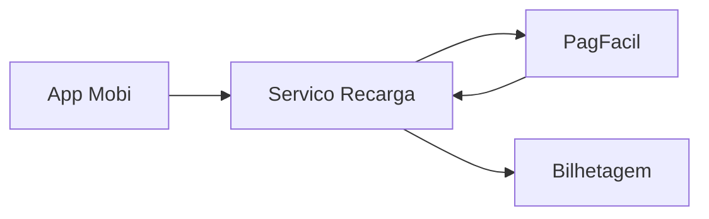
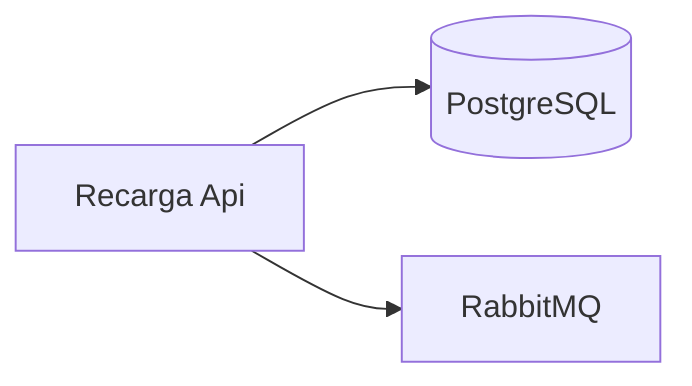
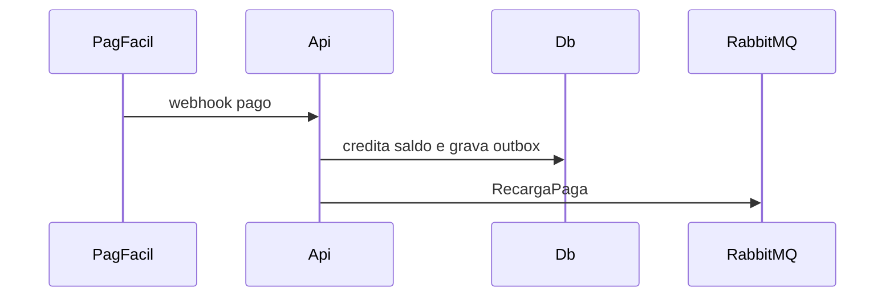
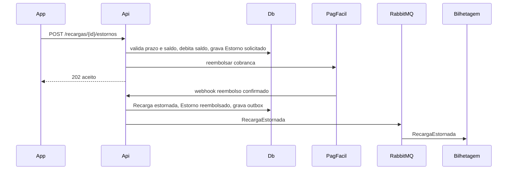
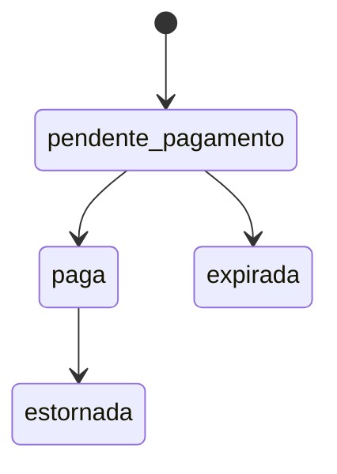

# RCG — Recarga de Cartão de Transporte
**Design Técnico**

- Versão: 1.1.0
- Data: 2026-09-26
- Status: Aprovado para desenvolvimento
- Referência base: docs/product/modules/recarga/requirements.md v1.3.0
- ADRs aplicáveis: ADR-0001, ADR-0002, ADR-0003, ADR-0004
- Rules aplicáveis: `.forge/rules/`

## Histórico de Versões

| Versão | Data | Status | Descrição da alteração |
|--------|------|--------|------------------------|
| 1.0.0 | 2026-09-20 | Aprovado para desenvolvimento | Criação inicial do documento, aprovado por @joao-reis |
| 1.1.0 | 2026-09-26 | Aprovado para desenvolvimento | Inclui RF-06 (estorno de recarga): comando de estorno, débito de saldo, reembolso no PagFacil, evento `RecargaEstornadaIntegrationEvent` e aviso à bilhetagem embarcada. Ver DD-002 sobre o pedido de publicação direta no Kafka. |

## 1. Visão Geral

Serviço `Recarga` que cria cobranças no PagFacil, confirma pagamento por webhook, credita saldo uma única vez, processa estornos dentro da janela de 7 dias e notifica a bilhetagem embarcada (RF-01 a RF-06).

## 2. Princípios e Decisões Macro

Clean Architecture (ADR-0001), eventos via Outbox no RabbitMQ (ADR-0002), REST para o app e para o webhook do PagFacil (ADR-0003), tenant = operadora (ADR-0004).

## 3. Estrutura da Solução

`Recarga.Domain`, `Recarga.Application`, `Recarga.Infrastructure`, `Recarga.Api`, `Recarga.Contracts`, com projetos de teste correspondentes e `Recarga.Architecture.Tests` (NetArchTest).

## 4. Modelo de Domínio

### 4.1 Aggregates

`Recarga` (raiz): id, tenant_id, numero_cartao, valor (Objeto de valor `Dinheiro` em centavos), meio_pagamento, status, cobranca_id, estorno_id (nulo até haver pedido de estorno). Invariante: crédito de saldo só na transição `pendente_pagamento → paga` (RF-03); débito de saldo só na transição `paga → estornada` (RF-06), e apenas quando `saldo_atual ≥ valor_recarga` (senão `RCG-ERR-011`) e dentro de 7 dias corridos da confirmação de pagamento (senão `RCG-ERR-012`). `SaldoCartao` (raiz): numero_cartao, saldo_centavos, versao (concorrência otimista). `Estorno` (raiz, referencia `Recarga` por id, sem herdar seu ciclo de vida): id, recarga_id, valor_centavos, status (`solicitado` → `debitado` → `reembolsado` | `falho_reembolso`), solicitado_por, solicitado_em.

### 4.2 Entidades

`TentativaWebhook` (dentro de `Recarga`): payload_hash, recebido_em.

### 4.3 Objetos de valor

`Dinheiro` (long centavos, valida RF-02), `NumeroCartao`, `CobrancaId`.

### 4.4 Domain Events

`RecargaSolicitada`, `RecargaPaga`, `RecargaExpirada`, `RecargaEstornoSolicitado`, `RecargaEstornada` (RF-06).

### 4.5 State Machines

`pendente_pagamento → paga | expirada`; `paga → estornada` (RF-06), sujeita a `EstornoDentroDoPrazoSpecification` e `SaldoSuficienteParaEstornoSpecification`. Estados terminais: `expirada`, `estornada`. `paga` deixa de ser terminal a partir desta versão.

### 4.6 Policies / Specifications

`ValorRecargaPermitidoSpecification` (RF-02, PBT-02). `EstornoDentroDoPrazoSpecification` (RF-06: `agora - confirmado_em ≤ 7 dias`). `SaldoSuficienteParaEstornoSpecification` (RF-06: `saldo_centavos ≥ valor_centavos`).

## 5. Application Layer

### 5.1 Commands

`SolicitarRecargaCommand` (RF-01), `ConfirmarPagamentoCommand` (RF-03), `ExpirarRecargasCommand` (RF-04, job a cada minuto), `SolicitarEstornoCommand` (RF-06: valida especificações, debita `SaldoCartao`, chama `PagFacilClient.Reembolsar` e grava `Estorno` em `solicitado`), `ConfirmarReembolsoCommand` (RF-06: webhook de confirmação do PagFacil transiciona `Recarga` para `estornada` e `Estorno` para `reembolsado`; falha do PagFacil transiciona `Estorno` para `falho_reembolso` sem reverter o débito, ver Riscos §18).

### 5.2 Queries

`ListarRecargasQuery` (RF-05), paginação por cursor.

### 5.3 Handlers

Um handler MediatR por command/query.

### 5.4 Pipeline Behaviors

Validation, Logging, Transaction, Idempotency.

### 5.5 Validações de Aplicação

FluentValidation na borda; RF-02 no domínio.

## 6. Infrastructure Layer

### 6.1 Persistência

EF Core 8 + PostgreSQL 16.

### 6.2 Cache

Não aplicável nesta versão.

### 6.3 Mensageria

RabbitMQ, exchange `mobi.eventos`, routing key `<tenant>.recarga.<evento>` (ADR-0002), incluindo `<tenant>.recarga.estornada` (RF-06). Ver DD-002 quanto ao pedido de publicação direta no Kafka.

### 6.4 Integrações Externas

`PagFacilClient` (REST): timeout 3 s, 2 retries com backoff, circuit breaker Polly (5 falhas / 30 s). Estende-se com `PagFacilClient.Reembolsar(cobranca_id, valor_centavos)` (RF-06), mesmo timeout/retry/circuit breaker; reembolso é operação idempotente por `estorno_id` enviado como `Idempotency-Key`.

### 6.5 Idempotência

Webhook deduplicado por `cobranca_id` + status; header `Idempotency-Key` em RF-01.

### 6.6 Outbox / Inbox

Tabela `outbox_mensagens`, publicador em background a cada 1 s.

## 7. Schema / Modelo de Persistência

`recargas` (id uuid pk, tenant_id uuid, numero_cartao char(16), valor_centavos bigint, meio_pagamento text, status text, cobranca_id text unique, confirmado_em timestamptz, criado_em, atualizado_em, criado_por); índice (tenant_id, numero_cartao, criado_em desc). `saldos_cartao` (tenant_id, numero_cartao pk composta, saldo_centavos bigint, versao int). `estornos` (id uuid pk, tenant_id uuid, recarga_id uuid fk `recargas.id`, valor_centavos bigint, status text, reembolso_id text unique nullable, solicitado_por uuid, solicitado_em, atualizado_em); índice (tenant_id, recarga_id); constraint que impede mais de um `estorno` não-`falho_reembolso` por `recarga_id`. `auditoria_recargas` (id, tenant_id, recarga_id, status_anterior, status_novo, autor, origem, instante), retenção 5 anos (RNF-03), passa a registrar também as transições de `Estorno`.

## 8. API Contracts

- `POST /v1/recargas` — JWT do app; body `{numero_cartao, valor_centavos, meio_pagamento}`; 201; erros RCG-ERR-001, 002, 003, 010.
- `GET /v1/recargas?cursor=&limite=` — JWT do app; 200; erros RCG-ERR-004.
- `POST /v1/webhooks/pagfacil` — assinatura HMAC do PagFacil; 204; erros RCG-ERR-005, 006.
- `POST /v1/recargas/{id}/estornos` — JWT do app; requer `sub` dono do cartão (RNF-02); header `Idempotency-Key`; 202 (assíncrono: dispara débito e reembolso); erros RCG-ERR-002, 011, 012, 013, 010. (RF-06)
- `POST /v1/webhooks/pagfacil/reembolsos` — assinatura HMAC do PagFacil; 204; erros RCG-ERR-005, 014. (RF-06)

## 9. AsyncAPI / Eventos Publicados e Consumidos

Publicado: `RecargaPagaIntegrationEvent` v1 (`recarga_id`, `numero_cartao`, `valor_centavos`, `event_version`, `correlation_id`, `causation_id`, `idempotency_key`), routing key `<tenant>.recarga.paga`, consumido pela bilhetagem embarcada (RNF-04).

Publicado: `RecargaEstornadaIntegrationEvent` v1 (`recarga_id`, `estorno_id`, `numero_cartao`, `valor_centavos`, `event_version`, `correlation_id`, `causation_id`, `idempotency_key`), routing key `<tenant>.recarga.estornada`, via Transactional Outbox (mesma transação do débito), fila com Inbox + DLQ `<fila>.dlq` após 5 tentativas (ADR-0002). Consumido pela bilhetagem embarcada (débito do crédito pendente, RF-06). **Não publicado diretamente no Kafka** — ver DD-002.

## 10. Segurança

JWT com claim `tenant` e `sub`; o cartão precisa estar vinculado ao `sub` (RNF-02); webhook validado por HMAC-SHA256 com segredo no Vault; `numero_cartao` mascarado em logs (últimos 4). Pedido de estorno (RF-06) exige que o `sub` do JWT seja o dono do cartão da recarga, senão `RCG-ERR-002` (evita enumeração de recargas de terceiros); `Idempotency-Key` obrigatória para não duplicar débito em reenvio.

## 11. Observabilidade

Logs estruturados com `correlation_id`; métricas `recarga_solicitada_total`, `recarga_paga_total`, `webhook_duplicado_total`, `outbox_atraso_segundos`, `recarga_estornada_total`, `estorno_falho_reembolso_total` (RF-06); alerta se `outbox_atraso_segundos` > 30 por 5 min ou se `estorno_falho_reembolso_total` crescer sem baixa manual em 24 h (indício de reembolso preso no PagFacil, ver Riscos §18).

## 12. Catálogo de Erros

| Código | Mensagem | HTTP Status | Quando ocorre | Ação recomendada |
|--------|----------|-------------|---------------|------------------|
| `RCG-ERR-001` | Valor de recarga fora da faixa permitida | 422 | RF-02 violado | Informar valor entre R$ 5,00 e R$ 500,00 múltiplo de R$ 0,50 |
| `RCG-ERR-002` | Cartão não encontrado | 404 | Cartão inexistente ou não vinculado ao usuário | Verificar o cartão |
| `RCG-ERR-003` | Meio de pagamento indisponível | 503 | PagFacil fora ou circuito aberto | Tentar novamente mais tarde |
| `RCG-ERR-004` | Parâmetro de paginação inválido | 400 | Cursor ou limite inválido | Corrigir parâmetros |
| `RCG-ERR-005` | Assinatura do webhook inválida | 401 | HMAC não confere | Nenhuma (log de segurança) |
| `RCG-ERR-006` | Cobrança desconhecida | 404 | cobranca_id sem recarga | Conciliação manual |
| `RCG-ERR-010` | Requisição duplicada com corpo divergente | 409 | Idempotency-Key reutilizada | Gerar nova chave |
| `RCG-ERR-011` | Saldo insuficiente para estorno | 422 | RF-06: saldo atual do cartão menor que o valor da recarga | Informar que o saldo já foi total ou parcialmente utilizado |
| `RCG-ERR-012` | Fora do prazo de estorno | 422 | RF-06: mais de 7 dias corridos desde a confirmação de pagamento | Nenhuma (prazo expirado) |
| `RCG-ERR-013` | Recarga não elegível para estorno | 409 | RF-06: recarga não está em `paga` (já `estornada`, `expirada` ou `pendente_pagamento`) | Consultar o status atual da recarga |
| `RCG-ERR-014` | Reembolso recusado pelo PagFacil | 502 | RF-06: PagFacil respondeu falha definitiva ao pedido de reembolso | Acionar conciliação manual; débito já efetuado não é revertido automaticamente (ver Riscos §18) |

## 13. Testes

Domínio: xUnit + FsCheck para PBT-01, PBT-02 e PBT-03 (RF-06). Aplicação: handlers com fakes, incluindo `SolicitarEstornoCommand` cobrindo saldo insuficiente, prazo expirado e recarga não elegível. Infraestrutura: Testcontainers PostgreSQL e RabbitMQ, incluindo publicação do `RecargaEstornadaIntegrationEvent` via Outbox. API: WebApplicationFactory cobrindo `POST /v1/recargas/{id}/estornos` e o webhook de reembolso. Arquitetura: NetArchTest. Contrato: Pact com a bilhetagem, estendido para o evento de estorno. Resiliência: teste de falha do PagFacil no reembolso confirmando que `Estorno` fica em `falho_reembolso` sem reverter o débito.

## 14. Multi-tenancy

Filtro global EF por `tenant_id` do claim `tenant` (ADR-0004); routing keys prefixadas pelo tenant.

## 15. Performance e Escalabilidade

RNF-01: p95 < 400 ms medido por histograma `recarga_solicitar_duracao_ms`; 3 réplicas com HPA por CPU 70 %.

## 16. Diagramas

### 16.1 C4 Level 1 - System Context

App, Recarga, PagFacil e Bilhetagem.

### 16.2 C4 Level 2 - Container

### 16.3 C4 Level 3 - Component

Não aplicável nesta versão.

### 16.4 Sequence Diagrams

Fluxo de estorno (RF-06): o app pede o estorno, o serviço debita o saldo e aciona o reembolso no PagFacil; a confirmação assíncrona fecha o ciclo e avisa a bilhetagem via RabbitMQ (não via Kafka, ver DD-002).

### 16.5 State Diagrams

## 17. Decisões Inline

### DD-001 - Concorrência otimista no saldo

**Contexto:** webhooks repetidos e concorrentes (RF-03).

**Decisão:** coluna `versao` em `saldos_cartao` com retry de 3 tentativas.

**Justificativa:** evita lock pessimista na tabela mais acessada.

**Alternativas:** `SELECT FOR UPDATE` (rejeitado por contenção em pico).

**Impacto:** conflito raro gera retry e latência extra.

### DD-002 - Evento de estorno via RabbitMQ/Outbox, não Kafka direto

**Contexto:** o pedido de origem (RF-06) descreve o evento `RecargaEstornada` publicado "direto no Kafka" para o time de dados consumir num painel de chargeback. A ADR-0002 (aceita) já avaliou Kafka para eventos de integração e o rejeitou explicitamente pelo custo operacional de um cluster dedicado sem volume que o justifique, além de determinar que "adotar Kafka exige nova ADR".

**Decisão:** `RecargaEstornada` é publicado como `RecargaEstornadaIntegrationEvent` no RabbitMQ via Transactional Outbox, exatamente como `RecargaPaga`, mantendo `event_version`, `correlation_id`, `causation_id` e `idempotency_key` (ADR-0002). O design não introduz um segundo transporte de mensageria ad hoc para este módulo.

**Justificativa:** o design não pode contradizer uma ADR aceita sem uma nova ADR (`.forge/agents/specifications/design-writer.md`, regra de rastreabilidade); introduzir Kafka aqui duplicaria a infraestrutura de mensageria só para este consumidor, fora do processo de decisão arquitetural já estabelecido.

**Alternativas:** (a) publicar direto no Kafka como pedido — rejeitada, contradiz ADR-0002 sem registro de nova ADR; (b) o time de dados consome o evento existente do RabbitMQ via um consumidor próprio (fila dedicada `analytics.recarga.estornada`) e materializa no seu pipeline — viável hoje, sem mudança de infraestrutura deste módulo; (c) uma ADR nova propõe um conector RabbitMQ→Kafka (Kafka Connect ou similar) mantido pelo time de dados/plataforma, se o volume ou o caso de uso justificar Kafka de fato.

**Impacto:** o time de dados recebe o evento pelo RabbitMQ (alternativa b) até que exista uma ADR que decida adotar Kafka; esse ponto deve ser levado ao time de arquitetura/dados como decisão pendente, não resolvido silenciosamente por este design.

## 18. Riscos

Webhook do PagFacil fora de ordem; mitigado por máquina de estados e conciliação diária.

Reembolso do PagFacil falhar definitivamente após o saldo já ter sido debitado (RF-06): a `Recarga` fica associada a um `Estorno` em `falho_reembolso`, o saldo permanece debitado e o cartão fica temporariamente com saldo menor do que teria sem o estorno pedido; mitigado por alerta em `estorno_falho_reembolso_total` e conciliação manual (não há estorno automático do débito para evitar dupla movimentação caso o PagFacil confirme atrasado).

Decisão pendente de arquitetura registrada em DD-002: se o pedido de consumo pelo time de dados via Kafka avançar sem uma ADR nova, o painel de chargeback fica sem fonte de dados até a decisão ser tomada.

## 19. Definition of Done

Todos os RF/RNF/PBT com teste verde (incluindo RF-06 e PBT-03), NetArchTest verde, contrato Pact publicado (incluindo o evento de estorno), dashboards criados (incluindo `recarga_estornada_total` e `estorno_falho_reembolso_total`), DD-002 comunicado ao time de dados e à arquitetura para decisão sobre Kafka.

## 20. Referências

requirements.md v1.3.0; ADR-0001 a ADR-0004.
