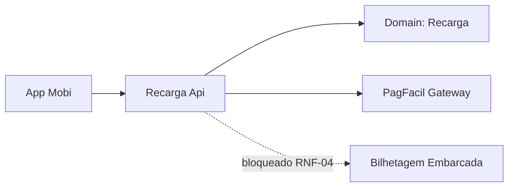

# RCG — Recarga de Cartão de Transporte
**Design Técnico**

- Versão: 0.1.0
- Data: 2026-09-26
- Status: Rascunho (bloqueado — dependente de aprovação do requirements.md)
- Referência base: docs/product/modules/recarga/requirements.md v0.3.0 (Rascunho, aprovação pendente de @carla-mendes e @joao-reis)
- ADRs aplicáveis: ADR-0001, ADR-0002, ADR-0003, ADR-0004
- Rules aplicáveis: nenhuma rule específica de módulo encontrada em `.forge/rules/` ou `docs/rules/`

## Histórico de Versões

| Versão | Data | Status | Descrição da alteração |
|--------|------|--------|------------------------|
| 0.1.0 | 2026-09-26 | Rascunho | Criação inicial do documento como análise de bloqueio — requirements.md ainda em rascunho, não pode ser promovido a "Aprovado para desenvolvimento" |

## 1. Visão Geral

Este documento **não é um design definitivo**. É um rascunho de análise de bloqueio, produzido porque `requirements.md` v0.3.0 está em status "Rascunho", com aprovação pendente de @carla-mendes e @joao-reis, e contém quatro marcações `NEEDS CLARIFICATION` que afetam diretamente o modelo de domínio, o schema de persistência, o catálogo de erros e a integração com a bilhetagem embarcada. Por instrução operacional do agente `design-writer` ("Se o `requirements.md` não existir ou não estiver aprovado, não produza um design definitivo. Gere apenas uma análise de bloqueio ou um rascunho explicitamente marcado como dependente de aprovação dos requisitos"), este design não recebe status "Aprovado para desenvolvimento" e não deve ser encaminhado ao time para quebra em tasks nesse estado.

## 2. Princípios e Decisões Macro

Decisões macro já assumíveis com segurança, por já estarem fixadas em ADR/glossário e não dependerem das lacunas abertas:

- Comunicação síncrona interna em gRPC, superfície externa (PagFacil, bilhetagem embarcada quando via API de terceiro) em REST/webhook — ADR-0003.
- `numero_cartao` como identificador de domínio (não é PAN de pagamento) — glossário.
- `operadora` como tenant — ADR-0004 (multi-tenancy) + glossário.
- Saldo em centavos, nunca `float`/`double` — regra padrão do agente e coerente com o requirements.

## 3. Bloqueios — o que impede um design definitivo

| Item do requirements | Lacuna | Por que bloqueia o design |
|---|---|---|
| RF-02 — Valor permitido | Faixa de valores e limite diário por cartão não definidos; jurídico avalia teto por CPF | Sem o limite, não é possível especificar a validação de domínio, a mensagem de erro de limite excedido no catálogo de erros, nem o índice/constraint de auditoria por CPF que o jurídico pode exigir |
| RF-04 — Expirar recarga | Prazo de expiração indefinido; comportamento de pagamento após expiração (credita ou reembolsa) indefinido | Sem isso não é possível desenhar a state machine da recarga (`pendente_pagamento → paga / expirada / reembolsada`), o job de expiração, nem o tratamento de webhook tardio — que é justamente o caso mais arriscado de duplicidade de crédito |
| RNF-04 — Notificação da bilhetagem | Canal de integração com a bilhetagem embarcada (evento próprio ou API do fornecedor do validador) e SLA de propagação indefinidos | Sem isso não é possível desenhar a seção de mensageria/eventos (AsyncAPI), a idempotência da notificação, nem o SLO de propagação — o design ficaria com a integração mais crítica do módulo inventada |
| PBT-02 | Depende de RF-02 | Propriedade não pode ser formalizada enquanto o limite não existir |

Assumir valores de negócio não validados (ex.: limite de R$ 500, expiração de 30 minutos) para fechar essas lacunas não é uma simplificação de detalhe de implementação — é uma decisão de produto e de risco de negócio (limite antifraude, janela de exposição a estorno, contrato de SLA com fornecedor de bilhetagem) que cabe a quem aprova o requirements, não ao autor do design. Um design que "resolve" essas lacunas por conta própria e sai já como "Aprovado para desenvolvimento" tornaria essas suposições invisíveis para quem vai revisar e implementar — o time trataria como decisão validada algo que é, na verdade, um chute do agente.

## 4. Modelo de Domínio

### 4.1 Aggregates

- **Recarga** (aggregate root): protege a invariante de crédito único por pagamento confirmado (RF-03, PBT-01) e a transição de estado. **Bloqueado:** estados de expiração/reembolso (RF-04) não podem ser fechados sem definição de prazo e política pós-expiração.

### 4.2 Entidades

Recarga é a única entidade de escrita identificada no requirements atual; não há evidência de outra entidade transacional além do agregado.

### 4.3 Objetos de valor

- `Valor` (centavos, inteiro, positivo) — **bloqueado:** faixa mínima/máxima depende de RF-02.
- `NumeroCartao`.
- `MeioDePagamento` (Pix | cartão de crédito).

### 4.4 Domain Events

- `RecargaSolicitada`, `RecargaPaga`, `RecargaExpirada` (nome e gatilho dependem de RF-04) — **bloqueado**.

### 4.5 State Machines

Não especificada nesta versão — depende diretamente de RF-04 (transições de expiração e reembolso). Especificar a máquina de estados sem essa definição arriscaria fixar, no `design.md` "Aprovado", uma política de estorno que ninguém decidiu.

### 4.6 Policies / Specifications

- Idempotência de crédito por `id_recarga` + `id_webhook` (RF-03, PBT-01) — não bloqueado, pode ser especificado com segurança na próxima revisão.

## 5. Application Layer

### 5.1 Commands

`SolicitarRecarga`, `ConfirmarPagamentoRecarga` são especificáveis hoje (RF-01, RF-03). `ExpirarRecarga` depende de RF-04.

### 5.2 Queries

`ListarRecargasDoCartao` (RF-05) é especificável hoje.

### 5.3 a 5.5

Detalhamento adiado para a revisão pós-aprovação do requirements, para não fixar validações de negócio (limite de valor, janela de expiração) que ainda estão em aberto.

## 6. Infrastructure Layer

Idempotência de webhook (RF-03) é especificável hoje. Mensageria com a bilhetagem embarcada (RNF-04) está bloqueada — não há canal definido.

## 7. Schema / Modelo de Persistência

Tabela `recargas` com `tenant_id` (operadora), `numero_cartao`, `valor_centavos`, `status`, `criado_em`, `atualizado_em`, `id_webhook_pagfacil` (chave de idempotência). Colunas relacionadas a limite (RF-02) e expiração (RF-04) — nome de coluna, constraint e índice de auditoria por CPF — ficam de fora desta versão até a definição jurídica/negócio.

## 8. API Contracts

`POST /recargas` (RF-01), `GET /recargas` (RF-05) são especificáveis hoje. Ambos herdam RNF-02 (isolamento por operadora/usuário) via `tenant_id` + escopo de usuário.

## 9. AsyncAPI / Eventos

Bloqueado por RNF-04 — sem canal definido não há payload, `correlation_id` de propagação nem SLA a especificar sem inventar contrato com o fornecedor de bilhetagem.

## 10. Segurança

RNF-02 (isolamento entre operadoras e usuários) é especificável hoje via `tenant_id` + escopo de usuário na query de listagem. Mascaramento de `numero_cartao` em logs aplica-se independentemente das lacunas.

## 11. Observabilidade

Auditoria de 5 anos (RNF-03) é especificável hoje. Métricas de latência (RNF-01) idem.

## 12. Catálogo de Erros

Catálogo completo bloqueado: erro de limite excedido (RF-02) e erro de recarga expirada (RF-04) não podem ser escritos sem as definições correspondentes.

## 13. Testes

PBT-01 é especificável hoje. PBT-02 bloqueado (depende de RF-02).

## 14. Multi-tenancy

Operadora como tenant, `tenant_id` em todas as tabelas — especificável hoje via ADR-0004.

## 15. Performance e Escalabilidade

RNF-01 (p95 < 400ms) é especificável hoje.

## 16. Diagramas

Diagramas de sequência e de estados completos ficam para a revisão pós-aprovação — um diagrama de estados hoje precisaria inventar as transições de expiração/reembolso.

## 17. Decisões Inline

### DD-001 - Não promover a "Aprovado para desenvolvimento" com requirements em rascunho

**Contexto:** o pedido do usuário foi gerar um design.md final, com status "Aprovado para desenvolvimento", assumindo valores (limite de R$ 500, expiração de 30 minutos, bilhetagem por evento) para as quatro lacunas marcadas `NEEDS CLARIFICATION` no requirements.md v0.3.0, que segue em rascunho com aprovação pendente.

**Decisão:** manter este documento como rascunho de análise de bloqueio, sem status "Aprovado para desenvolvimento", e sem fixar os valores assumidos como decisão de design.

**Justificativa:** a definição do agente design-writer proíbe produzir design definitivo a partir de requirements não aprovado; as quatro lacunas envolvem risco de negócio (antifraude, exposição a estorno, contrato com fornecedor externo) que cabe à operadora e ao jurídico decidir, não ao autor do design. Marcar como "Aprovado para desenvolvimento" um documento com suposições não validadas romperia a rastreabilidade que o próprio design.md deveria garantir e passaria adiante, como se fosse decisão validada, uma escolha que ninguém revisou.

**Alternativas consideradas:**
- Gerar o design completo assumindo os valores sugeridos e marcá-lo "Aprovado para desenvolvimento" — rejeitada por violar a diretriz de bloqueio do agente e por criar uma falsa sensação de pronto para o time quebrar em tasks.
- Gerar o design completo com os valores assumidos, mas em status "Rascunho para revisão" — rejeitada nesta rodada porque duas das quatro lacunas (RF-04 e RNF-04) afetam a state machine e a integração mais arriscada do módulo; prefiro devolver o bloqueio explícito a preencher a state machine e o contrato de evento com suposições meta.
- Recusar integralmente e não produzir nenhum artefato — rejeitada porque parte do requirements (RF-01, RF-03, RF-05, RNF-01 a RNF-03) já está madura e pode ser especificada com segurança, adiantando trabalho real.

**Impacto:** o time não recebe hoje um design.md pronto para quebrar em tasks. Recebe um mapa do que já pode avançar (seções 4.1 idempotência, 5.1/5.2 parcial, 8, 10, 12 parcial, 13 PBT-01, 14, 15) e do que depende de decisão de negócio antes de continuar. Isso adia a sprint de segunda para as partes bloqueadas, mas evita propagar valores de limite/expiração/SLA inventados para implementação, teste e para o contrato com o fornecedor de bilhetagem.

## 18. Riscos

- **Risco alto:** se o time implementar com os valores sugeridos pelo usuário (R$ 500, 30 min, evento) sem que jurídico/operadora os validem, qualquer mudança posterior no limite ou no prazo de expiração pode exigir migração de dados e recontrato com o fornecedor de bilhetagem.
- **Risco médio:** RF-04 mal definido é o ponto de maior exposição a duplicidade de crédito (webhook tardio após expiração) — é justamente a lacuna mais perigosa para se decidir por suposição.

## 19. Definition of Done

Este documento não tem DoD de implementação — tem DoD de desbloqueio:

- [ ] RF-02: limite de valor e regra de teto por CPF definidos pelo jurídico/operadora.
- [ ] RF-04: prazo de expiração e política de pagamento pós-expiração definidos.
- [ ] RNF-04: canal de integração com a bilhetagem embarcada e SLA de propagação definidos.
- [ ] requirements.md v0.3.0 (ou versão subsequente) aprovado por @carla-mendes e @joao-reis.
- [ ] Após o desbloqueio: revisar este documento, completar as seções 4.5, 6.3, 6.4, 9, 12, 13 (PBT-02) e só então promover o status para "Aprovado para desenvolvimento".

## 20. Referências

- docs/product/modules/recarga/requirements.md v0.3.0
- docs/product/adr/0001-stack-dotnet-postgresql.md
- docs/product/adr/0002-rabbitmq-eventos-integracao.md
- docs/product/adr/0003-grpc-interno-rest-externo.md
- docs/product/adr/0004-multi-tenancy-por-operadora.md
- docs/product/glossary/domain-glossary.md
