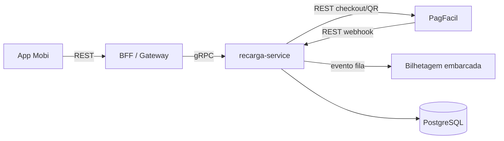
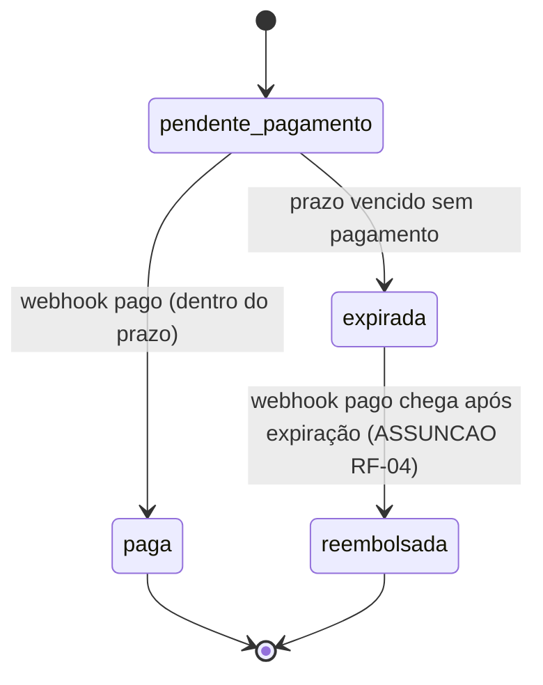

# RCG — Recarga de Cartão de Transporte
**Design técnico**

- Versão: 0.1.0
- Data: 2026-09-26
- Status: Rascunho para revisão
- Baseado em: requirements.md v0.3.0 (Rascunho, aprovação pendente de @carla-mendes e @joao-reis)

## 0. Aviso sobre o status deste documento

Este design **não está marcado como "Aprovado para desenvolvimento"** porque o requirements.md
que o origina ainda tem quatro pontos em aberto (`NEEDS CLARIFICATION`) que tocam parâmetros
financeiros e de integração, não apenas redação: RF-02 (teto de valor por recarga e limite diário
por cartão, com avaliação jurídica de teto por CPF ainda pendente), RF-04 (prazo de expiração e o
que fazer com pagamento tardio — creditar ou reembolsar), RNF-04 (canal e SLA de propagação para a
bilhetagem embarcada) e PBT-02 (depende de RF-02). A constituição deste projeto (cláusula 6) exige
aprovação humana explícita para fluxos financeiros regulados, e a esteira de status do próprio
repositório (`Rascunho → Rascunho para revisão → Aprovado para desenvolvimento → Supersedido`)
reserva "Aprovado para desenvolvimento" para quando os requisitos de origem também estiverem
fechados — o que ainda não é o caso.

Para não travar a sprint, os pontos abaixo foram preenchidos com **valores hipotéticos
explicitamente marcados como ASSUNÇÃO**, propostos por mim (não validados com jurídico, produto
ou a operadora), só para permitir quebra em tasks e desenvolvimento em paralelo às partes que não
dependem deles. Cada assunção está isolada dos componentes que ela afeta, para que corrigi-la
depois não implique redesenhar o módulo inteiro. Recomendo tratar RF-02, RF-04 e RNF-04 como
tarefas de decisão (com dono e prazo) na própria sprint, e não como algo resolvido "depois".

| Ponto em aberto | Assunção adotada aqui | Risco se a assunção estiver errada |
|---|---|---|
| RF-02 — teto de valor/limite diário | Teto de R$ 500,00 por recarga; limite diário de R$ 1.000,00 por cartão; sem teto por CPF (pendente de jurídico) | Se jurídico definir teto por CPF, é preciso um novo agregado de consulta cross-cartão — não é um simples ajuste de constante |
| RF-04 — expiração | 30 minutos; pagamento recebido após expiração é rejeitado pelo domínio (não credita) e webhook tardio gera evento de reembolso automático via PagFacil | Se a operadora exigir crédito mesmo tardio, muda a máquina de estados e o RNF-03 de auditoria |
| RNF-04 — canal com bilhetagem | Evento assíncrono (fila), payload mínimo `{numero_cartao, valor_centavos, id_recarga}`, sem SLA formal definido (proposto: 60s p95) | Se o fornecedor do validador só expõe API síncrona, a arquitetura de "Camada de Aplicação" muda de publisher para client HTTP/gRPC |
| PBT-02 | Não escrito — depende de RF-02 ser resolvido primeiro | — |

## 1. Visão geral da arquitetura

Serviço `recarga-service`, dono do Objeto de Valor `Recarga`. Comunicação síncrona interna via
gRPC (ADR-0003); a superfície do app Mobi é REST (BFF ou gateway existente, fora do escopo deste
módulo). Integração com PagFacil é REST externo (webhook de entrada). Notificação da bilhetagem
embarcada é assíncrona (fila), para desacoplar cadência entre `recarga-service` e o fornecedor do
validador, conforme convenção do projeto (comunicação externa é REST ou fila).

## 2. Modelo de domínio

**Objeto de Valor `Recarga`**

- `id` (UUID)
- `numero_cartao` (string, referência ao cartão da operadora)
- `valor_centavos` (integer, nunca float)
- `meio_pagamento` (enum: `pix`, `cartao_credito`)
- `status` (enum: `pendente_pagamento`, `paga`, `expirada`, `reembolsada`)
- `criado_em`, `expira_em`, `pago_em` (timestamps)
- `webhook_ultimo_evento_id` (para idempotência, ver §4)

**Máquina de estados**

## 3. Fluxos principais

### 3.1 RF-01 — Solicitar recarga

1. BFF chama `recarga-service.CriarRecarga(numero_cartao, valor_centavos, meio_pagamento)` via gRPC.
2. Serviço valida `valor_centavos` contra o teto de R$ 500,00 (ASSUNÇÃO RF-02) e contra o limite
   diário acumulado de R$ 1.000,00 por cartão (consulta agregada por `numero_cartao` + janela do
   dia corrente).
3. Cria `Recarga` com status `pendente_pagamento` e `expira_em = criado_em + 30min` (ASSUNÇÃO RF-04).
4. Chama PagFacil (REST) para gerar cobrança (QR Pix ou URL de checkout) e devolve ao BFF.

### 3.2 RF-03 — Confirmar pagamento (idempotência)

O webhook do PagFacil pode chegar duplicado. A idempotência é garantida por chave única
`(id_recarga, webhook_evento_id)` com constraint no banco: a segunda tentativa de crédito para o
mesmo evento é um no-op detectado, não uma nova escrita. Isso cobre PBT-01 (N webhooks da mesma
recarga → saldo creditado uma única vez).

- Se `status == pendente_pagamento` e dentro do prazo: transição para `paga`, crédito de saldo
  (chamada a serviço de saldo do cartão, fora do escopo deste módulo — apenas a interface é
  definida aqui) e publicação do evento para a bilhetagem.
- Se `status == expirada`: aplica-se a ASSUNÇÃO RF-04 (transição para `reembolsada`, aciona
  reembolso via API do PagFacil, sem creditar saldo).
- Se `status == paga` (evento duplicado): no-op, log de auditoria registra a tentativa duplicada.

### 3.3 RF-04 — Expirar recarga

Job assíncrono (worker periódico, intervalo de 1 minuto) varre recargas `pendente_pagamento` com
`expira_em < agora` e transiciona para `expirada`. Alternativa descartada: expiração lazy (checar
no momento da leitura) — rejeitada porque RNF-03 exige que a mudança de status seja auditável com
instante preciso, e uma expiração "descoberta" só na leitura não tem um instante de origem claro.

### 3.4 RNF-04 — Notificação da bilhetagem

Ao transicionar para `paga`, `recarga-service` publica evento
`recarga.paga { numero_cartao, valor_centavos, id_recarga }` em fila (RabbitMQ, conforme
ADR-0002). SLA proposto de 60s p95 fim-a-fim (ASSUNÇÃO, sem confirmação do fornecedor do
validador). Publicação é outbox-pattern (tabela `eventos_pendentes` na mesma transação da
mudança de status) para não perder o evento em caso de falha do broker — decisão adotada, não
uma ASSUNÇÃO aberta, porque decorre diretamente de RNF-03 (auditoria) e não de um dos pontos em
aberto.

### 3.5 RF-05 — Consultar recargas

Listagem paginada (cursor-based, não offset, para estabilidade sob concorrência) filtrada por
`usuario_id → cartões do usuário`, ordenada por `criado_em desc`. RNF-02 (isolamento) é reforçado
por filtro obrigatório de posse do cartão na camada de aplicação, nunca deixado só para a UI.

## 4. Não-funcionais

- **RNF-01 (latência):** RF-01 não depende de resposta síncrona do PagFacil para o crédito —
  apenas para devolver os dados de cobrança, que é uma chamada mais leve; o timeout de 3s do
  PagFacil está isolado atrás de um client com timeout e retry configurados, sem propagar para o
  p95 de 400ms do endpoint.
- **RNF-02 (isolamento):** filtro por posse do cartão obrigatório na camada de aplicação (ver §3.5).
- **RNF-03 (auditoria):** tabela `recarga_auditoria` append-only, retenção de 5 anos, populada por
  trigger ou pela própria transação de mudança de status (autor = sistema ou `usuario_id`,
  instante, origem = webhook/job/API).
- **RNF-04:** ver §3.4 (ASSUNÇÃO).

## 5. Dinheiro

Todos os valores monetários em `valor_centavos` (integer), nunca ponto flutuante, conforme
convenção do projeto. Nenhum arredondamento é necessário neste módulo porque não há divisão de
valores (NBR 5891 se aplicaria a rateio/cálculo proporcional, que não ocorre em RF-01–RF-05).

## 6. O que fica de fora deste design

- Serviço de saldo do cartão (crédito efetivo) — módulo separado, este design assume uma
  interface (`CreditarSaldo(numero_cartao, valor_centavos, id_recarga)`) sem especificar a
  implementação.
- Autenticação/autorização do app Mobi — herda o mecanismo existente do BFF.
- PBT-02 — não escrito, depende de RF-02.

## 7. Próximos passos recomendados (fora deste documento)

1. Decisão de produto/jurídico sobre RF-02 (teto por CPF) — bloqueia apenas a regra de limite
   diário cross-cartão, não o resto do módulo.
2. Confirmação de produto sobre RF-04 (pagamento tardio credita ou reembolsa) — a ASSUNÇÃO aqui
   (reembolso) é a mais conservadora do ponto de vista financeiro, mas pode não ser a desejada
   pela operadora.
3. Confirmação técnica com o fornecedor do validador sobre RNF-04 (evento vs. API síncrona e SLA
   real).
4. Após 1–3 resolvidos: atualizar requirements.md para "Rascunho para revisão" ou além, e só então
   promover este design.md a "Aprovado para desenvolvimento".
