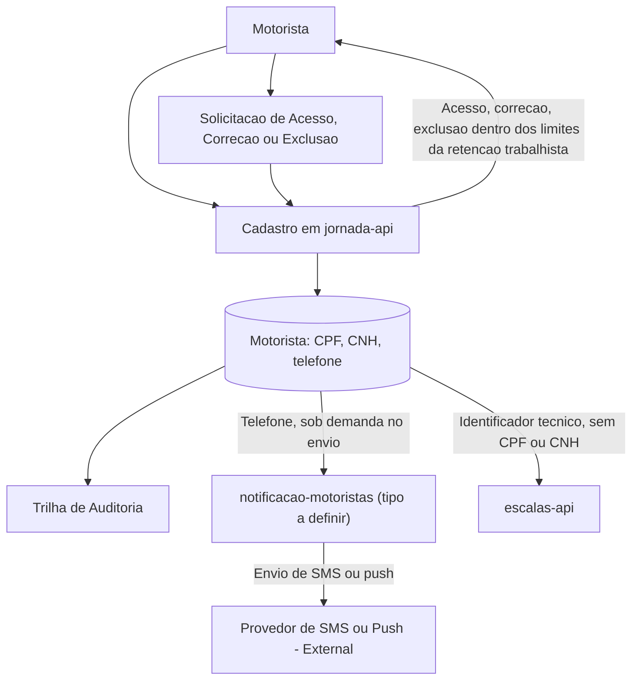

# LGPD / PII Compliance Flow

## 1. Objetivo

Descrever o fluxo de dados pessoais do motorista (CPF, CNH, telefone) e as regras de tratamento de PII no Frota Certa.

## 2. Dados Pessoais Identificados

| Dado | Categoria | Módulo Dono | Finalidade | Retenção |
|---|---|---|---|---|
| CPF do motorista | Pessoal | jornada-api | Identificação do motorista para fins trabalhistas e de escala | 5 anos após o desligamento (NFR-01) |
| CNH do motorista | Pessoal / Sensível (habilitação profissional) | jornada-api | Comprovação de habilitação para conduzir o veículo | 5 anos após o desligamento (NFR-01) |
| Telefone do motorista | Pessoal | jornada-api | Envio de notificação de escala (FR-05) via notificacao-motoristas | 5 anos após o desligamento (NFR-01) |

## 3. Diagrama de Fluxo PII

## 4. Regras LGPD / PII

| Regra | Descrição |
|---|---|
| Minimização | escalas-api e notificacao-motoristas devem referenciar o motorista por identificador técnico, nunca por CPF ou CNH |
| Finalidade | CPF e CNH têm finalidade de identificação/habilitação trabalhista; telefone tem finalidade de notificação de escala (FR-05) |
| Controle de acesso | Acesso a CPF/CNH/telefone deve ser restrito a jornada-api e auditável |
| Mascaramento | Logs de todos os módulos não devem exibir CPF, CNH ou telefone em claro |
| Retenção | 5 anos após o desligamento do motorista, por obrigação trabalhista (NFR-01) |
| Auditoria | Todo acesso de leitura ou escrita a Motorista deve ser auditável |
| Direitos do titular | Fluxo de acesso, correção e exclusão do motorista, respeitando o piso de retenção trabalhista de 5 anos (Ponto a Validar quanto ao processo formal) |

## 5. Pontos a Validar

| Código | Ponto | Impacto |
|---|---|---|
| VAL-JOR-01 | Forma de obtenção do telefone por notificacao-motoristas (API síncrona, replicação ou payload do evento) não definida | Impacta a superfície de exposição de PII e a arquitetura de integração |
| VAL-MOD-01 | Tipo de módulo de notificacao-motoristas (worker vs. rota em BFF) ainda não decidido pelo comitê | Impacta onde e como o telefone é processado tecnicamente |
| VAL-PII-01 | Processo formal de atendimento a direitos do titular (acesso, correção, exclusão) não descrito nesta base | Define o fluxo operacional de atendimento a solicitações de titulares |
