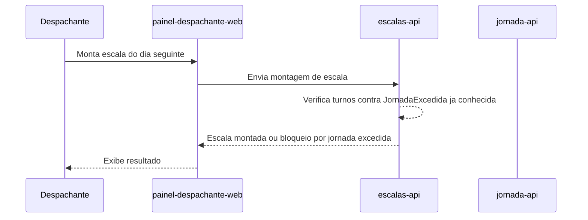
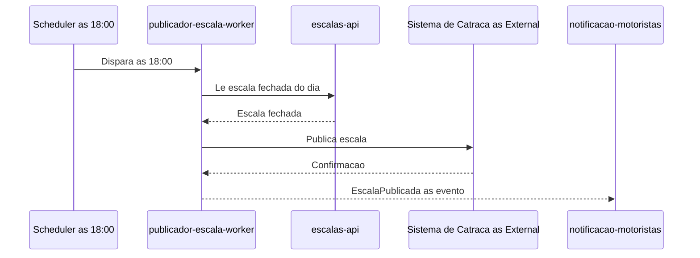
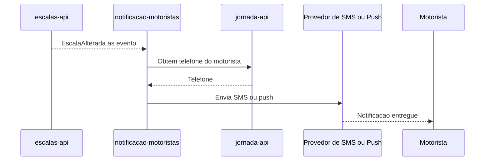

# Integration Flows

## 1. Objetivo

Documentar os principais fluxos de integração entre os módulos do Frota Certa e os sistemas externos.

## 2. Fluxo - Montagem e Bloqueio de Escala

## 3. Fluxo - Publicação da Escala Fechada

## 4. Fluxo - Notificação de Mudança de Escala

## 5. Regras do Fluxo

| Regra | Descrição |
|---|---|
| Bloqueio antes da publicação | Nenhum turno que exceda 10h diárias pode chegar ao fechamento da escala (FR-04) |
| Janela de publicação | A publicação da escala fechada não pode atrasar mais de 10 min além de 18:00 (NFR-02) |
| Minimização de PII em trânsito | O telefone do motorista só deve trafegar entre jornada-api e notificacao-motoristas no momento do envio, sem replicação persistente (Ponto a Validar, VAL-JOR-01) |

## 6. Pontos de Falha

| Ponto | Tratamento Esperado |
|---|---|
| Escala não fecha a tempo em escalas-api | publicador-escala-worker não tem o que publicar às 18:00; alertar operação (RISK-MOD-02 de publicador-escala-worker) |
| Sistema de catraca indisponível às 18:00 | Retry com backoff e alerta imediato (RISK-MOD-01 de publicador-escala-worker) |
| Provedor de SMS/push indisponível | Retry e fila de reenvio (Ponto a Validar quanto à estratégia exata) |
