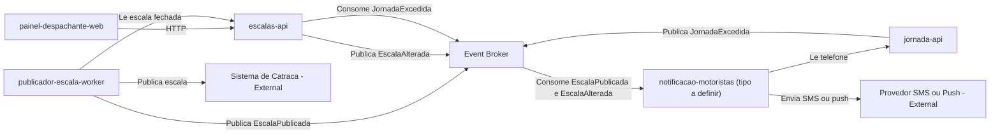

# Module Dependencies Diagram

## 1. Objetivo

Mostrar as dependências diretas e indiretas entre os módulos do Frota Certa.

## 2. Diagrama

## 3. Matriz de Dependências

| Origem | Destino | Tipo | Obrigatória? | Observação |
|---|---|---|---|---|
| painel-despachante-web | escalas-api | Síncrona | Sim | Montagem e consulta de escala (FR-01) |
| publicador-escala-worker | escalas-api | Síncrona | Sim | Leitura da escala fechada (FR-03) |
| publicador-escala-worker | Sistema de Catraca (externa) | Síncrona ou Assíncrona (Ponto a Validar) | Sim | Protocolo não especificado (VAL-MOD-04) |
| escalas-api | Event Broker | Assíncrona | Sim | Publica EscalaAlterada, consome JornadaExcedida |
| jornada-api | Event Broker | Assíncrona | Sim | Publica JornadaExcedida |
| notificacao-motoristas | Event Broker | Assíncrona | Sim | Consome EscalaPublicada e EscalaAlterada |
| notificacao-motoristas | jornada-api | Dados | Sim | Leitura do telefone do motorista (VAL-JOR-01) |
| notificacao-motoristas | Provedor de SMS/push (externa) | Externa | Sim | Provedor não especificado (VAL-MOD-04) |
