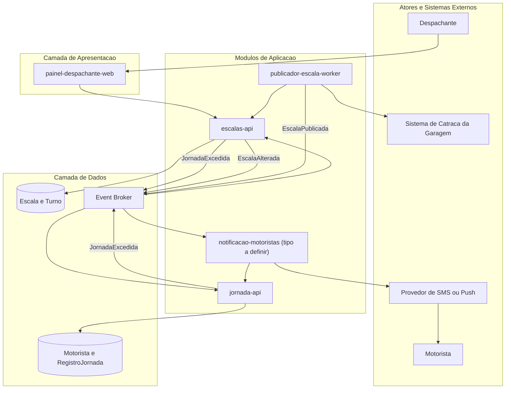

# Solution Architecture Diagram

## 1. Objetivo

Mostrar como os módulos do Frota Certa se relacionam em alto nível.

## 2. Diagrama

## 3. Observações

- `notificacao-motoristas` está desenhado como módulo de aplicação separado por ser assim que o Solution Module Map do DDD o lista, mas seu tipo final (worker próprio ou rota dentro de um BFF do painel) é um Ponto a Validar explícito (VAL-MOD-01) — não deve ser interpretado como decisão tomada.
- Não há Context Map ou Data Model nesta base; a separação de bancos de dados (Escala/Turno vs. Motorista/RegistroJornada) segue a Data Ownership do DDD Segmentation, não uma decisão de infraestrutura confirmada.
- O produto não possui zona de escopo PCI DSS (NFR-03) — não há subgrafo de CDE neste diagrama.
