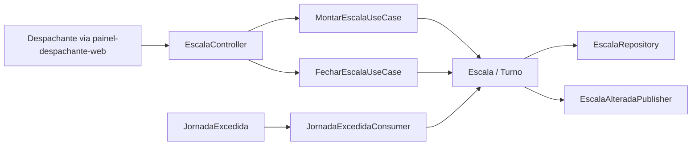
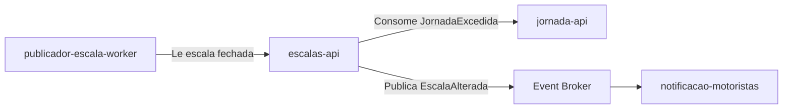
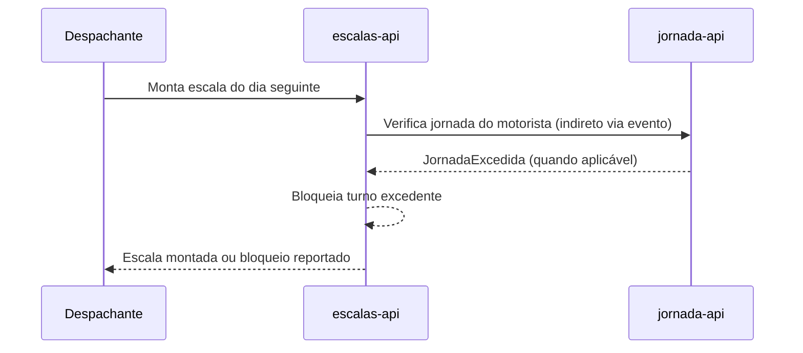

# Module - Escalas API

## 1. Visão Geral

Módulo que monta, fecha e disponibiliza a escala diária de motoristas e veículos da Viação Aurora. É o dono do agregado Escala e do Turno, e é o consumidor do evento `JornadaExcedida` para bloquear escalas que violem o limite de jornada.

## 2. Classificação

| Item | Valor |
|---|---|
| Tipo de Módulo | Microservice |
| Deployable Candidato | Sim |
| Bounded Context Relacionado | Programação de Escalas |
| Subdomínio DDD | Core Domain |
| Tier / Criticidade | Tier 1 |
| Status | Confirmado |

## 3. Objetivo

Permitir que o despachante monte a escala do dia seguinte e garantir que nenhuma escala publicada viole o limite de 10h diárias de jornada do motorista (FR-01, FR-04).

## 4. Responsabilidades

- Montar e persistir a escala diária (Escala, Turno) a partir da entrada do despachante
- Fechar a escala do dia seguinte para publicação
- Bloquear a inclusão de turnos que resultem em jornada acima de 10h diárias, a partir do evento `JornadaExcedida`
- Publicar o evento `EscalaAlterada` quando a escala de um motorista mudar
- Expor a escala fechada para consumo pelo `publicador-escala-worker`

## 5. Fora de Escopo

- Cadastro do motorista e registro de jornada (jornada-api)
- Publicação da escala no sistema de catraca da garagem (publicador-escala-worker)
- Envio de notificação ao motorista (notificacao-motoristas)
- Qualquer processamento de pagamento ou dado de cartão — o produto não trata isso (PRD, NFR-03)

## 6. Capacidades Atendidas

| Código | Capability | Descrição |
|---|---|---|
| FR-01 | Montagem de escala | Despachante monta a escala do dia seguinte no painel web |
| FR-04 | Bloqueio por jornada excedida | Registrar início/fim de jornada e bloquear escala que exceda 10h diárias (consumo do evento JornadaExcedida; o registro de jornada em si é do jornada-api) |

## 7. Bounded Context e Linguagem Ubíqua

| Termo | Definição |
|---|---|
| Escala | Agregado que representa a programação de turnos de motoristas e veículos para um dia |
| Turno | Unidade de trabalho dentro de uma Escala, associada a um motorista e um veículo |

Não havia glossário de linguagem ubíqua disponível nesta base; os termos acima foram extraídos diretamente do DDD Segmentation.

## 8. Componentes Internos Candidatos

| Componente | Tipo | Responsabilidade |
|---|---|---|
| EscalaController | API Controller | Expõe endpoints de montagem e consulta de escala |
| MontarEscalaUseCase | Use Case | Monta a escala a partir da entrada do despachante |
| FecharEscalaUseCase | Use Case | Fecha a escala do dia seguinte para publicação |
| Escala, Turno | Domain Model | Agregados do domínio |
| EscalaRepository | Repository | Persistência de Escala e Turno |
| JornadaExcedidaConsumer | Consumer | Consome o evento JornadaExcedida e bloqueia o turno correspondente |
| EscalaAlteradaPublisher | Publisher | Publica o evento EscalaAlterada |

## 9. APIs Principais

| Método | Endpoint | Finalidade | Consumidores |
|---|---|---|---|
| POST | /escalas (Ponto a Validar — nome exato do endpoint não definido nesta base) | Despachante monta/atualiza a escala do dia seguinte (FR-01) | painel-despachante-web |
| GET | /escalas/hoje (Ponto a Validar — FR-02 registra que "o endpoint ainda não definido pela equipe de integração") | Consulta da escala do dia, cujo consumidor final é o motorista | Canal do motorista — Ponto a Validar (ver VAL-MOD-01) |

## 10. Eventos Publicados

| Evento | Quando é publicado | Consumidores |
|---|---|---|
| EscalaAlterada | Quando a escala de um motorista é criada ou modificada após já ter sido comunicada | notificacao-motoristas |

## 11. Eventos Consumidos

| Evento | Produtor | Finalidade |
|---|---|---|
| JornadaExcedida | jornada-api | Bloquear a criação/manutenção de um turno que faria o motorista exceder 10h diárias |

## 12. Dados Próprios

| Entidade/Tabela/Collection | Tipo | Banco/Persistência | Observações |
|---|---|---|---|
| Escala | Aggregate Root | Ponto a Validar — tecnologia de persistência não definida nesta base | Programação diária de turnos |
| Turno | Aggregate | Ponto a Validar — tecnologia de persistência não definida nesta base | Associa motorista e veículo a um período do dia |

## 13. Integrações

| Sistema/Módulo | Tipo de Integração | Direção | Observações |
|---|---|---|---|
| jornada-api | Evento (JornadaExcedida) | Entrada | Consumida para bloqueio de jornada |
| notificacao-motoristas | Evento (EscalaAlterada) | Saída | Notifica mudança de escala |
| publicador-escala-worker | API ou leitura de dados (Ponto a Validar) | Saída | Fornece a escala fechada para publicação às 18:00 |
| painel-despachante-web | HTTP | Entrada | Consumido pelo painel do despachante |

## 14. Dependências

### 14.1 Dependências de Domínio

- Depende do bounded context Jornada do Motorista para saber quando uma jornada foi excedida (evento JornadaExcedida)

### 14.2 Dependências Técnicas

- Banco de dados para persistência de Escala e Turno (Ponto a Validar — tecnologia não definida)
- Broker de eventos para publicar EscalaAlterada e consumir JornadaExcedida (Ponto a Validar — tecnologia não definida)

### 14.3 Dependências Operacionais

- Job/agenda que aciona o fechamento da escala antes das 18:00, para que o publicador-escala-worker tenha o que publicar (Ponto a Validar — se o fechamento é automático ou acionado pelo despachante)
- Observabilidade de bloqueios de jornada excedida, dado o impacto trabalhista (CLT)

## 15. Requisitos Não Funcionais Relevantes

| Categoria | Requisito / Observação |
|---|---|
| Performance | Não especificado nesta base |
| Segurança | Controle de acesso do despachante ao painel (não detalhado nesta base — Ponto a Validar) |
| Disponibilidade | NFR-02 — a publicação da escala fechada às 18:00 não pode atrasar mais de 10 min; escalas-api precisa fechar a escala a tempo do publicador-escala-worker cumprir esse prazo |
| Observabilidade | Auditoria de bloqueios por jornada excedida, dado o vínculo com obrigação trabalhista (CLT) |
| Compliance | Não trata diretamente CPF/CNH/telefone (dados de propriedade do jornada-api), mas referencia o motorista responsável por cada Turno — ver VAL-MOD-05 |
| Resiliência | Não especificado nesta base |
| Privacidade | Turno referencia um identificador de motorista; não deve replicar CPF/CNH/telefone (esses são dados próprios do jornada-api) |
| Auditabilidade | Alterações de escala devem ser rastreáveis, dado o impacto na rotina do motorista e na obrigação de publicação às 18:00 |

## 16. Compliance Aplicável

| Compliance / Norma / Lei | Aplicável? | Motivo | Impacto no Módulo |
|---|---|---|---|
| PCI DSS | Não | NFR-03 e o PRD declaram explicitamente que o produto não trata dados de cartão nem movimenta dinheiro | Nenhum |
| LGPD / GDPR / Privacidade | Ponto a Validar | O módulo referencia o motorista responsável por cada Turno, mas não é dono de CPF/CNH/telefone (propriedade do jornada-api, NFR-01) | Deve evitar duplicar dados pessoais; usar identificador não sensível para referenciar o motorista |
| SOX / Auditoria Financeira | Não | Produto não movimenta dinheiro (PRD) | Nenhum |
| Outra | — | — | — |

## 17. Observabilidade

| Item | Recomendação Inicial |
|---|---|
| Logs | Logs estruturados com correlation_id, incluindo id da escala e do turno |
| Métricas | Contagem de escalas fechadas, contagem de bloqueios por jornada excedida |
| Traces | Trace do fluxo de montagem→fechamento→publicação da escala |
| Alertas | Alerta se a escala não fechar a tempo de cumprir a janela de publicação de 18:00 (NFR-02) |
| Health Checks | Endpoint de health padrão |
| Auditoria | Registro de quem montou/alterou cada escala |

## 18. Diagramas do Módulo

### 18.1 Diagrama de Componentes Internos

### 18.2 Diagrama de Dependências

### 18.3 Diagrama de Fluxo Principal

## 19. Riscos

| Código | Risco | Impacto | Mitigação |
|---|---|---|---|
| RISK-MOD-01 | Fechamento tardio da escala pode violar o prazo de publicação de 18:00 (NFR-02) | Atraso na publicação para o sistema de catraca e para o motorista | Definir horário de corte para fechamento com folga antes das 18:00 |
| RISK-MOD-02 | Duplicação de dados pessoais do motorista (nome, CPF) dentro de Turno, ferindo ownership do jornada-api | Inconsistência de dados e risco LGPD | Referenciar motorista por identificador técnico, nunca por CPF/CNH |

## 20. Pontos a Validar

| Código | Ponto | Impacto | Recomendação |
|---|---|---|---|
| VAL-MOD-03 | FR-02 não define o endpoint nem o canal de consumo pelo motorista ("endpoint ainda não definido pela equipe de integração") | Impacta a API principal e a existência de um canal dedicado ao motorista | Validar com a equipe de integração antes de implementar |
| VAL-ESC-01 | Tecnologia de persistência e de broker de eventos não definida nesta base | Impacta dependências técnicas | Validar com TRD/ADR quando existirem |
| VAL-ESC-02 | Não está claro se o fechamento da escala é automático (agendado) ou acionado manualmente pelo despachante | Impacta a garantia do prazo de publicação de 18:00 (NFR-02) | Confirmar com o time de produto |

## 21. Backlog Inicial Sugerido

| Tipo | Item | Descrição |
|---|---|---|
| Epic | Montagem e publicação de escala | Cobrir FR-01, FR-03 (via worker) e FR-04 |
| Story Técnica | Consumo de JornadaExcedida | Implementar bloqueio de turno a partir do evento |
| Story Técnica | Publicação de EscalaAlterada | Publicar evento ao alterar escala já comunicada |
| Task | Definir endpoint de consulta do motorista (FR-02) | Alinhar com equipe de integração (VAL-MOD-03) |

## 22. Referências

| Documento | Seção |
|---|---|
| DDD Segmentation | Solution Module Map |
| DDD Segmentation | Data Ownership |
| DDD Segmentation | Eventos de Domínio |
| FRD | FR-01, FR-02, FR-04 |
| NFRD | NFR-02 |
