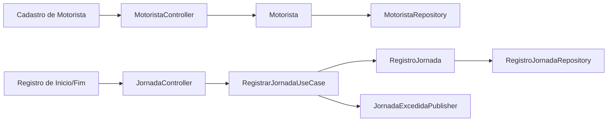
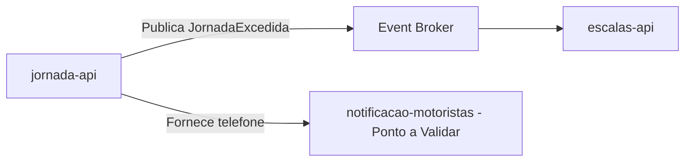
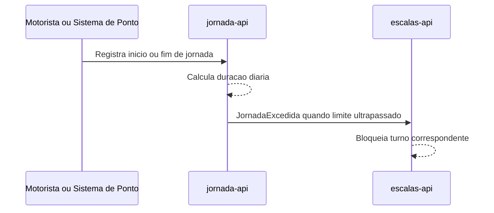

# Module - Jornada API

## 1. Visão Geral

Módulo dono do cadastro do motorista (CPF, CNH, telefone) e dos registros de jornada, responsável por controlar o cumprimento do limite de 10h diárias exigido pela CLT (FR-04). É o módulo com maior exposição a dados pessoais do produto (NFR-01).

## 2. Classificação

| Item | Valor |
|---|---|
| Tipo de Módulo | Microservice |
| Deployable Candidato | Sim |
| Bounded Context Relacionado | Jornada do Motorista |
| Subdomínio DDD | Supporting Subdomain |
| Tier / Criticidade | Tier 1 |
| Status | Confirmado |

## 3. Objetivo

Manter o cadastro do motorista e registrar o início/fim de cada jornada, detectando e sinalizando quando um motorista está prestes a exceder 10h diárias, para que a escala correspondente seja bloqueada (FR-04).

## 4. Responsabilidades

- Cadastrar e manter os dados do motorista: CPF, CNH, telefone
- Registrar início e fim de jornada de trabalho do motorista
- Calcular a duração da jornada diária e detectar excesso acima de 10h
- Publicar o evento JornadaExcedida quando o limite for ultrapassado ou estiver na iminência de ser
- Aplicar a política de retenção de dados pessoais definida em NFR-01 (5 anos após o desligamento)

## 5. Fora de Escopo

- Montagem e fechamento da escala (escalas-api)
- Publicação da escala no sistema de catraca (publicador-escala-worker)
- Envio de notificação ao motorista (notificacao-motoristas) — este módulo é a fonte do telefone, mas não envia a notificação
- Qualquer processamento de pagamento ou dado de cartão — não aplicável (PRD, NFR-03)

## 6. Capacidades Atendidas

| Código | Capability | Descrição |
|---|---|---|
| FR-04 | Controle de jornada | Registrar início/fim de jornada e sinalizar excesso de 10h diárias para bloqueio na escala |

## 7. Bounded Context e Linguagem Ubíqua

| Termo | Definição |
|---|---|
| Motorista | Aggregate que representa o cadastro do motorista, incluindo CPF, CNH e telefone |
| RegistroJornada | Aggregate que representa um registro de início/fim de jornada de trabalho de um motorista em um dia |

## 8. Componentes Internos Candidatos

| Componente | Tipo | Responsabilidade |
|---|---|---|
| MotoristaController | API Controller | Expõe cadastro e consulta de motorista |
| JornadaController | API Controller | Expõe registro de início/fim de jornada |
| RegistrarJornadaUseCase | Use Case | Registra início/fim de jornada e calcula duração |
| Motorista, RegistroJornada | Domain Model | Agregados do domínio |
| MotoristaRepository, RegistroJornadaRepository | Repository | Persistência dos agregados |
| JornadaExcedidaPublisher | Publisher | Publica o evento JornadaExcedida |
| RetencaoDadosPessoaisPolicy | Domain Service | Aplica a política de retenção de 5 anos pós-desligamento (NFR-01) |

## 9. APIs Principais

| Método | Endpoint | Finalidade | Consumidores |
|---|---|---|---|
| POST | /motoristas (Ponto a Validar — nome exato do endpoint não definido nesta base) | Cadastro de motorista | painel-despachante-web (Ponto a Validar — não há evidência de qual módulo faz o cadastro do motorista) |
| POST | /jornadas/inicio, /jornadas/fim (Ponto a Validar) | Registro de início/fim de jornada | Ponto a Validar — canal do motorista não definido (mesmo gap de FR-02) |

## 10. Eventos Publicados

| Evento | Quando é publicado | Consumidores |
|---|---|---|
| JornadaExcedida | Quando o registro de jornada indica que o motorista atingiria ou ultrapassaria 10h diárias | escalas-api |

## 11. Eventos Consumidos

Este módulo não consome eventos diretamente.

## 12. Dados Próprios

| Entidade/Tabela/Collection | Tipo | Banco/Persistência | Observações |
|---|---|---|---|
| Motorista (CPF, CNH, telefone) | Aggregate Root | Ponto a Validar — tecnologia não definida nesta base | Dado pessoal sensível (CPF, CNH); reter por 5 anos após desligamento (NFR-01) |
| RegistroJornada | Aggregate | Ponto a Validar — tecnologia não definida nesta base | Base para o cálculo de excesso de jornada; relevante para auditoria trabalhista |

## 13. Integrações

| Sistema/Módulo | Tipo de Integração | Direção | Observações |
|---|---|---|---|
| escalas-api | Evento (JornadaExcedida) | Saída | Aciona o bloqueio de turno |
| notificacao-motoristas | Dado (telefone) | Saída | Ponto a Validar — se o telefone é replicado, consultado sob demanda ou enviado apenas no evento (ver VAL-JOR-01) |

## 14. Dependências

### 14.1 Dependências de Domínio

- Nenhuma dependência de domínio externa identificada; jornada-api é a fonte de verdade do motorista e da jornada

### 14.2 Dependências Técnicas

- Banco de dados para persistência de Motorista e RegistroJornada, com controle de acesso restrito por conter CPF/CNH (Ponto a Validar — tecnologia não definida)
- Broker de eventos para publicar JornadaExcedida (Ponto a Validar)

### 14.3 Dependências Operacionais

- Job de retenção/expurgo de dados pessoais após 5 anos do desligamento (NFR-01)
- Controle de acesso e criptografia em repouso para CPF/CNH (Ponto a Validar — mecanismo não definido nesta base)
- Auditoria de acesso a dados pessoais

## 15. Requisitos Não Funcionais Relevantes

| Categoria | Requisito / Observação |
|---|---|
| Performance | Não especificado nesta base |
| Segurança | Controle de acesso restrito a CPF/CNH/telefone; criptografia em repouso recomendada (Ponto a Validar quanto ao mecanismo) |
| Disponibilidade | Não especificado nesta base |
| Observabilidade | Auditoria de leitura e escrita de dados pessoais |
| Compliance | NFR-01 — CPF, CNH e telefone são dados pessoais; retenção de 5 anos após o desligamento (obrigação trabalhista) |
| Resiliência | Não especificado nesta base |
| Privacidade | Módulo concentra os dados pessoais mais sensíveis do produto; aplicar minimização ao expor dados a outros módulos (ex.: escalas-api deve referenciar motorista por id, não por CPF) |
| Auditabilidade | Toda alteração de cadastro do motorista e todo cálculo de excesso de jornada devem ser auditáveis, dado o vínculo trabalhista (CLT) |

## 16. Compliance Aplicável

| Compliance / Norma / Lei | Aplicável? | Motivo | Impacto no Módulo |
|---|---|---|---|
| PCI DSS | Não | NFR-03 e o PRD declaram que o produto não trata dados de cartão nem movimenta dinheiro | Nenhum |
| LGPD / GDPR / Privacidade | Sim | NFR-01 — CPF, CNH e telefone do motorista são dados pessoais, com retenção obrigatória de 5 anos após desligamento | Exige base legal, controle de acesso, criptografia em repouso, política de retenção e expurgo, e minimização ao expor dados a outros módulos |
| SOX / Auditoria Financeira | Não | Produto não movimenta dinheiro | Nenhum |
| Outra | Legislação trabalhista (CLT) | A obrigação de reter RegistroJornada e limitar jornada a 10h/dia decorre da CLT | Retenção e integridade dos registros de jornada como evidência trabalhista |

## 17. Observabilidade

| Item | Recomendação Inicial |
|---|---|
| Logs | Logs estruturados com correlation_id; nunca logar CPF, CNH ou telefone em claro |
| Métricas | Quantidade de jornadas registradas, quantidade de excessos detectados |
| Traces | Trace do fluxo de registro de jornada até a publicação de JornadaExcedida |
| Alertas | Alerta de excesso recorrente de jornada por motorista (indicador de risco trabalhista) |
| Health Checks | Endpoint de health padrão |
| Auditoria | Log de todo acesso de leitura/escrita a dados de Motorista, com identidade de quem acessou |

## 18. Diagramas do Módulo

### 18.1 Diagrama de Componentes Internos

### 18.2 Diagrama de Dependências

### 18.3 Diagrama de Fluxo Principal

## 19. Riscos

| Código | Risco | Impacto | Mitigação |
|---|---|---|---|
| RISK-MOD-01 | Exposição de CPF/CNH/telefone por replicação em outros módulos (ex.: escalas-api, notificacao-motoristas) | Violação de minimização de dados exigida pela LGPD | Expor apenas identificador técnico do motorista; telefone entregue apenas no momento do envio de notificação, não replicado |
| RISK-MOD-02 | Retenção indevida (além ou aquém dos 5 anos exigidos por NFR-01) | Risco de não conformidade trabalhista/LGPD | Implementar job de expurgo automático alinhado a NFR-01 |

## 20. Pontos a Validar

| Código | Ponto | Impacto | Recomendação |
|---|---|---|---|
| VAL-JOR-01 | Não está definido se o telefone do motorista é replicado para notificacao-motoristas, consultado sob demanda, ou incluído apenas no payload do evento | Impacta modelagem de dados e superfície de exposição de PII | Definir junto ao desenho de notificacao-motoristas quando o tipo do módulo for decidido (VAL-MOD-01) |
| VAL-MOD-05 | Tecnologia de persistência e de broker de eventos não definida nesta base | Impacta dependências técnicas | Validar com TRD/ADR quando existirem |

## 21. Backlog Inicial Sugerido

| Tipo | Item | Descrição |
|---|---|---|
| Epic | Cadastro e controle de jornada do motorista | Cobrir FR-04 e NFR-01 |
| Story Técnica | Publicação de JornadaExcedida | Detectar e publicar excesso de jornada em tempo hábil para o bloqueio em escalas-api |
| Story Técnica | Política de retenção de dados pessoais | Implementar expurgo automático após 5 anos do desligamento (NFR-01) |
| Task | Definir superfície de exposição do telefone para notificação | Depende de VAL-JOR-01 e VAL-MOD-01 |

## 22. Referências

| Documento | Seção |
|---|---|
| DDD Segmentation | Solution Module Map |
| DDD Segmentation | Data Ownership |
| DDD Segmentation | Eventos de Domínio |
| FRD | FR-04 |
| NFRD | NFR-01 |
