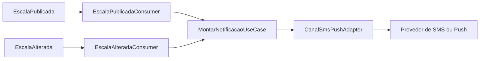
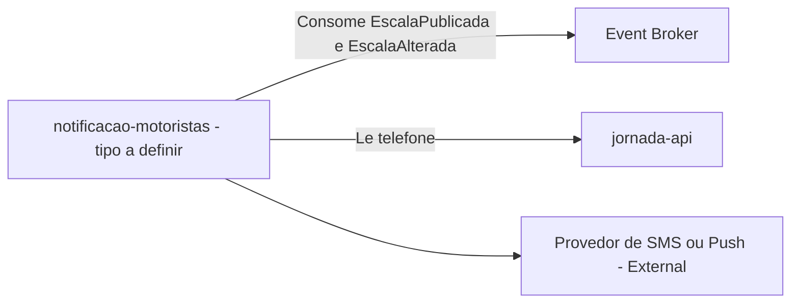
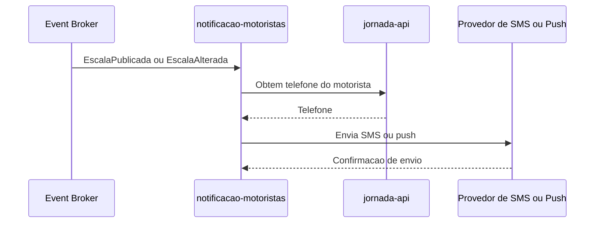

# Module - Notificacao Motoristas

## 1. Visão Geral

Responsável por avisar o motorista por SMS/push quando a escala dele mudar (FR-05). O DDD Segmentation registra este módulo no Solution Module Map com o tipo explicitamente em aberto: "A definir — worker próprio ou rota dentro do painel-despachante-bff; o comitê não decidiu". Este README documenta as responsabilidades funcionais do módulo sem decidir essa forma de implantação — a decisão pertence ao comitê citado no DDD.

## 2. Classificação

| Item | Valor |
|---|---|
| Tipo de Módulo | Ponto a Validar — candidatos documentados no DDD: Worker próprio (CronJob/Worker) ou rota dentro de um BFF do painel do despachante. Este documento não escolhe entre as duas opções. |
| Deployable Candidato | Ponto a Validar — depende da decisão do comitê |
| Bounded Context Relacionado | Comunicação |
| Subdomínio DDD | Generic Subdomain |
| Tier / Criticidade | Tier 2 |
| Status | Ponto a Validar |

## 3. Objetivo

Notificar o motorista por SMS/push sempre que a escala dele for publicada ou alterada (FR-05), a partir dos eventos EscalaPublicada e EscalaAlterada.

## 4. Responsabilidades

- Consumir os eventos EscalaPublicada e EscalaAlterada
- Selecionar os motoristas impactados por cada evento
- Obter o telefone do motorista a partir do jornada-api (dono do dado, ver VAL-JOR-01)
- Enviar a notificação por SMS ou push ao motorista

## 5. Fora de Escopo

- Montagem, fechamento ou publicação da escala (escalas-api, publicador-escala-worker)
- Cadastro do motorista e dados de jornada (jornada-api, dono de CPF/CNH/telefone)
- Decidir a forma de implantação (worker próprio vs. rota em BFF) — decisão do comitê, fora do escopo deste agente

## 6. Capacidades Atendidas

| Código | Capability | Descrição |
|---|---|---|
| FR-05 | Notificação de mudança de escala | Notificar o motorista por SMS/push quando a escala dele mudar |

## 7. Bounded Context e Linguagem Ubíqua

| Termo | Definição |
|---|---|
| Notificacao | Aggregate/entidade que representa o envio de um aviso (SMS/push) ao motorista sobre sua escala |

## 8. Componentes Internos Candidatos

| Componente | Tipo | Responsabilidade |
|---|---|---|
| EscalaPublicadaConsumer | Consumer | Reage ao evento EscalaPublicada |
| EscalaAlteradaConsumer | Consumer | Reage ao evento EscalaAlterada |
| MontarNotificacaoUseCase | Use Case | Monta a mensagem e resolve o destinatário |
| CanalSmsPushAdapter | Adapter | Envia a notificação via provedor externo de SMS/push |

Observação: se a decisão do comitê for "rota dentro do painel-despachante-bff", estes mesmos componentes seriam reclassificados como componentes internos de um módulo BFF maior, em vez de um deployable próprio. A lista de componentes é válida nas duas alternativas.

## 9. APIs Principais

Este módulo não expõe API pública. Atua como worker, adapter, package ou componente interno.

Observação: se implementado como rota dentro de um BFF, poderia expor endpoints administrativos (ex.: reenvio manual de notificação); isso não está definido nesta base.

## 10. Eventos Publicados

Este módulo não publica eventos de domínio próprios.

## 11. Eventos Consumidos

| Evento | Produtor | Finalidade |
|---|---|---|
| EscalaPublicada | publicador-escala-worker (Inferência Arquitetural, ver VAL-MOD-02) | Notificar o motorista da nova escala publicada |
| EscalaAlterada | escalas-api | Notificar o motorista de uma mudança na escala já comunicada |

## 12. Dados Próprios

Este módulo é stateless e não possui dados próprios. Não é dono de CPF, CNH ou telefone — esses dados pertencem a jornada-api (NFR-01).

## 13. Integrações

| Sistema/Módulo | Tipo de Integração | Direção | Observações |
|---|---|---|---|
| jornada-api | API ou Evento (Ponto a Validar, VAL-JOR-01) | Entrada | Obtenção do telefone do motorista |
| Provedor de SMS/push (externo) | API | Saída | Provedor não especificado nesta base (VAL-MOD-04) |

## 14. Dependências

### 14.1 Dependências de Domínio

- Depende de jornada-api para o telefone do motorista
- Depende dos eventos EscalaPublicada e EscalaAlterada

### 14.2 Dependências Técnicas

- Cliente/adapter para o provedor de SMS/push (Ponto a Validar — provedor não especificado)
- Broker de eventos para consumir EscalaPublicada e EscalaAlterada (Ponto a Validar)

### 14.3 Dependências Operacionais

- Se worker próprio: infraestrutura de deploy e escala independente
- Se rota em BFF: acopla o ciclo de deploy deste componente ao do BFF do painel do despachante
- Ambos os cenários exigem controle de acesso ao telefone do motorista (dado pessoal)

## 15. Requisitos Não Funcionais Relevantes

| Categoria | Requisito / Observação |
|---|---|
| Performance | Não especificado nesta base |
| Segurança | Acesso ao telefone do motorista deve ser restrito e auditável |
| Disponibilidade | Não especificado nesta base; indiretamente relevante, pois a notificação segue a publicação de 18:00 (NFR-02) |
| Observabilidade | Taxa de sucesso/falha de envio de SMS/push |
| Compliance | LGPD — trata (sem armazenar permanentemente) o telefone do motorista, dado pessoal de propriedade do jornada-api |
| Resiliência | Retry em caso de falha do provedor de SMS/push (Ponto a Validar) |
| Privacidade | Não deve persistir telefone além do necessário para o envio; não deve logar o número em claro |
| Auditabilidade | Registro de que a notificação foi enviada (sem necessariamente reter o conteúdo) |

## 16. Compliance Aplicável

| Compliance / Norma / Lei | Aplicável? | Motivo | Impacto no Módulo |
|---|---|---|---|
| PCI DSS | Não | NFR-03 declara que o produto não trata dados de cartão nem movimenta dinheiro | Nenhum |
| LGPD / GDPR / Privacidade | Sim | O módulo processa o telefone do motorista (dado pessoal, NFR-01) para envio de SMS/push, ainda que não seja o dono do dado | Minimizar retenção do telefone, não logar em claro, e tratar o provedor externo de SMS/push como operador de dados pessoais |
| SOX / Auditoria Financeira | Não | Produto não movimenta dinheiro | Nenhum |
| Outra | — | — | — |

## 17. Observabilidade

| Item | Recomendação Inicial |
|---|---|
| Logs | Logs estruturados com correlation_id; mascarar o telefone do motorista |
| Métricas | Taxa de entrega de SMS/push, latência entre evento e envio |
| Traces | Trace do fluxo evento → resolução de destinatário → envio |
| Alertas | Alerta se a taxa de falha de envio exceder um limiar |
| Health Checks | Verificação de conectividade com o provedor de SMS/push |
| Auditoria | Registro de que uma notificação foi enviada para um motorista, sem reter o número em texto claro além do necessário |

## 18. Diagramas do Módulo

### 18.1 Diagrama de Componentes Internos

### 18.2 Diagrama de Dependências

### 18.3 Diagrama de Fluxo Principal

## 19. Riscos

| Código | Risco | Impacto | Mitigação |
|---|---|---|---|
| RISK-MOD-01 | Indecisão sobre o tipo de módulo (worker vs. rota em BFF) atrasa a definição de infraestrutura de deploy e observabilidade | Bloqueio de planejamento técnico até decisão do comitê | Sinalizar como bloqueador explícito para o comitê (VAL-MOD-01); não inferir a decisão |
| RISK-MOD-02 | Exposição do telefone do motorista em logs ou em trânsito sem proteção adequada | Violação de LGPD | Mascarar em logs, usar canal seguro com o provedor de SMS/push |

## 20. Pontos a Validar

| Código | Ponto | Impacto | Recomendação |
|---|---|---|---|
| VAL-MOD-01 | O comitê ainda não decidiu se este módulo é um worker próprio ou uma rota dentro do painel-despachante-bff. Este README documenta as duas alternativas sem escolher uma. | Define o deployable, a infraestrutura, o ciclo de deploy e a criticidade operacional do módulo | Aguardar decisão do comitê antes de detalhar arquitetura técnica ou criar projeto de código |
| VAL-JOR-01 | Forma de obtenção do telefone do motorista (API síncrona, replicação, payload do evento) não definida | Impacta modelagem de dados e superfície de exposição de PII | Definir junto com jornada-api quando VAL-MOD-01 for resolvido |
| VAL-MOD-04 | Provedor de SMS/push não especificado | Impacta o CanalSmsPushAdapter e as dependências técnicas | Validar com produto/fornecedores |

## 21. Backlog Inicial Sugerido

| Tipo | Item | Descrição |
|---|---|---|
| Epic | Notificação do motorista | Cobrir FR-05 |
| Task | Levar VAL-MOD-01 ao comitê | Decisão bloqueadora antes de detalhamento técnico |
| Story Técnica | Consumo de EscalaPublicada e EscalaAlterada | Implementar os consumers, independente da decisão de deployable |

## 22. Referências

| Documento | Seção |
|---|---|
| DDD Segmentation | Solution Module Map (nota explícita: "o comitê não decidiu") |
| DDD Segmentation | Eventos de Domínio |
| FRD | FR-05 |
| NFRD | NFR-01 |
