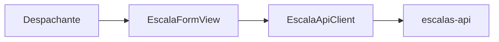
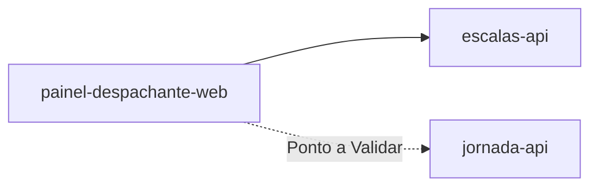
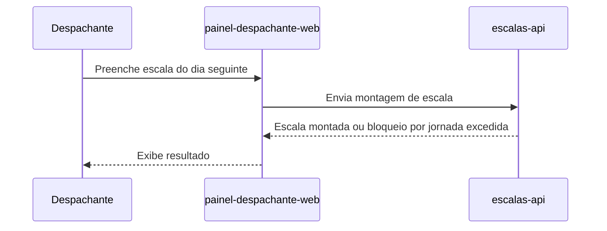

# Module - Painel Despachante Web

## 1. Visão Geral

Painel web utilizado pelo despachante da Viação Aurora para montar a escala diária de motoristas e veículos (FR-01).

## 2. Classificação

| Item | Valor |
|---|---|
| Tipo de Módulo | Frontend |
| Deployable Candidato | Sim |
| Bounded Context Relacionado | Não é dono de um bounded context; consome Programação de Escalas via escalas-api |
| Subdomínio DDD | Não aplicável (camada de apresentação) |
| Tier / Criticidade | Tier 2 |
| Status | Confirmado |

## 3. Objetivo

Prover a interface web pela qual o despachante monta, revisa e ajusta a escala do dia seguinte antes do fechamento (FR-01).

## 4. Responsabilidades

- Exibir a escala atual e permitir a montagem da escala do dia seguinte
- Enviar as alterações de escala para escalas-api
- Exibir eventual bloqueio por jornada excedida retornado por escalas-api (FR-04)

## 5. Fora de Escopo

- Regras de negócio de montagem, fechamento ou bloqueio de escala (escalas-api)
- Publicação para o sistema de catraca (publicador-escala-worker)
- Cadastro de motorista e jornada (jornada-api)
- Envio de notificação ao motorista (notificacao-motoristas)

## 6. Capacidades Atendidas

| Código | Capability | Descrição |
|---|---|---|
| FR-01 | Montagem de escala | Despachante monta a escala do dia seguinte no painel web |

## 7. Bounded Context e Linguagem Ubíqua

| Termo | Definição |
|---|---|
| Despachante | Ator humano responsável por montar a escala diária |

## 8. Componentes Internos Candidatos

| Componente | Tipo | Responsabilidade |
|---|---|---|
| EscalaFormView | UI Component | Formulário de montagem da escala |
| EscalaApiClient | Adapter | Cliente HTTP para escalas-api |

## 9. APIs Principais

Este módulo não expõe API pública. Atua como worker, adapter, package ou componente interno.

Observação: este é um módulo frontend — ele consome as APIs de escalas-api (e possivelmente jornada-api, ver VAL-MOD-03) em vez de expor API própria.

## 10. Eventos Publicados

Este módulo não publica eventos de domínio próprios.

## 11. Eventos Consumidos

Este módulo não consome eventos diretamente.

## 12. Dados Próprios

Este módulo é stateless e não possui dados próprios.

## 13. Integrações

| Sistema/Módulo | Tipo de Integração | Direção | Observações |
|---|---|---|---|
| escalas-api | HTTP | Saída | Montagem e consulta de escala |
| jornada-api | HTTP (Ponto a Validar) | Saída | Ponto a Validar se o cadastro de motorista é feito por este painel (VAL-MOD-03) |

## 14. Dependências

### 14.1 Dependências de Domínio

- Depende de escalas-api para montar e fechar a escala

### 14.2 Dependências Técnicas

- Nenhuma dependência técnica além do consumo de API (Ponto a Validar quanto a stack de frontend)

### 14.3 Dependências Operacionais

- Autenticação e autorização do despachante (Ponto a Validar — mecanismo não definido nesta base)

## 15. Requisitos Não Funcionais Relevantes

| Categoria | Requisito / Observação |
|---|---|
| Performance | Não especificado nesta base |
| Segurança | Autenticação do despachante não definida nesta base (Ponto a Validar) |
| Disponibilidade | Não especificado nesta base |
| Observabilidade | Não especificado nesta base |
| Compliance | Não aplicável a dados de cartão (NFR-03); Ponto a Validar quanto à exibição de dados pessoais do motorista na UI |
| Resiliência | Não especificado nesta base |
| Privacidade | Se exibir nome/CPF do motorista na tela de montagem de escala, deve seguir minimização de dados (mostrar apenas o necessário) |
| Auditabilidade | Não especificado nesta base |

## 16. Compliance Aplicável

| Compliance / Norma / Lei | Aplicável? | Motivo | Impacto no Módulo |
|---|---|---|---|
| PCI DSS | Não | NFR-03 e o PRD declaram que o produto não trata dados de cartão nem movimenta dinheiro | Nenhum |
| LGPD / GDPR / Privacidade | Ponto a Validar | Pode exibir dados do motorista (ex.: nome) na tela de montagem de escala; não há evidência de quais campos são exibidos | Minimizar exibição de dados pessoais; evitar exibir CPF/CNH salvo necessidade operacional comprovada |
| SOX / Auditoria Financeira | Não | Produto não movimenta dinheiro | Nenhum |
| Outra | — | — | — |

## 17. Observabilidade

| Item | Recomendação Inicial |
|---|---|
| Logs | Logs de erros de UI e falhas de chamada à API, sem dados pessoais |
| Métricas | Não especificado nesta base |
| Traces | Correlação com as chamadas a escalas-api |
| Alertas | Não especificado nesta base |
| Health Checks | Não aplicável a frontend estático/SPA |
| Auditoria | Não especificado nesta base |

## 18. Diagramas do Módulo

### 18.1 Diagrama de Componentes Internos

### 18.2 Diagrama de Dependências

### 18.3 Diagrama de Fluxo Principal

## 19. Riscos

| Código | Risco | Impacto | Mitigação |
|---|---|---|---|
| RISK-MOD-01 | Exposição de dados pessoais do motorista na tela sem necessidade operacional | Risco LGPD | Minimizar campos exibidos; validar com jornada-api quais dados são realmente necessários |

## 20. Pontos a Validar

| Código | Ponto | Impacto | Recomendação |
|---|---|---|---|
| VAL-MOD-03 | Não há evidência de qual módulo faz o cadastro de motorista nem de qual canal serve a consulta de escala pelo motorista (FR-02) | Impacta se este painel também cobre cadastro de motorista, ou se isso pertence a outro canal | Validar com produto e com a equipe de integração |
| VAL-PAINEL-01 | Autenticação e autorização do despachante não definidas nesta base | Impacta segurança do painel | Definir mecanismo de autenticação (Ponto a Validar) |

## 21. Backlog Inicial Sugerido

| Tipo | Item | Descrição |
|---|---|---|
| Epic | Painel de montagem de escala | Cobrir FR-01 |
| Task | Definir autenticação do despachante | Depende de VAL-PAINEL-01 |

## 22. Referências

| Documento | Seção |
|---|---|
| DDD Segmentation | Solution Module Map |
| FRD | FR-01, FR-04 |
