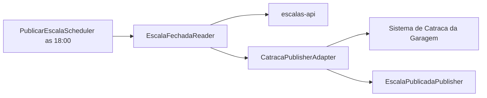
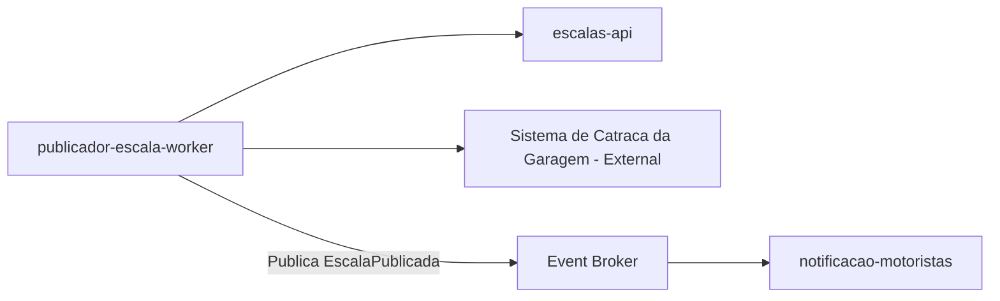
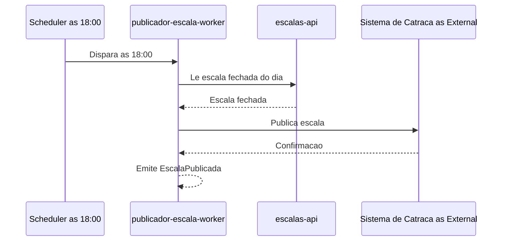

# Module - Publicador Escala Worker

## 1. Visão Geral

Worker agendado (CronJob) responsável por publicar a escala fechada às 18:00 para o sistema de catraca da garagem (FR-03), respeitando a janela de disponibilidade de no máximo 10 minutos de atraso (NFR-02).

## 2. Classificação

| Item | Valor |
|---|---|
| Tipo de Módulo | CronJob |
| Deployable Candidato | Sim |
| Bounded Context Relacionado | Programação de Escalas |
| Subdomínio DDD | Core Domain |
| Tier / Criticidade | Tier 1 |
| Status | Confirmado |

## 3. Objetivo

Ler a escala fechada do dia em `escalas-api` às 18:00 e publicá-la no sistema de catraca da garagem, dentro da janela de disponibilidade definida em NFR-02.

## 4. Responsabilidades

- Disparar às 18:00 (ou horário configurado) e buscar a escala fechada do dia
- Publicar a escala no sistema de catraca da garagem (sistema externo)
- Emitir sinal de sucesso/falha da publicação para observabilidade

## 5. Fora de Escopo

- Montagem ou fechamento da escala (escalas-api)
- Notificação ao motorista (notificacao-motoristas)
- Cadastro de motorista ou jornada (jornada-api)

## 6. Capacidades Atendidas

| Código | Capability | Descrição |
|---|---|---|
| FR-03 | Publicação da escala fechada | Publicar a escala fechada às 18:00 para o sistema de catraca da garagem |
| NFR-02 | Disponibilidade da publicação | A publicação não pode atrasar mais de 10 min |

## 7. Bounded Context e Linguagem Ubíqua

| Termo | Definição |
|---|---|
| Escala fechada | Escala que já passou pelo fechamento em escalas-api e está pronta para ser publicada externamente |
| Sistema de catraca | Sistema externo, mantido pela garagem, que controla o acesso físico e a liberação de veículos/motoristas conforme a escala |

## 8. Componentes Internos Candidatos

| Componente | Tipo | Responsabilidade |
|---|---|---|
| PublicarEscalaScheduler | Worker | Dispara a rotina às 18:00 |
| EscalaFechadaReader | Adapter | Lê a escala fechada em escalas-api |
| CatracaPublisherAdapter | Adapter | Publica a escala no sistema de catraca (protocolo Ponto a Validar) |
| EscalaPublicadaPublisher | Publisher | Emite o evento EscalaPublicada (Inferência Arquitetural — ver VAL-MOD-02) |

## 9. APIs Principais

Este módulo não expõe API pública. Atua como worker, adapter, package ou componente interno.

## 10. Eventos Publicados

| Evento | Quando é publicado | Consumidores |
|---|---|---|
| EscalaPublicada | Após a publicação bem-sucedida da escala fechada no sistema de catraca (Inferência Arquitetural — o DDD atribui a publicação ao bounded context Programação de Escalas como um todo, sem especificar o módulo técnico; ver VAL-MOD-02) | notificacao-motoristas; sistema de catraca da garagem (externo, como efeito colateral direto da chamada de publicação, não como assinante de evento) |

## 11. Eventos Consumidos

Este módulo não consome eventos diretamente.

## 12. Dados Próprios

Este módulo é stateless e não possui dados próprios.

## 13. Integrações

| Sistema/Módulo | Tipo de Integração | Direção | Observações |
|---|---|---|---|
| escalas-api | API (Ponto a Validar — leitura pode ser via API síncrona ou consulta direta a dado publicado) | Entrada | Leitura da escala fechada do dia |
| Sistema de catraca da garagem | API / Arquivo (Ponto a Validar — protocolo não especificado, VAL-MOD-04) | Saída | Publicação da escala fechada |
| notificacao-motoristas | Evento (EscalaPublicada) | Saída | Aciona a notificação ao motorista |

## 14. Dependências

### 14.1 Dependências de Domínio

- Depende da escala já estar fechada em escalas-api antes das 18:00

### 14.2 Dependências Técnicas

- Cliente/adapter para o protocolo do sistema de catraca da garagem (Ponto a Validar)
- Broker de eventos para publicar EscalaPublicada (Ponto a Validar)

### 14.3 Dependências Operacionais

- Agendador (cron) configurado para 18:00, com folga para cumprir NFR-02
- Alertas de falha de publicação, dado o impacto operacional direto na garagem
- Runbook de reprocessamento manual em caso de falha da integração externa

## 15. Requisitos Não Funcionais Relevantes

| Categoria | Requisito / Observação |
|---|---|
| Performance | Publicação deve concluir dentro da janela de 10 min após 18:00 (NFR-02) |
| Segurança | Autenticação com o sistema de catraca da garagem (Ponto a Validar — mecanismo não especificado) |
| Disponibilidade | NFR-02 — atraso máximo de 10 min na publicação |
| Observabilidade | Alerta obrigatório em caso de falha ou atraso na publicação |
| Compliance | Não aplicável a dados de cartão (NFR-03); não manipula CPF/CNH/telefone diretamente |
| Resiliência | Necessita estratégia de retry para falha de comunicação com o sistema externo (Ponto a Validar) |
| Privacidade | Não deve propagar CPF/CNH/telefone ao sistema de catraca, salvo se estritamente necessário e validado (Ponto a Validar) |
| Auditabilidade | Registro de cada tentativa de publicação, sucesso ou falha |

## 16. Compliance Aplicável

| Compliance / Norma / Lei | Aplicável? | Motivo | Impacto no Módulo |
|---|---|---|---|
| PCI DSS | Não | NFR-03 declara que o produto não trata dados de cartão nem movimenta dinheiro | Nenhum |
| LGPD / GDPR / Privacidade | Ponto a Validar | Depende de saber se a escala publicada no sistema de catraca inclui identificação do motorista além de um identificador técnico | Se incluir CPF/CNH/nome, aplica-se minimização de dados |
| SOX / Auditoria Financeira | Não | Produto não movimenta dinheiro | Nenhum |
| Outra | — | — | — |

## 17. Observabilidade

| Item | Recomendação Inicial |
|---|---|
| Logs | Logs estruturados com correlation_id e horário de disparo/conclusão |
| Métricas | Tempo de execução da publicação, taxa de sucesso/falha |
| Traces | Trace da chamada a escalas-api e ao sistema de catraca |
| Alertas | Alerta imediato se a publicação não concluir dentro de 10 min após 18:00 (NFR-02) |
| Health Checks | Verificação de última execução bem-sucedida |
| Auditoria | Log de cada publicação com identificador da escala publicada |

## 18. Diagramas do Módulo

### 18.1 Diagrama de Componentes Internos

### 18.2 Diagrama de Dependências

### 18.3 Diagrama de Fluxo Principal

## 19. Riscos

| Código | Risco | Impacto | Mitigação |
|---|---|---|---|
| RISK-MOD-01 | Indisponibilidade do sistema de catraca da garagem no horário de publicação | Violação de NFR-02 e impacto operacional na garagem | Retry com backoff e alerta imediato ao time operacional |
| RISK-MOD-02 | Escala não fechada a tempo em escalas-api | Worker não tem o que publicar às 18:00 | Alinhar corte de fechamento com folga (ver RISK-MOD-01 de escalas-api) |

## 20. Pontos a Validar

| Código | Ponto | Impacto | Recomendação |
|---|---|---|---|
| VAL-MOD-02 | Não há evidência de que este módulo especificamente publica o evento EscalaPublicada; foi inferência baseada em FR-03 | Pode mudar o ponto de emissão do evento no diagrama de integração | Confirmar com arquitetura quando o Context Map existir |
| VAL-MOD-04 | Protocolo de integração com o sistema de catraca não especificado (API, arquivo, mensageria) | Impacta o CatracaPublisherAdapter e as dependências técnicas | Validar com a equipe responsável pelo sistema de catraca da garagem |

## 21. Backlog Inicial Sugerido

| Tipo | Item | Descrição |
|---|---|---|
| Epic | Publicação da escala fechada | Cobrir FR-03 e NFR-02 |
| Story Técnica | Adapter para o sistema de catraca | Implementar CatracaPublisherAdapter conforme protocolo a validar (VAL-MOD-04) |
| Task | Alertas de atraso de publicação | Implementar alerta se publicação exceder 10 min após 18:00 |

## 22. Referências

| Documento | Seção |
|---|---|
| DDD Segmentation | Solution Module Map |
| DDD Segmentation | Eventos de Domínio |
| FRD | FR-03 |
| NFRD | NFR-02, NFR-03 |
