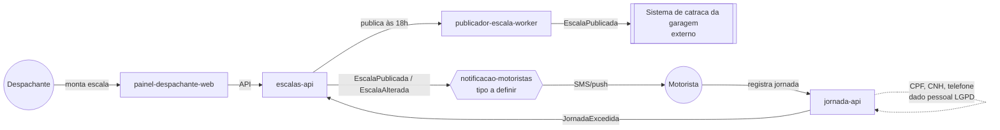

# Módulos — Frota Certa

Este diretório traduz o `docs/product/ddd/ddd-segmentation.md` (aprovado em 2026-09-24) em módulos de solução implementáveis. Cada subpasta corresponde a uma linha do Solution Module Map do DDD e contém um `README.md` com escopo, dados de propriedade, eventos e dependências, além de um diagrama de contexto em Mermaid.

## Índice de módulos

| Módulo | Tipo | Bounded Context | Status de definição |
|---|---|---|---|
| [escalas-api](./escalas-api/README.md) | Microservice | Programação de Escalas | Definido |
| [publicador-escala-worker](./publicador-escala-worker/README.md) | CronJob | Programação de Escalas | Definido |
| [jornada-api](./jornada-api/README.md) | Microservice | Jornada do Motorista | Definido |
| [notificacao-motoristas](./notificacao-motoristas/README.md) | A definir (worker próprio ou rota no BFF) | Comunicação | **Em aberto — decisão do comitê pendente** |
| [painel-despachante-web](./painel-despachante-web/README.md) | Frontend | — | Definido |

## Decisões e pendências relevantes para toda a estrutura

- **Sem dados de cartão ou pagamento:** o Frota Certa não movimenta dinheiro nem armazena dados de meios de pagamento (NFR-03). Nenhum módulo abaixo deve ser desenhado com escopo de PCI DSS; isso é uma decisão de produto, não um esquecimento de modelagem.
- **Dados sensíveis presentes são de identidade, não financeiros:** CPF, número da CNH e telefone do motorista são dados pessoais sob LGPD, com retenção de 5 anos após o desligamento por obrigação trabalhista (NFR-02). Essa responsabilidade é isolada em `jornada-api`, dono exclusivo desses dados.
- **Tipo de módulo em aberto — `notificacao-motoristas`:** o comitê ainda não decidiu se esse componente será um worker próprio ou uma rota dentro do `painel-despachante-bff`. O README do módulo documenta as duas opções lado a lado, sem eleger uma, e este índice marca o módulo como "A definir" propositalmente. Nenhum outro artefato aqui assume uma das duas alternativas como resolvida.

## Diagrama de contexto geral

