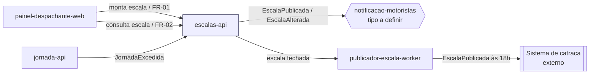

# Módulo: escalas-api

## Visão geral

Microserviço dono da montagem e consulta de escalas de motoristas. É o core domain do Frota Certa: monta a escala do dia seguinte a partir da interação do despachante no painel web (FR-01), disponibiliza a consulta da escala do dia (FR-02) e publica a escala fechada às 18:00 para o sistema de catraca da garagem (FR-03).

## Bounded context

Programação de Escalas (Core Domain), conforme `docs/product/ddd/ddd-segmentation.md`.

## Aggregates e propriedade de dados

| Aggregate | Descrição |
|---|---|
| Escala | Conjunto de turnos de um dia, com estado (rascunho, fechada, publicada) |
| Turno | Janela de trabalho atribuída a um motorista dentro de uma escala |

Este módulo é o único dono de leitura e escrita de `Escala` e `Turno`. Nenhum outro módulo persiste esses dados; consumidores leem via API ou reagem aos eventos publicados abaixo.

## Dados sensíveis

Nenhum. `escalas-api` referencia o motorista apenas por identificador; CPF, CNH e telefone pertencem exclusivamente a `jornada-api` (ver seção de dependências). O módulo não trata cartão nem qualquer dado de pagamento — o produto como um todo está fora de escopo PCI DSS (NFR-03).

## Eventos de domínio

| Evento | Direção | Consumidores conhecidos |
|---|---|---|
| EscalaPublicada | Publica | notificacao-motoristas (tipo de módulo ainda não definido); sistema de catraca da garagem (externo) |
| EscalaAlterada | Publica | notificacao-motoristas (tipo de módulo ainda não definido) |
| JornadaExcedida | Consome | Recebido de jornada-api para bloquear ou revisar uma escala que excederia 10 h diárias de jornada (FR-04) |

## Dependências

- **jornada-api** (upstream do evento `JornadaExcedida`): `escalas-api` precisa saber quando uma jornada excederia o limite diário para não fechar uma escala inválida.
- **notificacao-motoristas** (downstream de `EscalaPublicada`/`EscalaAlterada`): o mecanismo de entrega (worker dedicado ou rota do BFF) ainda não foi decidido pelo comitê; `escalas-api` publica os eventos de forma agnóstica ao transporte escolhido, sem acoplamento a essa decisão.
- **publicador-escala-worker**: consome o estado de escala fechada para realizar a publicação às 18:00 no sistema de catraca (ver NFR-02, atraso máximo de 10 min).

## Requisitos atendidos

FR-01, FR-02, FR-04 (parcial, como consumidor do evento `JornadaExcedida`).

## Pendências e decisões não tomadas aqui

Nenhuma pendência de escopo própria deste módulo. A indefinição sobre o tipo de `notificacao-motoristas` é tratada no README daquele módulo e não é resolvida por este documento.

## Diagrama de contexto

