# Módulo: jornada-api

## Visão geral

Microserviço dono do cadastro do motorista e dos registros de jornada. Registra início e fim de jornada e bloqueia (ou sinaliza) escalas que excedam 10 horas diárias (FR-04). É o único módulo do sistema que armazena dados pessoais do motorista.

## Bounded context

Jornada do Motorista (Supporting Subdomain), conforme `docs/product/ddd/ddd-segmentation.md`.

## Aggregates e propriedade de dados

| Aggregate | Descrição |
|---|---|
| Motorista | Cadastro do motorista: CPF, número da CNH, telefone |
| RegistroJornada | Marcações de início/fim de jornada de trabalho |

Este módulo é o único dono de `Motorista` e `RegistroJornada`. Nenhum outro módulo deve persistir cópia desses dados; consumidores como `escalas-api` referenciam o motorista por identificador.

## Dados sensíveis — atenção especial

`jornada-api` armazena **CPF, número da CNH e telefone do motorista**. São dados pessoais sob LGPD, com retenção de 5 anos após o desligamento do motorista por obrigação trabalhista (NFR-01). Isso exige, no desenho técnico deste módulo:

- Controle de acesso restrito a esses campos (nem todo consumidor interno precisa do CPF/CNH completos — considerar mascaramento por padrão e exposição plena só para quem tem necessidade comprovada).
- Rotina de retenção/expurgo alinhada aos 5 anos após desligamento, não à data de criação do registro.
- Trilha de auditoria de acesso a esses campos, dado o caráter sensível.

**Importante — isto não é um módulo de pagamentos:** apesar de tratar dado sensível, `jornada-api` não tem qualquer relação com cartão, gateway de pagamento ou movimentação financeira. O produto Frota Certa é explicitamente fora do escopo PCI DSS (NFR-03); a sensibilidade aqui é de identidade e trabalhista, não financeira, e não deve ser modelada com os controles de dados de cartão.

## Eventos de domínio

| Evento | Direção | Consumidores conhecidos |
|---|---|---|
| JornadaExcedida | Publica | escalas-api |

## Dependências

- **escalas-api**: consumidor do evento `JornadaExcedida`; `jornada-api` não depende de `escalas-api` para funcionar, apenas notifica.

## Requisitos atendidos

FR-04. Sustenta a obrigação de retenção de NFR-01.

## Pendências e decisões não tomadas aqui

Nenhuma pendência de escopo própria deste módulo.

## Diagrama de contexto

```mermaid
graph LR
    Motorista((Motorista)) -->|registra início/fim de jornada| JAPI[jornada-api]
    JAPI -->|JornadaExcedida &#40;> 10h/dia&#41;| EAPI[escalas-api]
    JAPI -.->|CPF, CNH, telefone<br/>dado pessoal — retenção 5 anos<br/>NÃO é dado de pagamento| JAPI

    classDef pii fill:#fee,stroke:#944;
    class JAPI pii;
```

