# Módulo: notificacao-motoristas

## Visão geral

Responsável por notificar o motorista por SMS/push quando a escala dele mudar (FR-05). Reage aos eventos `EscalaPublicada` e `EscalaAlterada` emitidos pelo bounded context de Programação de Escalas.

## Bounded context

Comunicação (Generic Subdomain), conforme `docs/product/ddd/ddd-segmentation.md`.

## Tipo de módulo — decisão em aberto

O DDD registra explicitamente que o comitê **ainda não decidiu** se este componente será:

- **Opção A — worker próprio**, dedicado, consumindo os eventos de escala de uma fila/tópico e disparando os envios de SMS/push de forma assíncrona e desacoplada do painel; ou
- **Opção B — rota dentro do `painel-despachante-bff`**, tratando a notificação como parte do backend-for-frontend do painel, sem processo separado.

Este documento não escolhe entre as duas opções. As seções abaixo descrevem responsabilidades e dados que valem para qualquer uma das duas formas, para que a decisão do comitê possa ser tomada depois sem reabrir o restante do desenho.

O que já é sabido, independente da opção escolhida:

- O gatilho é sempre um evento de domínio (`EscalaPublicada` ou `EscalaAlterada`), nunca uma chamada síncrona disparada pelo despachante.
- O canal de saída é SMS/push ao motorista; nenhuma das duas opções muda esse contrato externo.
- Nenhuma das duas opções altera a propriedade de dados: este componente não deve persistir cópia de `Motorista`, `Escala` ou `Turno` — apenas o necessário para efetivar o envio (ex.: telefone/token de push, obtidos por referência a `jornada-api`, e não duplicados permanentemente).

## Aggregates e propriedade de dados

Nenhum aggregate próprio. Não é dono de dado de domínio; consome dados de referência (telefone do motorista, de `jornada-api`) apenas no momento do envio.

## Dados sensíveis

Trata o telefone do motorista (dado pessoal, de propriedade de `jornada-api`) apenas em trânsito, para efetivar o envio de SMS/push — não deve reter cópia persistente desse dado além do necessário para retry de curto prazo. Não trata cartão nem qualquer dado de pagamento; o produto é fora de escopo PCI DSS (NFR-03).

## Eventos de domínio

| Evento | Direção | Origem |
|---|---|---|
| EscalaPublicada | Consome | escalas-api / publicador-escala-worker |
| EscalaAlterada | Consome | escalas-api |

## Dependências

- **escalas-api**: origem dos eventos `EscalaPublicada` e `EscalaAlterada`.
- **jornada-api**: fonte do telefone do motorista para o envio.
- **painel-despachante-web** / **painel-despachante-bff**: relevante apenas se a Opção B for escolhida, caso em que este módulo deixaria de existir como componente separado e sua responsabilidade migraria para uma rota do BFF do painel.

## Requisitos atendidos

FR-05.

## Pendências e decisões não tomadas aqui

- **Tipo de módulo (worker próprio vs. rota no BFF):** decisão do comitê, ainda pendente na data deste documento (2026-09-26). Nenhum artefato desta estrutura de módulos assume uma das duas alternativas.
- Consequência prática da pendência: o desenho técnico detalhado (design.md) e o dimensionamento de infraestrutura deste componente devem aguardar essa decisão, ou ser escritos de forma condicional às duas opções.

## Diagrama de contexto

O diagrama abaixo representa o componente de forma agnóstica ao tipo de módulo, com as duas opções indicadas lado a lado.

```mermaid
graph LR
    EAPI[escalas-api] -->|EscalaPublicada / EscalaAlterada| NOTIF{{notificacao-motoristas<br/>tipo a definir pelo comitê}}
    JAPI[jornada-api] -->|telefone &#40;referência, sem cópia permanente&#41;| NOTIF
    NOTIF -->|SMS/push| Motorista((Motorista))

    subgraph Opções em avaliação pelo comitê
        OPA[Opção A: worker próprio]
        OPB[Opção B: rota no painel-despachante-bff]
    end
    NOTIF -.-> OPA
    NOTIF -.-> OPB
```

