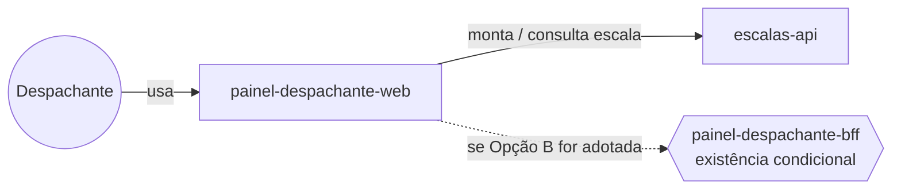

# Módulo: painel-despachante-web

## Visão geral

Frontend web do despachante. É a interface usada para montar a escala do dia seguinte (FR-01) e consultá-la. Não é dono de nenhum dado de domínio: consome a API de `escalas-api` para todas as operações.

## Bounded context

Não pertence a um bounded context de domínio próprio (é um módulo de apresentação); consome o bounded context de Programação de Escalas via API.

## Aggregates e propriedade de dados

Nenhum. Este módulo não persiste `Escala`, `Turno`, `Motorista` nem qualquer outro aggregate — é uma camada de apresentação sobre `escalas-api`.

## Dados sensíveis

Nenhum dado sensível é armazenado neste módulo. Eventual exibição de dados do motorista (nome, identificação do turno) deve vir por consulta a `escalas-api`/`jornada-api`, sem persistência local além de cache de sessão. O produto não trata cartão nem dados de pagamento.

## Eventos de domínio

Não publica nem consome eventos de domínio diretamente; opera via chamadas síncronas de API.

## Dependências

- **escalas-api**: fonte de todas as operações de montagem e consulta de escala.
- **painel-despachante-bff** (mencionado no DDD como possível destino da Opção B de `notificacao-motoristas`): se essa opção vier a ser adotada pelo comitê, este frontend passaria a consumir também uma rota de notificação nesse BFF. Essa dependência é condicional e não está confirmada.

## Requisitos atendidos

FR-01 (interface), FR-02 (interface de consulta, ainda sujeita à definição do endpoint pela equipe de integração conforme observado no FRD).

## Pendências e decisões não tomadas aqui

- FR-02 registra que o endpoint de consulta da escala pelo motorista "ainda não definido pela equipe de integração" — isso é relevante para o desenho de `escalas-api`, não deste frontend, mas é citado aqui porque pode afetar se este painel também serve a consulta do motorista ou se essa consulta migra para outro canal (ex.: app do motorista, fora do escopo atual).
- A existência (ou não) de um `painel-despachante-bff` como módulo separado depende da decisão do comitê sobre `notificacao-motoristas` (Opção B). Este README não assume essa decisão.

## Diagrama de contexto

