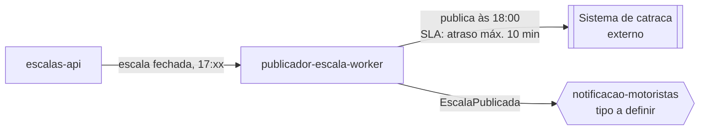

# Módulo: publicador-escala-worker

## Visão geral

CronJob responsável por publicar a escala fechada do dia às 18:00 no sistema de catraca da garagem (FR-03). É um componente de integração, não um dono de dados de domínio: lê o estado de escala fechada em `escalas-api` e empurra o resultado para o sistema externo dentro da janela de tolerância definida em NFR-02 (atraso máximo de 10 minutos).

## Bounded context

Programação de Escalas (Core Domain), mesmo bounded context de `escalas-api`, mas como um processo de integração agendado, não como parte do aggregate.

## Aggregates e propriedade de dados

Nenhum. Este módulo não possui aggregates próprios nem persiste estado de domínio; ele orquestra a publicação de um estado que pertence a `escalas-api`.

## Dados sensíveis

Nenhum dado pessoal ou de pagamento transita por este módulo além do necessário para identificar turnos e motoristas na integração com a catraca (por identificador, não por CPF/CNH). O produto não trata cartão nem dados de pagamento.

## Eventos de domínio

| Evento | Direção | Observação |
|---|---|---|
| EscalaPublicada | Publica | Emitido após a publicação bem-sucedida no sistema de catraca; consumido por notificacao-motoristas (tipo de módulo ainda não definido) |

## Dependências

- **escalas-api**: fonte da escala fechada a ser publicada; este worker lê o estado via API/consulta, não replica o aggregate.
- **Sistema de catraca da garagem (externo)**: destino da publicação às 18:00. É um sistema de terceiros fora do bounded context do Frota Certa.

## Requisitos atendidos

FR-03. Contribui para NFR-02 (janela de publicação com atraso máximo de 10 minutos), que deve ser validado com alerta de atraso e retry no desenho técnico deste módulo.

## Pendências e decisões não tomadas aqui

Nenhuma pendência de escopo. A publicação do evento `EscalaPublicada` é agnóstica a quem o consome — a indefinição sobre `notificacao-motoristas` não afeta o contrato deste worker.

## Diagrama de contexto

