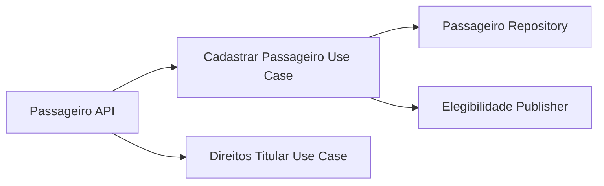
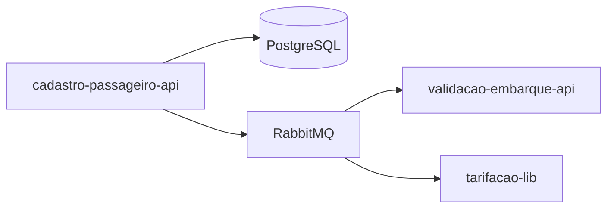
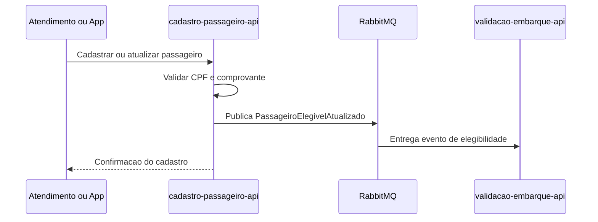

# Module - Cadastro de Passageiro API

## 1. Visão Geral

Serviço dono dos dados pessoais do passageiro (CPF, data de nascimento e comprovante de matrícula), usado para conceder gratuidades e meia-tarifa estudantil. É o módulo com maior exposição a dados pessoais (LGPD) da solução.

## 2. Classificação

| Item | Valor |
|---|---|
| Tipo de Módulo | Microservice |
| Deployable Candidato | cadastro-passageiro-api |
| Bounded Context Relacionado | Cadastro |
| Subdomínio DDD | Generic Subdomain |
| Tier / Criticidade | Tier 2 / Alta (privacidade) |
| Status | Confirmado |

## 3. Objetivo

Cadastrar o passageiro com CPF, data de nascimento e comprovante de matrícula para viabilizar gratuidades e meia-tarifa estudantil (OBJ-04 do PRD; FR-06 do FRD).

## 4. Responsabilidades

- Cadastrar e manter os dados do passageiro (`Passageiro`): CPF, data de nascimento, comprovante de matrícula.
- Expor consulta de passageiro para outros módulos (`GET /v1/passageiros/{id}`).
- Publicar `PassageiroElegivelAtualizado` quando a elegibilidade a gratuidade/meia-tarifa mudar.
- Atender direitos do titular de dados pessoais (acesso, correção, exclusão) conforme LGPD.

## 5. Fora de Escopo

- Aplicação da elegibilidade no cálculo da tarifa — pertence à `tarifacao-lib`/`validacao-embarque-api`.
- Emissão do cartão transporte físico ou QR do app.

## 6. Capacidades Atendidas

| Código | Capability | Descrição |
|---|---|---|
| CAP-05 | Cadastro | Cadastrar passageiro com CPF, data de nascimento e comprovante de matrícula (FR-06) |

## 7. Bounded Context e Linguagem Ubíqua

| Termo | Definição |
|---|---|
| Passageiro | Aggregate raiz do bounded context Cadastro |
| Gratuidade | Isenção de tarifa concedida a passageiro elegível |
| Comprovante | Documento de matrícula usado para conceder meia-tarifa estudantil |

## 8. Componentes Internos Candidatos

| Componente | Tipo | Responsabilidade |
|---|---|---|
| PassageiroController | API Controller | Expõe `GET /v1/passageiros/{id}` e cadastro (endpoint de escrita não detalhado no FRD — ver Ponto a Validar) |
| CadastrarPassageiroUseCase | Use Case | Cadastra passageiro e valida CPF/comprovante |
| PassageiroRepository | Repository | Persiste `passageiros` |
| ElegibilidadePublisher | Publisher | Publica `PassageiroElegivelAtualizado` |
| DireitosTitularUseCase | Use Case | Atende solicitações de acesso, correção e exclusão de dados (LGPD) |

## 9. APIs Principais

| Método | Endpoint | Finalidade | Consumidores |
|---|---|---|---|
| GET | /v1/passageiros/{id} | Consultar dados do passageiro (FR-06) | tarifacao-lib (via validacao-embarque-api), demais módulos autorizados |

O FRD não define explicitamente o endpoint de escrita (cadastro/atualização) — registrado como ponto a validar.

## 10. Eventos Publicados

| Evento | Quando é publicado | Consumidores |
|---|---|---|
| PassageiroElegivelAtualizado | Quando a elegibilidade a gratuidade/meia-tarifa do passageiro muda | tarifacao-lib (via validacao-embarque-api), validacao-embarque-api |

## 11. Eventos Consumidos

Este módulo não consome eventos diretamente.

## 12. Dados Próprios

| Entidade/Tabela/Collection | Tipo | Banco/Persistência | Observações |
|---|---|---|---|
| passageiros | Tabela | PostgreSQL (por serviço) | Campos sensíveis: `cpf`, `data_nascimento`, `comprovante_matricula_url` (data model, PII) |

## 13. Integrações

| Sistema/Módulo | Tipo de Integração | Direção | Observações |
|---|---|---|---|
| validacao-embarque-api / tarifacao-lib | Evento (RabbitMQ) | Saída | Publica `PassageiroElegivelAtualizado` |
| Demais módulos consumidores de GET /v1/passageiros/{id} | API REST | Saída | Consulta de dados do passageiro |

## 14. Dependências

### 14.1 Dependências de Domínio

- Nenhuma dependência de outro bounded context para cadastrar o passageiro (Generic Subdomain).

### 14.2 Dependências Técnicas

- PostgreSQL (persistência de `passageiros`).
- RabbitMQ (publicação de `PassageiroElegivelAtualizado`).
- Armazenamento de arquivo para `comprovante_matricula_url` (mecanismo não detalhado no TRD — Ponto a Validar).

### 14.3 Dependências Operacionais

- Política de retenção de 5 anos após o último uso do cartão (NFR-03).
- Processo de atendimento a direitos do titular em até 15 dias (NFR-03).

## 15. Requisitos Não Funcionais Relevantes

| Categoria | Requisito / Observação |
|---|---|
| Performance | Não especificado diretamente no NFRD — Ponto a Validar |
| Segurança | Controle de acesso a dados pessoais (CPF, nascimento, comprovante) |
| Disponibilidade | 99,5% (NFR-05) |
| Observabilidade | Auditoria de acesso a dados pessoais |
| Compliance | LGPD — retenção de 5 anos após último uso do cartão; direitos do titular em até 15 dias (NFR-03) |
| Resiliência | Não especificado — Ponto a Validar |
| Privacidade | CPF, data de nascimento e comprovante de matrícula são dados pessoais (NFR-03); ver compliance-lgpd.md |
| Auditabilidade | Todo acesso e alteração de dados pessoais deve ser auditável (regra LGPD) |

## 16. Compliance Aplicável

| Compliance / Norma / Lei | Aplicável? | Motivo | Impacto no Módulo |
|---|---|---|---|
| PCI DSS | Não | Não processa, transmite nem armazena dados de cartão de pagamento | Nenhum |
| LGPD / GDPR / Privacidade | Sim | Armazena CPF, data de nascimento e comprovante de matrícula (NFR-03) | Retenção de 5 anos após último uso do cartão; atendimento a direitos do titular em até 15 dias; minimização e controle de acesso |
| SOX / Auditoria Financeira | Não | — | — |
| Outra | — | — | — |

## 17. Observabilidade

| Item | Recomendação Inicial |
|---|---|
| Logs | Logs estruturados com correlation_id, mascarando CPF e demais dados pessoais |
| Métricas | Volume de cadastros, taxa de atualização de elegibilidade |
| Traces | Trace de cadastro/consulta de passageiro |
| Alertas | Falha em processo de retenção/expurgo de dados pessoais |
| Health Checks | Liveness/readiness padrão de serviço com banco próprio |
| Auditoria | Log de auditoria de todo acesso, criação, alteração ou exclusão de dado pessoal |

## 18. Diagramas do Módulo

### 18.1 Diagrama de Componentes Internos

### 18.2 Diagrama de Dependências

### 18.3 Diagrama de Fluxo Principal

## 19. Riscos

| Código | Risco | Impacto | Mitigação |
|---|---|---|---|
| RISK-MOD-01 | Exposição de CPF/comprovante em log ou API sem mascaramento | Violação LGPD | Mascaramento obrigatório em logs e revisão de payloads de API |
| RISK-MOD-02 | Ausência de mecanismo automatizado de retenção/expurgo após 5 anos | Descumprimento de NFR-03 | Job de expurgo automatizado com auditoria |

## 20. Pontos a Validar

| Código | Ponto | Impacto | Recomendação |
|---|---|---|---|
| VAL-MOD-07 | Endpoint de escrita (cadastro/atualização de passageiro) não definido explicitamente no FRD, que só lista o GET | Impede detalhar contrato de API completo do módulo | Confirmar com produto/FRD o endpoint de cadastro/atualização |
| VAL-MOD-08 | Mecanismo de armazenamento do arquivo de comprovante de matrícula não definido no TRD | Impacta arquitetura de armazenamento e escopo LGPD de arquivos | Definir storage (ex.: bucket dedicado) e controles de acesso |

## 21. Backlog Inicial Sugerido

| Tipo | Item | Descrição |
|---|---|---|
| Epic | Cadastro de passageiro e elegibilidade | Cobrir FR-06 com CPF, nascimento e comprovante |
| Story Técnica | Job de retenção/expurgo de dados pessoais (5 anos) | Suporte a NFR-03 |
| Task | Definir endpoint de escrita do cadastro | Resolver VAL-MOD-07 |

## 22. Referências

| Documento | Seção |
|---|---|
| DDD Segmentation | Solution Module Map, Data Ownership Matrix |
| Context Map | Cadastro → Tarifação (Customer/Supplier) |
| NFRD | NFR-03, NFR-05 |
| FRD | FR-06 |
| PRD | OBJ-04 |
