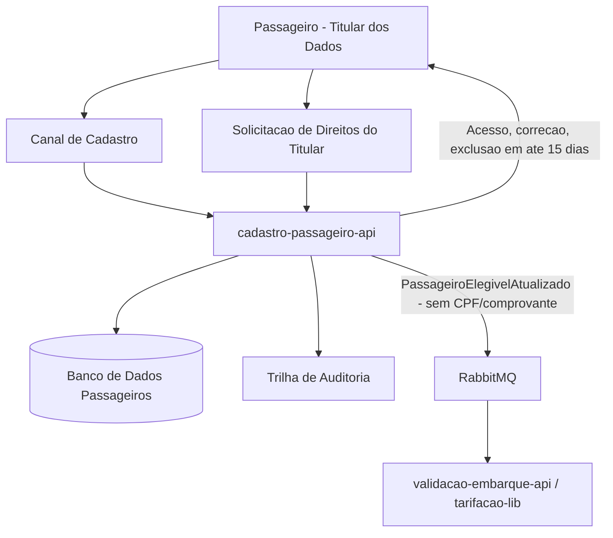

# LGPD / PII Compliance Flow

## 1. Objetivo

Descrever o fluxo de dados pessoais do passageiro e as regras de tratamento de PII na solução Tarifa Viva.

## 2. Dados Pessoais Identificados

| Dado | Categoria | Módulo Dono | Finalidade | Retenção |
|---|---|---|---|---|
| CPF | Pessoal | cadastro-passageiro-api | Concessão de gratuidade/meia-tarifa estudantil (FR-06) | 5 anos após o último uso do cartão (NFR-03) |
| Data de nascimento | Pessoal | cadastro-passageiro-api | Elegibilidade a gratuidade por idade | 5 anos após o último uso do cartão (NFR-03) |
| Comprovante de matrícula | Sensível | cadastro-passageiro-api | Concessão de meia-tarifa estudantil | 5 anos após o último uso do cartão (NFR-03) |

## 3. Diagrama de Fluxo PII

## 4. Regras LGPD / PII

| Regra | Descrição |
|---|---|
| Minimização | Apenas CPF, data de nascimento e comprovante de matrícula são coletados, conforme necessário para FR-06 |
| Finalidade | Os dados pessoais servem exclusivamente à concessão de gratuidade e meia-tarifa estudantil |
| Controle de acesso | Acesso a `passageiros` deve ser restrito ao cadastro-passageiro-api e a consumidores autorizados via API |
| Mascaramento | O evento `PassageiroElegivelAtualizado` não deve carregar CPF nem comprovante — apenas o sinal de elegibilidade |
| Retenção | 5 anos após o último uso do cartão transporte (NFR-03) |
| Auditoria | Todo acesso e alteração a dados pessoais deve ser auditável |
| Direitos do titular | Acesso, correção, exclusão e portabilidade atendidos em até 15 dias (NFR-03) |

## 5. Pontos a Validar

| Código | Ponto | Impacto |
|---|---|---|
| VAL-MOD-08 | Mecanismo de armazenamento do arquivo de comprovante de matrícula não definido no TRD | Impacta o escopo de proteção de dados do armazenamento de arquivo (storage dedicado, controles de acesso) |
| VAL-MOD-07 | Endpoint de escrita (cadastro/atualização) do passageiro não definido explicitamente no FRD | Impacta o desenho do fluxo de coleta e consentimento |
