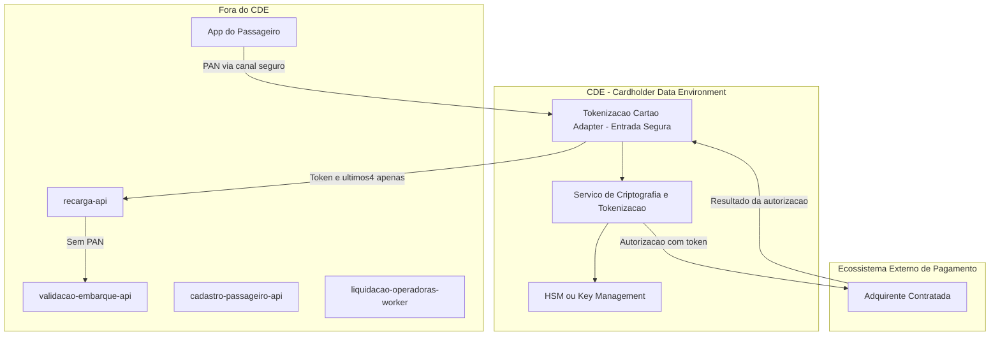

# PCI DSS Compliance Flow

## 1. Objetivo

Descrever o fluxo de dados de cartão na recarga de saldo do Tarifa Viva e delimitar o CDE - Cardholder Data Environment.

## 2. Escopo PCI

| Módulo | Dentro do CDE? | Motivo |
|---|---|---|
| tokenizacao-cartao-adapter | Sim | Único módulo que recebe, tokeniza e transmite o PAN à adquirente (NFR-02) |
| recarga-api | Não | Recebe apenas token e resultado da autorização; nunca o PAN |
| validacao-embarque-api | Não | Não processa dados de cartão de pagamento |
| tarifacao-lib | Não | Não processa dados de cartão de pagamento |
| liquidacao-operadoras-worker | Não | Não processa dados de cartão de pagamento |
| cadastro-passageiro-api | Não | Não processa dados de cartão de pagamento |
| App do Passageiro | Ponto a Validar | Não modelado como módulo no Solution Module Map (VAL-MOD-01); é o canal onde o usuário digita o PAN antes de chegar ao tokenizacao-cartao-adapter, e pode ter escopo PCI próprio (SAQ) |

## 3. Diagrama CDE

## 4. Regras PCI

| Regra | Descrição |
|---|---|
| Dados sensíveis não devem sair do CDE | O PAN não pode ser propagado do tokenizacao-cartao-adapter para nenhum outro módulo (NFR-02) |
| Tokenização obrigatória | Módulos fora do CDE (recarga-api e demais) devem receber apenas token e últimos 4 dígitos |
| Acesso restrito | Somente o tokenizacao-cartao-adapter pode acessar o HSM/serviço de criptografia |
| Auditoria obrigatória | Toda tokenização e autorização deve gerar evento auditável, sem PAN |
| Logs sem PAN | Logs não devem conter PAN, CVV ou track data (NFR-02) |

## 5. Pontos a Validar

| Código | Ponto | Impacto |
|---|---|---|
| VAL-PCI-01 | Confirmar se o app do passageiro captura e envia o PAN diretamente ao tokenizacao-cartao-adapter, ou se existe um componente de app/BFF intermediário não modelado (VAL-MOD-01) | Define se o app precisa de controles PCI adicionais (SAQ aplicável) |
| VAL-MOD-03 | Retenção de token_cartao/ultimos4 em pedidos_recarga (recarga-api) não está definida | Mesmo fora do CDE, pode exigir controles de acesso e retenção adicionais |
