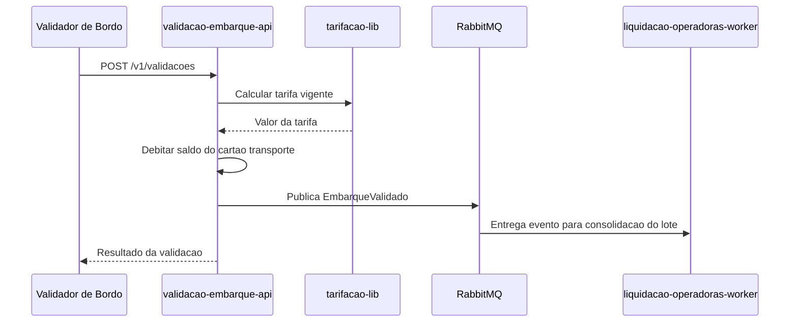
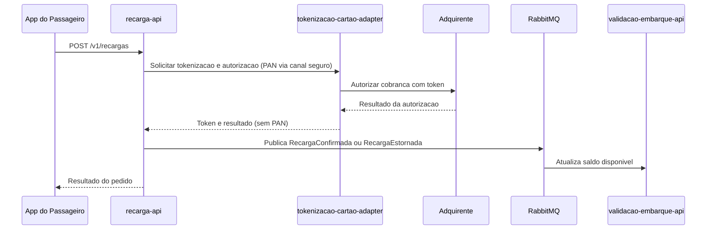
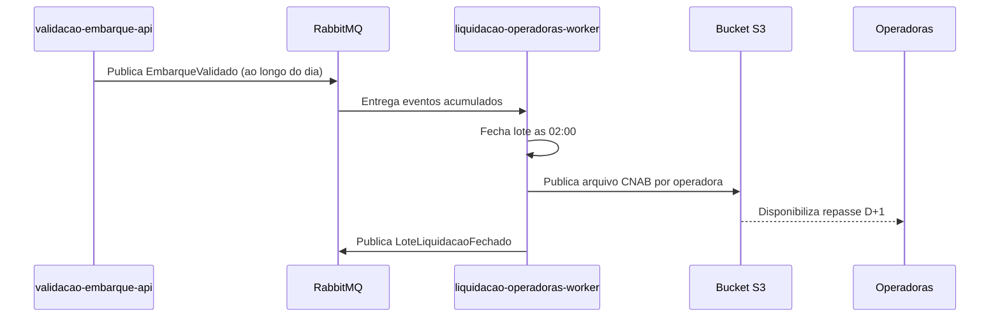

# Integration Flows

## 1. Objetivo

Documentar os principais fluxos de integração entre módulos e sistemas externos da Tarifa Viva.

## 2. Fluxo - Validação de Embarque

## 3. Fluxo - Recarga de Saldo com Cartão

## 4. Fluxo - Liquidação Diária com Operadoras

## 5. Regras do Fluxo

| Regra | Descrição |
|---|---|
| Nunca propagar PAN | Apenas o tokenizacao-cartao-adapter recebe e processa o PAN; os demais módulos trabalham só com token (NFR-02) |
| Reprodutibilidade do lote | O lote de liquidação deve poder ser reconstruído a partir dos eventos EmbarqueValidado (NFR-04) |
| Estorno automático | Recarga não confirmada pela adquirente em até 24 h deve gerar RecargaEstornada (FR-03) |
| Operação offline | O validador de bordo pode operar offline por até 4 h, sincronizando lista de bloqueio depois (NFR-01) |

## 6. Pontos de Falha

| Ponto | Tratamento Esperado |
|---|---|
| Indisponibilidade da adquirente | Timeout com retry controlado; recarga não confirmada segue para estorno automático em 24 h |
| Falha na publicação de EmbarqueValidado | Publicação transacional/outbox com reprocessamento, para não quebrar a reprodutibilidade exigida por NFR-04 |
| Falha no CronJob de liquidação às 02:00 | Alerta imediato e reprocessamento manual/automático do fechamento do lote |
| Perda de conectividade do validador offline | Operação local até 4 h com sincronização posterior da lista de bloqueio (frequência a definir, VAL-MOD-04) |
