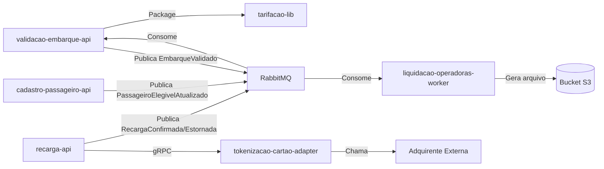

# Module Dependencies Diagram

## 1. Objetivo

Mostrar as dependências diretas e indiretas entre os módulos da solução Tarifa Viva.

## 2. Diagrama

## 3. Matriz de Dependências

| Origem | Destino | Tipo | Obrigatória? | Observação |
|---|---|---|---|---|
| validacao-embarque-api | tarifacao-lib | Package | Sim | Cálculo de tarifa embarcado no mesmo deployable |
| recarga-api | tokenizacao-cartao-adapter | Síncrona (gRPC) | Sim | Nunca envia PAN, apenas dados necessários à tokenização |
| recarga-api | RabbitMQ (validacao-embarque-api) | Assíncrona | Sim | RecargaConfirmada/RecargaEstornada |
| cadastro-passageiro-api | RabbitMQ (validacao-embarque-api / tarifacao-lib) | Assíncrona | Sim | PassageiroElegivelAtualizado |
| validacao-embarque-api | RabbitMQ (liquidacao-operadoras-worker) | Assíncrona | Sim | EmbarqueValidado |
| tokenizacao-cartao-adapter | Adquirente (externa) | Externa | Sim | Autorização de pagamento |
| liquidacao-operadoras-worker | Bucket S3 | Dados | Sim | Publicação do arquivo CNAB |
