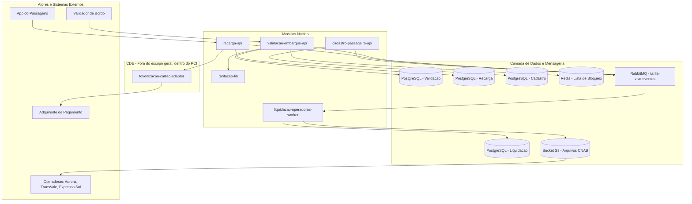

# Solution Architecture Diagram

## 1. Objetivo

Mostrar como os módulos da solução Tarifa Viva se relacionam em alto nível, incluindo a fronteira de segurança do CDE (PCI DSS).

## 2. Diagrama

## 3. Observações

- O `tokenizacao-cartao-adapter` é o único módulo dentro do CDE (Cardholder Data Environment); todos os demais módulos operam fora do escopo PCI DSS, recebendo apenas token quando necessário.
- Não há frontend/BFF documentado no Solution Module Map além do "App do Passageiro" citado no PRD/FRD como ator externo — ver VAL-MOD-01 em `docs/product/modules/README.md`.
- RabbitMQ, PostgreSQL por serviço e Redis são infraestrutura compartilhada conforme o TRD; não foram modelados como módulos próprios (ver VAL-MOD-02).
