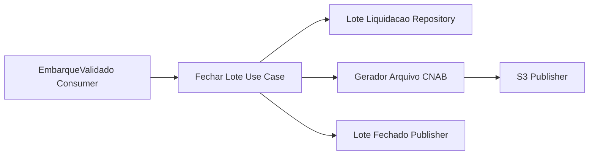
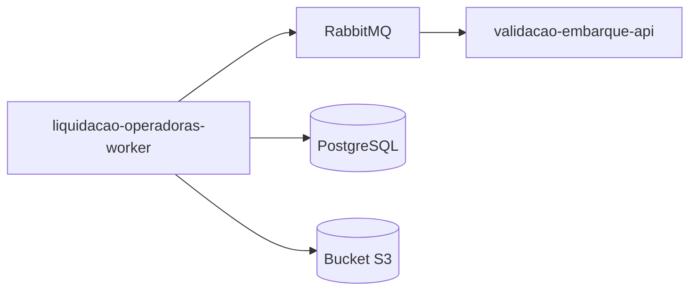
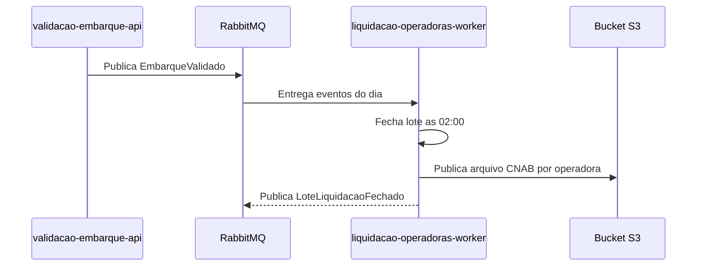

# Module - Liquidação com Operadoras Worker

## 1. Visão Geral

CronJob diário que fecha o lote de liquidação a partir dos eventos `EmbarqueValidado` e gera o arquivo de repasse (CNAB) para cada uma das três operadoras de ônibus (Viação Aurora, TransVale e Expresso Sol).

## 2. Classificação

| Item | Valor |
|---|---|
| Tipo de Módulo | CronJob |
| Deployable Candidato | liquidacao-operadoras-worker |
| Bounded Context Relacionado | Liquidação |
| Subdomínio DDD | Supporting Subdomain |
| Tier / Criticidade | Tier 2 / Alta (financeiro) |
| Status | Confirmado |

## 3. Objetivo

Executar diariamente às 02:00 o fechamento do lote de liquidação e gerar o arquivo CNAB de repasse por operadora, garantindo liquidação D+1 (OBJ-03 do PRD; FR-05 do FRD).

## 4. Responsabilidades

- Consumir os eventos `EmbarqueValidado` do dia e consolidar o lote (`LoteLiquidacao`) por operadora.
- Fechar o lote diário e publicar `LoteLiquidacaoFechado`.
- Gerar o arquivo CNAB por operadora e publicá-lo no bucket S3 (TRD).

## 5. Fora de Escopo

- Validação de embarque — pertence ao `validacao-embarque-api`.
- Envio ou integração direta com o sistema bancário/financeiro das operadoras além da geração do arquivo.

## 6. Capacidades Atendidas

| Código | Capability | Descrição |
|---|---|---|
| CAP-04 | Liquidação | Fechar lote diário de liquidação por operadora e gerar arquivo de repasse (FR-05) |

## 7. Bounded Context e Linguagem Ubíqua

| Termo | Definição |
|---|---|
| Lote | Conjunto de embarques validados consolidados para repasse |
| Repasse | Valor devido a cada operadora pela liquidação do lote |
| Operadora | Empresa de ônibus (Viação Aurora, TransVale, Expresso Sol) |

## 8. Componentes Internos Candidatos

| Componente | Tipo | Responsabilidade |
|---|---|---|
| EmbarqueValidadoConsumer | Consumer | Consome `EmbarqueValidado` e acumula no lote do dia |
| FecharLoteUseCase | Use Case | Fecha o lote diário às 02:00 e calcula o repasse por operadora |
| LoteLiquidacaoRepository | Repository | Persiste `lotes_liquidacao` |
| GeradorArquivoCnab | Adapter | Gera o arquivo CNAB por operadora |
| S3Publisher | Adapter | Publica o arquivo gerado no bucket S3 |
| LoteFechadoPublisher | Publisher | Publica `LoteLiquidacaoFechado` |

## 9. APIs Principais

Este módulo não expõe API pública. Atua como worker/CronJob agendado (TRD: execução diária às 02:00).

## 10. Eventos Publicados

| Evento | Quando é publicado | Consumidores |
|---|---|---|
| LoteLiquidacaoFechado | Ao concluir o fechamento diário do lote | Externo, via arquivo (operadoras não consomem evento diretamente) |

## 11. Eventos Consumidos

| Evento | Produtor | Finalidade |
|---|---|---|
| EmbarqueValidado | validacao-embarque-api | Consolidar o lote diário de liquidação por operadora |

## 12. Dados Próprios

| Entidade/Tabela/Collection | Tipo | Banco/Persistência | Observações |
|---|---|---|---|
| lotes_liquidacao | Tabela | PostgreSQL (por serviço) | Sem campos sensíveis (data model) |

## 13. Integrações

| Sistema/Módulo | Tipo de Integração | Direção | Observações |
|---|---|---|---|
| validacao-embarque-api | Evento (RabbitMQ) | Entrada | Consome `EmbarqueValidado` |
| Operadoras (Viação Aurora, TransVale, Expresso Sol) | Arquivo (CNAB via S3) | Saída | Repasse diário D+1 |

## 14. Dependências

### 14.1 Dependências de Domínio

- Reprodutibilidade do lote a partir dos eventos `EmbarqueValidado` (NFR-04).

### 14.2 Dependências Técnicas

- PostgreSQL (persistência de `lotes_liquidacao`).
- RabbitMQ (consumo de `EmbarqueValidado`).
- Bucket S3 (armazenamento do arquivo CNAB).
- Scheduler de CronJob (execução diária às 02:00, TRD).

### 14.3 Dependências Operacionais

- Job agendado (cron) com alerta de falha de execução.
- Runbook de reprocessamento de lote em caso de falha.

## 15. Requisitos Não Funcionais Relevantes

| Categoria | Requisito / Observação |
|---|---|
| Performance | Não especificado diretamente — janela de execução até liquidação D+1 (OBJ-03) |
| Segurança | Não aplicável diretamente — não processa PAN nem PII |
| Disponibilidade | 99,5% (NFR-05) |
| Observabilidade | Confirmação de execução diária e sucesso de geração/publicação do arquivo |
| Compliance | Auditabilidade obrigatória — lote deve ser reproduzível a partir de `EmbarqueValidado` (NFR-04) |
| Resiliência | Reprocessamento em caso de falha na geração do arquivo ou publicação no S3 |
| Privacidade | Não aplicável |
| Auditabilidade | NFR-04 — todo lote deve ser reproduzível a partir dos eventos de origem |

## 16. Compliance Aplicável

| Compliance / Norma / Lei | Aplicável? | Motivo | Impacto no Módulo |
|---|---|---|---|
| PCI DSS | Não | Não processa dados de cartão de pagamento | Nenhum |
| LGPD / GDPR / Privacidade | Não | Não processa dados pessoais de passageiro | Nenhum |
| SOX / Auditoria Financeira | Ponto a Validar | Gera o repasse financeiro diário às operadoras a partir de dados de arrecadação | NFR-04 já exige reprodutibilidade; pode requerer controles adicionais de auditoria financeira formal |
| Outra | — | — | — |

## 17. Observabilidade

| Item | Recomendação Inicial |
|---|---|
| Logs | Logs estruturados por execução do job, com identificação do lote e da operadora |
| Métricas | Sucesso/falha da execução diária, tempo de geração do arquivo, tamanho do lote |
| Traces | Trace do fechamento do lote à publicação do arquivo no S3 |
| Alertas | Falha de execução do CronJob, atraso além da janela D+1 |
| Health Checks | Verificação de última execução bem-sucedida |
| Auditoria | Reprodutibilidade do lote a partir dos eventos `EmbarqueValidado` (NFR-04) |

## 18. Diagramas do Módulo

### 18.1 Diagrama de Componentes Internos

### 18.2 Diagrama de Dependências

### 18.3 Diagrama de Fluxo Principal

## 19. Riscos

| Código | Risco | Impacto | Mitigação |
|---|---|---|---|
| RISK-MOD-01 | Falha do job às 02:00 sem reprocessamento | Atraso na liquidação D+1 das operadoras | Alerta imediato e job de reprocessamento manual/automático |
| RISK-MOD-02 | Perda ou atraso de eventos `EmbarqueValidado` no RabbitMQ | Lote incompleto, violando NFR-04 | Consumo idempotente com reconciliação contra o total de embarques validados |

## 20. Pontos a Validar

| Código | Ponto | Impacto | Recomendação |
|---|---|---|---|
| VAL-MOD-06 | Formato exato do arquivo CNAB e layout esperado por cada operadora não detalhado no TRD/FRD | Risco de rejeição do arquivo pela operadora | Confirmar layout CNAB específico com cada operadora |

## 21. Backlog Inicial Sugerido

| Tipo | Item | Descrição |
|---|---|---|
| Epic | Fechamento diário de liquidação | Cobrir FR-05 com geração de arquivo CNAB por operadora |
| Story Técnica | Reconciliação de eventos EmbarqueValidado no fechamento do lote | Suporte a NFR-04 |
| Task | Confirmar layout CNAB por operadora | Resolver VAL-MOD-06 |

## 22. Referências

| Documento | Seção |
|---|---|
| DDD Segmentation | Solution Module Map, Eventos de Domínio |
| NFRD | NFR-04, NFR-05 |
| FRD | FR-05 |
| TRD | CronJob diário 02:00, arquivo CNAB em bucket S3 |
| PRD | OBJ-03 |
