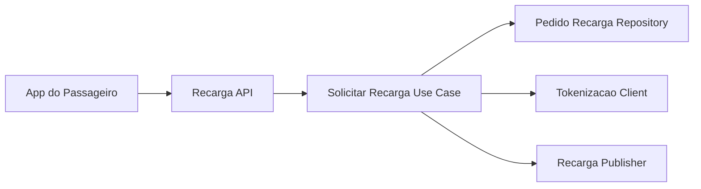
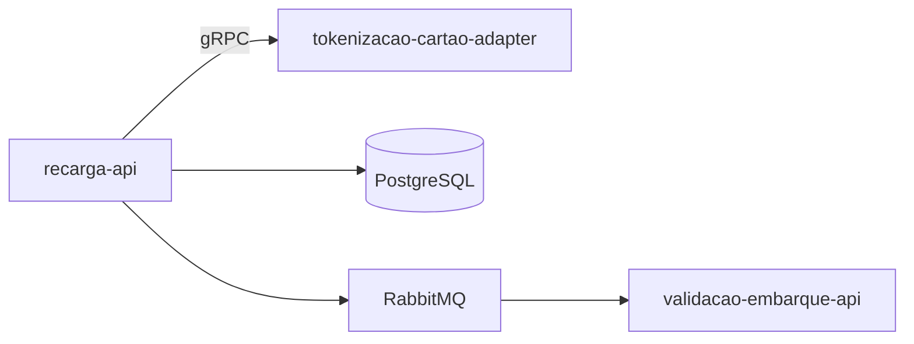
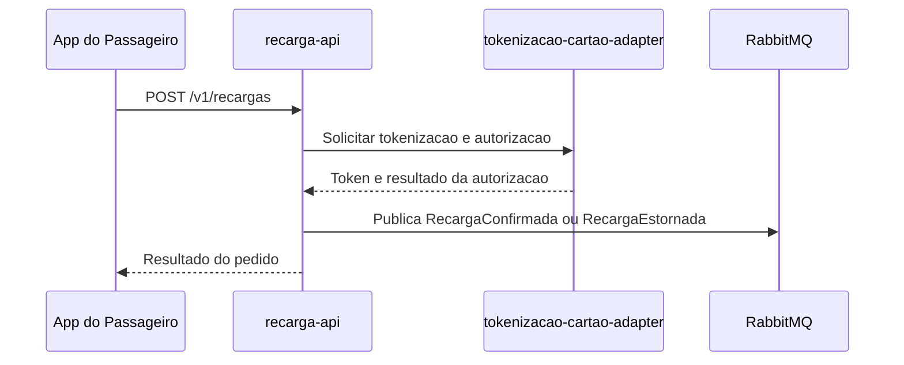

# Module - Recarga API

## 1. Visão Geral

Serviço que orquestra o pedido de recarga do saldo do cartão transporte feito pelo passageiro no app. Nunca recebe o PAN do cartão de crédito/débito — delega a captura e tokenização ao `tokenizacao-cartao-adapter` e trabalha apenas com token.

## 2. Classificação

| Item | Valor |
|---|---|
| Tipo de Módulo | Microservice |
| Deployable Candidato | recarga-api |
| Bounded Context Relacionado | Recarga |
| Subdomínio DDD | Supporting Subdomain |
| Tier / Criticidade | Tier 2 / Média |
| Status | Confirmado |

## 3. Objetivo

Permitir a recarga do saldo do cartão transporte pelo app com cartão de crédito/débito, sem que o PAN trafegue por este módulo, e permitir o estorno de recarga não confirmada em até 24 h (OBJ-02 do PRD; FR-02 e FR-03 do FRD).

## 4. Responsabilidades

- Orquestrar o pedido de recarga (`PedidoRecarga`) do saldo do cartão transporte.
- Delegar a captura de dados de cartão e a autorização à adquirente ao `tokenizacao-cartao-adapter`.
- Publicar `RecargaConfirmada` quando a autorização for aprovada.
- Publicar `RecargaEstornada` quando a recarga não for confirmada pela adquirente em até 24 h.

## 5. Fora de Escopo

- Captura, tokenização e autorização de dados de cartão de pagamento — pertence ao `tokenizacao-cartao-adapter`.
- Débito da tarifa no embarque — pertence ao `validacao-embarque-api`.

## 6. Capacidades Atendidas

| Código | Capability | Descrição |
|---|---|---|
| CAP-02 | Recarga | Recarregar saldo do cartão transporte pelo app com cartão de crédito/débito; estornar recarga não confirmada em até 24 h (FR-02, FR-03) |

## 7. Bounded Context e Linguagem Ubíqua

| Termo | Definição |
|---|---|
| Recarga | Operação de adicionar saldo ao cartão transporte |
| Token de Cartão | Referência opaca ao cartão de pagamento, sem PAN, recebida do tokenizacao-cartao-adapter |
| Estorno | Reversão de uma recarga não confirmada pela adquirente |

## 8. Componentes Internos Candidatos

| Componente | Tipo | Responsabilidade |
|---|---|---|
| RecargaController | API Controller | Expõe `POST /v1/recargas` |
| SolicitarRecargaUseCase | Use Case | Orquestra o pedido de recarga e a chamada ao adapter de tokenização |
| PedidoRecargaRepository | Repository | Persiste `pedidos_recarga` (token, últimos 4 dígitos) |
| TokenizacaoClient | Adapter | Chama o `tokenizacao-cartao-adapter` via gRPC interno |
| RecargaConfirmadaPublisher | Publisher | Publica `RecargaConfirmada`/`RecargaEstornada` |
| EstornoScheduler | Worker interno | Verifica pedidos não confirmados após 24 h e dispara estorno |

## 9. APIs Principais

| Método | Endpoint | Finalidade | Consumidores |
|---|---|---|---|
| POST | /v1/recargas | Solicitar recarga de saldo (FR-02) | App do passageiro |

## 10. Eventos Publicados

| Evento | Quando é publicado | Consumidores |
|---|---|---|
| RecargaConfirmada | Quando a adquirente confirma a autorização | validacao-embarque-api |
| RecargaEstornada | Quando a recarga não é confirmada em até 24 h (FR-03) | validacao-embarque-api |

## 11. Eventos Consumidos

Este módulo não consome eventos diretamente.

## 12. Dados Próprios

| Entidade/Tabela/Collection | Tipo | Banco/Persistência | Observações |
|---|---|---|---|
| pedidos_recarga | Tabela | PostgreSQL (por serviço) | Campos sensíveis: `token_cartao`, `ultimos4` (data model) — não é PAN, mas token; retenção não definida (VAL-MOD-03) |

## 13. Integrações

| Sistema/Módulo | Tipo de Integração | Direção | Observações |
|---|---|---|---|
| tokenizacao-cartao-adapter | gRPC (interno) | Saída | Solicita tokenização/autorização; nunca envia PAN |
| validacao-embarque-api | Evento (RabbitMQ) | Saída | Publica `RecargaConfirmada`/`RecargaEstornada` |

## 14. Dependências

### 14.1 Dependências de Domínio

- Resultado da tokenização/autorização do bounded context Recarga (via `tokenizacao-cartao-adapter`).

### 14.2 Dependências Técnicas

- PostgreSQL (persistência de `pedidos_recarga`).
- RabbitMQ (exchange `tarifa-viva.eventos`).
- gRPC interno para chamar o `tokenizacao-cartao-adapter` (TRD).

### 14.3 Dependências Operacionais

- Job/scheduler para estorno automático após 24 h sem confirmação.
- Observabilidade de taxa de aprovação/estorno.

## 15. Requisitos Não Funcionais Relevantes

| Categoria | Requisito / Observação |
|---|---|
| Performance | Não especificado diretamente no NFRD — Ponto a Validar |
| Segurança | Nunca recebe PAN (NFR-02); trabalha apenas com token e últimos 4 dígitos |
| Disponibilidade | 99,5% (NFR-05) |
| Observabilidade | Taxa de recargas confirmadas vs. estornadas |
| Compliance | PCI DSS — módulo fora do CDE, mas armazena token de cartão; ver compliance-pci-dss.md |
| Resiliência | Estorno automático em até 24 h (FR-03) |
| Privacidade | Não aplicável — não processa PII do passageiro |
| Auditabilidade | Toda recarga confirmada/estornada deve ser rastreável ao pedido original |

## 16. Compliance Aplicável

| Compliance / Norma / Lei | Aplicável? | Motivo | Impacto no Módulo |
|---|---|---|---|
| PCI DSS | Ponto a Validar | Não recebe PAN, mas armazena `token_cartao` e `ultimos4` associados a um cartão de pagamento — QSA deve confirmar se token+últimos4 mantém o módulo fora do escopo PCI | Pode exigir controles adicionais de acesso e retenção mesmo fora do CDE |
| LGPD / GDPR / Privacidade | Não | Não processa dados pessoais do passageiro (CPF, nascimento) | Nenhum |
| SOX / Auditoria Financeira | Ponto a Validar | Movimenta valores de recarga que alimentam a liquidação | Rastreabilidade financeira do pedido de recarga |
| Outra | — | — | — |

## 17. Observabilidade

| Item | Recomendação Inicial |
|---|---|
| Logs | Logs estruturados com correlation_id por pedido de recarga, sem token completo em texto claro |
| Métricas | Taxa de confirmação, taxa de estorno, latência de autorização |
| Traces | Trace do fluxo pedido → tokenização → confirmação/estorno |
| Alertas | Taxa de estorno acima do esperado, indisponibilidade do tokenizacao-cartao-adapter |
| Health Checks | Liveness/readiness incluindo dependência do tokenizacao-cartao-adapter |
| Auditoria | Todo pedido de recarga deve ser auditável do pedido à confirmação/estorno |

## 18. Diagramas do Módulo

### 18.1 Diagrama de Componentes Internos

### 18.2 Diagrama de Dependências

### 18.3 Diagrama de Fluxo Principal

## 19. Riscos

| Código | Risco | Impacto | Mitigação |
|---|---|---|---|
| RISK-MOD-01 | Retenção indefinida de `token_cartao`/`ultimos4` | Exposição desnecessária de dado associado a cartão de pagamento | Definir política de retenção (VAL-MOD-03) |
| RISK-MOD-02 | Falha na comunicação gRPC com o tokenizacao-cartao-adapter | Recarga travada sem confirmação nem estorno automático | Timeout com retry e fallback para estorno automático em 24 h |

## 20. Pontos a Validar

| Código | Ponto | Impacto | Recomendação |
|---|---|---|---|
| VAL-MOD-03 | Retenção de `token_cartao`/`ultimos4` não definida | Impacta classificação de dado sensível e escopo PCI | Confirmar com segurança/PCI a política de retenção |

## 21. Backlog Inicial Sugerido

| Tipo | Item | Descrição |
|---|---|---|
| Epic | Recarga de saldo via app | Cobrir FR-02 e FR-03 sem exposição de PAN |
| Story Técnica | Scheduler de estorno automático em 24 h | Implementar FR-03 |
| Task | Definir retenção de token_cartao/ultimos4 | Resolver VAL-MOD-03 com segurança |

## 22. Referências

| Documento | Seção |
|---|---|
| DDD Segmentation | Solution Module Map, Data Ownership Matrix |
| Context Map | Adquirente → Recarga (Anticorruption Layer) |
| NFRD | NFR-02, NFR-05 |
| FRD | FR-02, FR-03 |
| TRD | Comunicação interna gRPC, adquirente via gateway REST |
