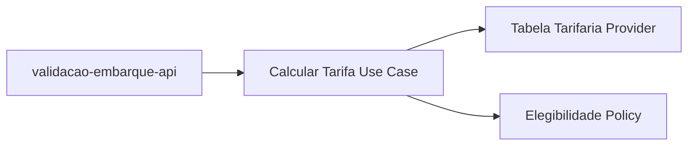
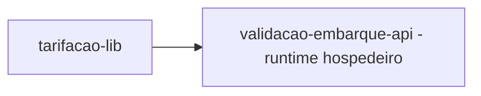
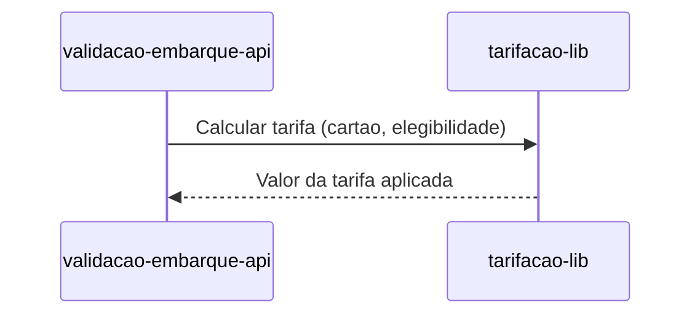

# Module - Tarifação Lib

## 1. Visão Geral

Biblioteca de domínio que concentra as regras de cálculo de tarifa (inteira, meia estudantil, gratuidade, integração em 60 min). É embarcada como package no deployable `validacao-embarque-api`, sem processo próprio em execução.

## 2. Classificação

| Item | Valor |
|---|---|
| Tipo de Módulo | Shared Library |
| Deployable Candidato | Não aplicável — embarcada em validacao-embarque-api (DDD Segmentation, Solution Module Map) |
| Bounded Context Relacionado | Tarifação |
| Subdomínio DDD | Core Domain |
| Tier / Criticidade | Não aplicável (sem deploy próprio) |
| Status | Confirmado |

## 3. Objetivo

Calcular a tarifa vigente (inteira, meia estudantil, gratuidade, integração em 60 min) para uso pelo `validacao-embarque-api` no momento da validação de embarque (FR-04 do FRD).

## 4. Responsabilidades

- Manter a `TabelaTarifaria` versionada e as regras de cálculo (tarifa inteira, meia estudantil, gratuidade, integração em 60 min).
- Expor uma API de package para o `validacao-embarque-api` calcular a tarifa vigente.
- Aplicar a elegibilidade de gratuidade/meia-tarifa recebida via `PassageiroElegivelAtualizado`.

## 5. Fora de Escopo

- Persistência de dados de embarque ou de passageiro.
- Publicação de eventos de domínio próprios.
- Exposição de API HTTP/gRPC — é consumida apenas como package interno.

## 6. Capacidades Atendidas

| Código | Capability | Descrição |
|---|---|---|
| CAP-03 | Tarifação | Calcular tarifa (inteira, meia estudantil, gratuidade, integração em 60 min) — FR-04 |

## 7. Bounded Context e Linguagem Ubíqua

| Termo | Definição |
|---|---|
| Tarifa Inteira | Valor cheio cobrado no embarque |
| Meia Estudantil | Tarifa reduzida para passageiros elegíveis |
| Integração | Janela de 60 min em que embarques subsequentes não geram nova cobrança integral |

## 8. Componentes Internos Candidatos

| Componente | Tipo | Responsabilidade |
|---|---|---|
| TabelaTarifariaProvider | Domain Service | Fornece a versão vigente da `TabelaTarifaria` |
| CalcularTarifaUseCase | Use Case | Calcula o valor da tarifa considerando elegibilidade e integração |
| ElegibilidadePolicy | Domain Service | Aplica a elegibilidade recebida de `PassageiroElegivelAtualizado` |

## 9. APIs Principais

Este módulo não expõe API pública. Atua como package consumido internamente pelo `validacao-embarque-api`.

## 10. Eventos Publicados

Este módulo não publica eventos de domínio próprios.

## 11. Eventos Consumidos

Este módulo não consome eventos diretamente — a elegibilidade (`PassageiroElegivelAtualizado`) é consumida pelo `validacao-embarque-api`, que a repassa à lib no cálculo.

## 12. Dados Próprios

| Entidade/Tabela/Collection | Tipo | Banco/Persistência | Observações |
|---|---|---|---|
| TabelaTarifaria | Versionada no pacote | Não há banco próprio — distribuída junto ao código/config do package | Sem campos sensíveis |

## 13. Integrações

| Sistema/Módulo | Tipo de Integração | Direção | Observações |
|---|---|---|---|
| validacao-embarque-api | Package | Entrada | Consumida como biblioteca interna, sem chamada de rede |

## 14. Dependências

### 14.1 Dependências de Domínio

- Elegibilidade de gratuidade/meia-tarifa do bounded context Cadastro.

### 14.2 Dependências Técnicas

- Nenhuma dependência técnica de infraestrutura própria — herda o runtime do `validacao-embarque-api`.

### 14.3 Dependências Operacionais

- Processo de publicação/versionamento do package (não descrito no TRD — Ponto a Validar).

## 15. Requisitos Não Funcionais Relevantes

| Categoria | Requisito / Observação |
|---|---|
| Performance | Cálculo deve caber dentro do orçamento de latência p99 < 300 ms do validacao-embarque-api (NFR-01) |
| Segurança | Não aplicável — não processa dado sensível |
| Disponibilidade | Herdada do validacao-embarque-api (99,95%, NFR-05) |
| Observabilidade | Não aplicável diretamente — métricas ficam no módulo hospedeiro |
| Compliance | Não aplicável |
| Resiliência | Não aplicável — sem estado próprio |
| Privacidade | Não aplicável |
| Auditabilidade | Versão da `TabelaTarifaria` usada em cada cálculo deve ser rastreável (suporte a NFR-04 do embarque) |

## 16. Compliance Aplicável

| Compliance / Norma / Lei | Aplicável? | Motivo | Impacto no Módulo |
|---|---|---|---|
| PCI DSS | Não | Não processa dados de cartão de pagamento | Nenhum |
| LGPD / GDPR / Privacidade | Não | Não armazena dados pessoais — apenas consome um sinal de elegibilidade já tratado pelo Cadastro | Nenhum |
| SOX / Auditoria Financeira | Não | — | — |
| Outra | — | — | — |

## 17. Observabilidade

| Item | Recomendação Inicial |
|---|---|
| Logs | Logs estruturados no módulo hospedeiro (validacao-embarque-api), incluindo versão da tabela tarifária usada |
| Métricas | Distribuição de tipos de tarifa aplicados (inteira/meia/gratuidade/integração) |
| Traces | Incluído no trace do validacao-embarque-api |
| Alertas | Não aplicável diretamente — monitorado via módulo hospedeiro |
| Health Checks | Não aplicável — sem processo próprio |
| Auditoria | Versão da tabela tarifária aplicada em cada validação |

## 18. Diagramas do Módulo

### 18.1 Diagrama de Componentes Internos

### 18.2 Diagrama de Dependências

### 18.3 Diagrama de Fluxo Principal

## 19. Riscos

| Código | Risco | Impacto | Mitigação |
|---|---|---|---|
| RISK-MOD-01 | Divergência de versão da lib entre ambientes por não haver processo de release definido | Cálculo de tarifa inconsistente entre validadores | Definir versionamento e release do package (Ponto a Validar) |

## 20. Pontos a Validar

| Código | Ponto | Impacto | Recomendação |
|---|---|---|---|
| VAL-MOD-05 | Processo de versionamento/publicação do package `tarifacao-lib` não está descrito no TRD | Risco de divergência de regra tarifária entre deployments do validacao-embarque-api | Definir pipeline de release do package junto ao TRD |

## 21. Backlog Inicial Sugerido

| Tipo | Item | Descrição |
|---|---|---|
| Epic | Motor de cálculo de tarifa | Cobrir FR-04 (inteira, meia, gratuidade, integração 60 min) |
| Task | Definir processo de versionamento do package | Resolver VAL-MOD-05 |

## 22. Referências

| Documento | Seção |
|---|---|
| DDD Segmentation | Solution Module Map, Bounded Contexts |
| Context Map | Tarifação → Validação (Shared Kernel) |
| FRD | FR-04 |
