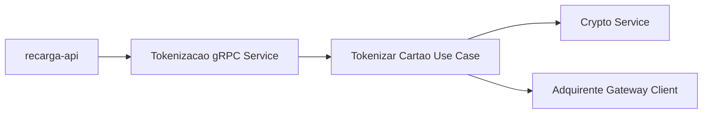
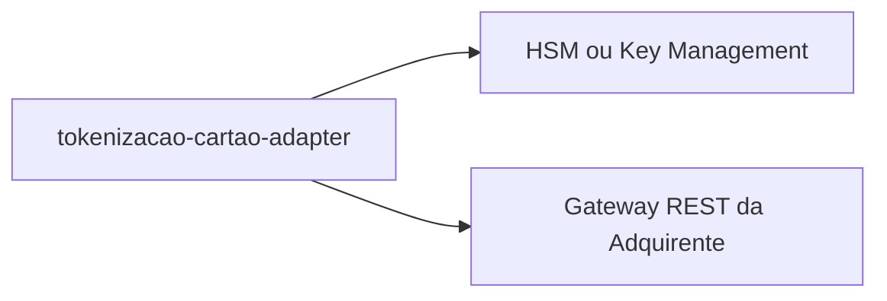
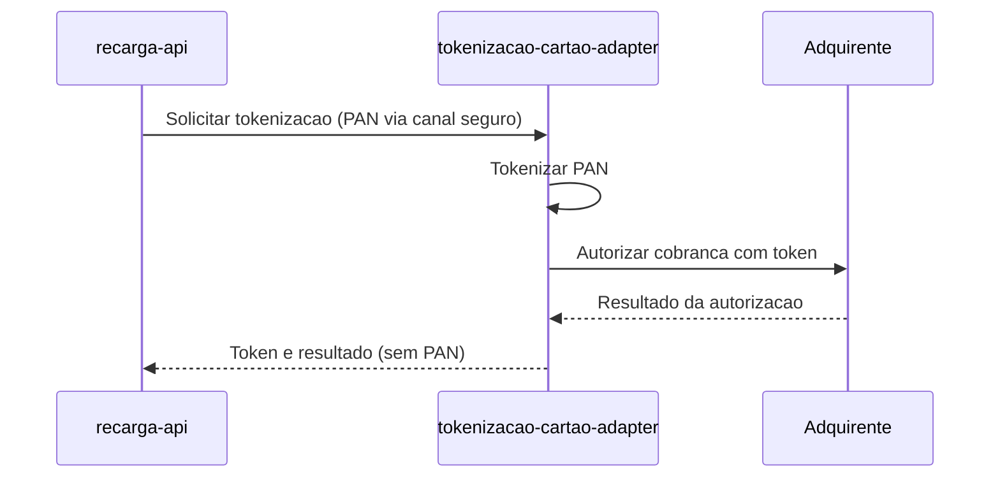

# Module - Tokenização de Cartão Adapter

## 1. Visão Geral

Único módulo da solução autorizado a receber o PAN do cartão de crédito/débito informado pelo passageiro no app. Tokeniza o dado e submete a autorização à adquirente contratada, funcionando como Anticorruption Layer entre a Tarifa Viva e o ecossistema externo de pagamento. Concentra o CDE (Cardholder Data Environment) da solução.

## 2. Classificação

| Item | Valor |
|---|---|
| Tipo de Módulo | Adapter |
| Deployable Candidato | tokenizacao-cartao-adapter |
| Bounded Context Relacionado | Recarga |
| Subdomínio DDD | Supporting Subdomain |
| Tier / Criticidade | Tier 2 / Alta (compliance) |
| Status | Confirmado |

## 3. Objetivo

Garantir que o PAN do cartão de pagamento nunca trafegue fora deste componente, tokenizando o dado e autorizando a recarga junto à adquirente, em conformidade com PCI DSS 4.0.1 (OBJ-02 do PRD; NFR-02 do NFRD).

## 4. Responsabilidades

- Receber os dados de cartão (PAN) enviados pelo app no momento da recarga.
- Tokenizar o PAN e enviar a requisição de autorização ao gateway REST da adquirente contratada.
- Retornar apenas o token e o resultado da autorização ao `recarga-api` — nunca o PAN.
- Garantir que logs e observabilidade não exponham PAN/CVV/track data.

## 5. Fora de Escopo

- Orquestração do pedido de recarga (estado, estorno) — pertence ao `recarga-api`.
- Persistência de histórico de recargas — pertence ao `recarga-api`.

## 6. Capacidades Atendidas

| Código | Capability | Descrição |
|---|---|---|
| CAP-02 | Recarga | Suporta FR-02 garantindo que o PAN não trafegue fora do componente de tokenização (NFR-02) |

## 7. Bounded Context e Linguagem Ubíqua

| Termo | Definição |
|---|---|
| Token de Cartão | Referência opaca ao PAN gerada por este módulo |
| Anticorruption Layer | Padrão do context map que isola o modelo interno do modelo externo da adquirente |

## 8. Componentes Internos Candidatos

| Componente | Tipo | Responsabilidade |
|---|---|---|
| TokenizacaoGrpcService | API Controller | Expõe interface gRPC interna para o recarga-api |
| TokenizarCartaoUseCase | Use Case | Tokeniza o PAN e solicita autorização |
| AdquirenteGatewayClient | Adapter | Chama o gateway REST da adquirente contratada |
| CryptoService | Domain Service | Aplica criptografia/tokenização do PAN antes de qualquer persistência ou log |

## 9. APIs Principais

Este módulo não expõe API pública. Atua como adapter interno, consumido via gRPC pelo `recarga-api` (TRD: comunicação interna gRPC).

## 10. Eventos Publicados

Este módulo não publica eventos de domínio próprios.

## 11. Eventos Consumidos

Este módulo não consome eventos diretamente.

## 12. Dados Próprios

Este módulo é stateless e não possui dados próprios no data model — o PAN é processado em trânsito e não persistido; o token resultante é armazenado pelo `recarga-api` em `pedidos_recarga`.

## 13. Integrações

| Sistema/Módulo | Tipo de Integração | Direção | Observações |
|---|---|---|---|
| recarga-api | gRPC (interno) | Entrada | Recebe a solicitação de tokenização/autorização |
| Adquirente (gateway REST) | API REST (externa) | Saída | Envia PAN tokenizado e recebe resultado da autorização |

## 14. Dependências

### 14.1 Dependências de Domínio

- Contrato de Anticorruption Layer definido no context map entre Adquirente (externo) e Recarga.

### 14.2 Dependências Técnicas

- HSM ou serviço de gerenciamento de chaves para tokenização (a confirmar — ver Pontos a Validar).
- Gateway REST da adquirente contratada (TRD).
- gRPC interno para receber chamadas do `recarga-api`.

### 14.3 Dependências Operacionais

- Certificados/segredos de integração com a adquirente.
- Rotação de chaves de criptografia/tokenização.
- Runbook de indisponibilidade da adquirente.

## 15. Requisitos Não Funcionais Relevantes

| Categoria | Requisito / Observação |
|---|---|
| Performance | Não especificado diretamente no NFRD — Ponto a Validar |
| Segurança | Único módulo autorizado a receber PAN; logs sem PAN/CVV (NFR-02) |
| Disponibilidade | 99,5% (NFR-05, aplicável a "demais" módulos) |
| Observabilidade | Auditoria de toda chamada à adquirente, sem exposição de dado sensível |
| Compliance | PCI DSS 4.0.1 — módulo dentro do CDE; ver compliance-pci-dss.md |
| Resiliência | Timeout e tratamento de indisponibilidade da adquirente |
| Privacidade | Não aplicável — não trata PII de passageiro, apenas dado de cartão de pagamento |
| Auditabilidade | Toda tokenização/autorização deve gerar evento auditável (regra PCI) |

## 16. Compliance Aplicável

| Compliance / Norma / Lei | Aplicável? | Motivo | Impacto no Módulo |
|---|---|---|---|
| PCI DSS | Sim | É o único componente que recebe, processa e transmite PAN (NFR-02); delimita o CDE da solução | Escopo PCI DSS 4.0.1 integral: controles de criptografia, tokenização, acesso restrito, logs sem PAN, segmentação de rede |
| LGPD / GDPR / Privacidade | Não | Não processa dados pessoais do passageiro | Nenhum |
| SOX / Auditoria Financeira | Ponto a Validar | Intermedeia autorização financeira de recarga | Rastreabilidade de autorizações junto à adquirente |
| Outra | — | — | — |

## 17. Observabilidade

| Item | Recomendação Inicial |
|---|---|
| Logs | Logs estruturados com correlation_id, sem PAN/CVV/track data (regra PCI obrigatória) |
| Métricas | Taxa de autorização aprovada/negada, latência de chamada à adquirente |
| Traces | Trace da chamada recarga-api → adapter → adquirente |
| Alertas | Indisponibilidade da adquirente, aumento de negativas de autorização |
| Health Checks | Conectividade com o gateway da adquirente |
| Auditoria | Toda tokenização e autorização deve gerar evento auditável, sem PAN |

## 18. Diagramas do Módulo

### 18.1 Diagrama de Componentes Internos

### 18.2 Diagrama de Dependências

### 18.3 Diagrama de Fluxo Principal

## 19. Riscos

| Código | Risco | Impacto | Mitigação |
|---|---|---|---|
| RISK-MOD-01 | Vazamento de PAN em log ou trace mal configurado | Violação PCI DSS grave | Masking obrigatório e revisão de logging antes de produção |
| RISK-MOD-02 | Indisponibilidade da adquirente | Bloqueio de todas as recargas | Timeout, retry controlado e comunicação de falha ao recarga-api |

## 20. Pontos a Validar

| Código | Ponto | Impacto | Recomendação |
|---|---|---|---|
| VAL-PCI-01 | Confirmar se o PAN chega a este módulo diretamente do app ou passa por algum componente de app/BFF ainda não modelado (ver VAL-MOD-01) | Define o escopo real do CDE — o app pode precisar de controles PCI adicionais (SAQ aplicável) | Time de segurança/PCI deve mapear o fluxo completo do app até este adapter |
| VAL-PCI-02 | Mecanismo de tokenização/HSM não especificado no TRD | Define arquitetura de criptografia dentro do CDE | Confirmar com segurança/infra o provedor de HSM ou vault |

## 21. Backlog Inicial Sugerido

| Tipo | Item | Descrição |
|---|---|---|
| Epic | Tokenização e autorização de cartão | Cobrir NFR-02 com PAN restrito a este módulo |
| Story Técnica | Integração com HSM/vault de tokenização | Resolver VAL-PCI-02 |
| Task | Revisão de logging para ausência de PAN/CVV | Auditoria pré-produção exigida por PCI DSS |

## 22. Referências

| Documento | Seção |
|---|---|
| DDD Segmentation | Solution Module Map, Candidate Deployables |
| Context Map | Adquirente (externo) → Recarga (Anticorruption Layer) |
| NFRD | NFR-02 |
| TRD | Adquirente de recarga via gateway REST |
