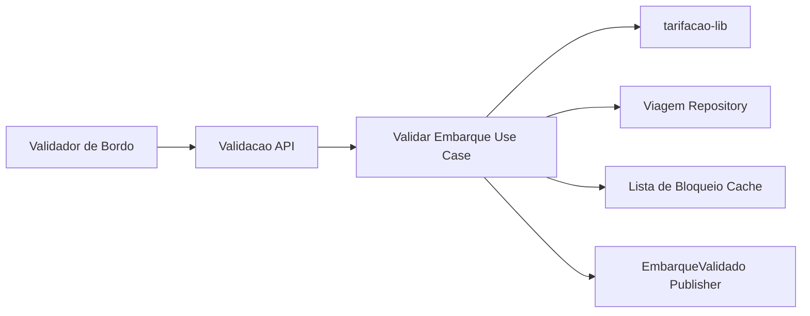
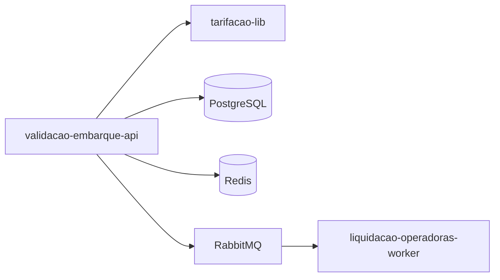
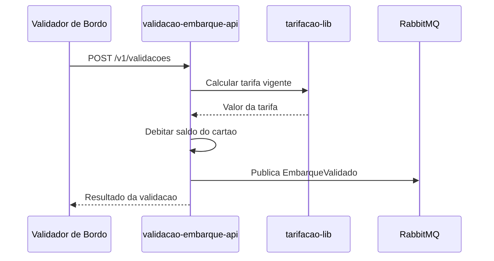

# Module - Validação de Embarque API

## 1. Visão Geral

Serviço que recebe as validações de embarque enviadas pelos validadores dos ônibus (cartão transporte ou QR do app), calcula a tarifa vigente (via `tarifacao-lib` embarcada) e debita o saldo do cartão. É o módulo Tier 1 da solução, com a maior exigência de disponibilidade e latência.

## 2. Classificação

| Item | Valor |
|---|---|
| Tipo de Módulo | Microservice |
| Deployable Candidato | validacao-embarque-api |
| Bounded Context Relacionado | Validação |
| Subdomínio DDD | Core Domain |
| Tier / Criticidade | Tier 1 / Alta |
| Status | Confirmado |

## 3. Objetivo

Validar embarques em até 300 ms (p99), inclusive com o validador operando offline por até 4 horas, aplicando a tarifa vigente e debitando o saldo do cartão transporte (OBJ-01 do PRD, FR-01 do FRD).

## 4. Responsabilidades

- Receber e validar eventos de embarque por cartão transporte ou QR do app.
- Calcular a tarifa vigente delegando à `tarifacao-lib` (inteira, meia estudantil, gratuidade, integração em 60 min).
- Debitar o saldo do cartão transporte (aggregate `Viagem`/`CartaoTransporte`).
- Manter cache local de lista de bloqueio (Redis) para operação offline do validador.
- Publicar o evento `EmbarqueValidado` para a liquidação.

## 5. Fora de Escopo

- Processamento de recarga de saldo — pertence ao `recarga-api`.
- Cálculo detalhado das regras de elegibilidade de gratuidade — origem em `PassageiroElegivelAtualizado`, publicado pelo `cadastro-passageiro-api`.
- Fechamento de lote e geração de arquivo de repasse — pertence ao `liquidacao-operadoras-worker`.

## 6. Capacidades Atendidas

| Código | Capability | Descrição |
|---|---|---|
| CAP-01 | Validação de Embarque | Validar embarque por cartão transporte ou QR e debitar a tarifa vigente (FR-01) |

## 7. Bounded Context e Linguagem Ubíqua

| Termo | Definição |
|---|---|
| Embarque | Ato de validar a entrada do passageiro no ônibus |
| Validador | Equipamento de bordo que lê o cartão transporte ou o QR |
| Lista de Bloqueio | Conjunto de cartões/tokens inválidos, cacheado localmente para validação offline |

## 8. Componentes Internos Candidatos

| Componente | Tipo | Responsabilidade |
|---|---|---|
| ValidacaoController | API Controller | Expõe `POST /v1/validacoes` |
| ValidarEmbarqueUseCase | Use Case | Orquestra validação, cálculo de tarifa e débito de saldo |
| ViagemRepository | Repository | Persiste `viagens` e `cartoes_transporte` |
| ListaBloqueioCache | Adapter | Lê/escreve lista de bloqueio no Redis |
| EmbarqueValidadoPublisher | Publisher | Publica o evento `EmbarqueValidado` no RabbitMQ |
| EventosRecargaConsumer | Consumer | Consome `RecargaConfirmada`/`RecargaEstornada` para atualizar saldo |
| EventosCadastroConsumer | Consumer | Consome `PassageiroElegivelAtualizado` para aplicar gratuidade/meia-tarifa |

## 9. APIs Principais

| Método | Endpoint | Finalidade | Consumidores |
|---|---|---|---|
| POST | /v1/validacoes | Validar embarque e debitar tarifa (FR-01) | Validadores de bordo |

## 10. Eventos Publicados

| Evento | Quando é publicado | Consumidores |
|---|---|---|
| EmbarqueValidado | Ao concluir a validação de um embarque | liquidacao-operadoras-worker |

## 11. Eventos Consumidos

| Evento | Produtor | Finalidade |
|---|---|---|
| RecargaConfirmada | recarga-api | Atualizar saldo disponível do cartão transporte |
| RecargaEstornada | recarga-api | Reverter saldo em caso de estorno |
| PassageiroElegivelAtualizado | cadastro-passageiro-api | Aplicar gratuidade/meia-tarifa estudantil na validação |

## 12. Dados Próprios

| Entidade/Tabela/Collection | Tipo | Banco/Persistência | Observações |
|---|---|---|---|
| viagens | Tabela | PostgreSQL (por serviço) | Sem campos sensíveis (data model) |
| cartoes_transporte | Tabela | PostgreSQL (por serviço) | Número lógico do cartão, não é cartão de pagamento — sem campos sensíveis |

## 13. Integrações

| Sistema/Módulo | Tipo de Integração | Direção | Observações |
|---|---|---|---|
| recarga-api | Evento (RabbitMQ) | Entrada | Consome `RecargaConfirmada`/`RecargaEstornada` |
| cadastro-passageiro-api | Evento (RabbitMQ) | Entrada | Consome `PassageiroElegivelAtualizado` |
| liquidacao-operadoras-worker | Evento (RabbitMQ) | Saída | Publica `EmbarqueValidado` |
| tarifacao-lib | Package | Interna | Cálculo de tarifa embarcado no mesmo deployable |
| Redis | Cache | Saída | Cache de lista de bloqueio para validação offline |

## 14. Dependências

### 14.1 Dependências de Domínio

- Regras de cálculo de tarifa do bounded context Tarifação (via `tarifacao-lib`).
- Elegibilidade de gratuidade/meia-tarifa do bounded context Cadastro.

### 14.2 Dependências Técnicas

- PostgreSQL (persistência de `viagens` e `cartoes_transporte`).
- Redis (cache de lista de bloqueio).
- RabbitMQ (exchange `tarifa-viva.eventos`).
- gRPC interno para comunicação de serviço a serviço (TRD).

### 14.3 Dependências Operacionais

- Job/rotina de sincronização do validador offline (frequência não definida — ver VAL-MOD-04).
- Observabilidade de latência p99 (NFR-01).

## 15. Requisitos Não Funcionais Relevantes

| Categoria | Requisito / Observação |
|---|---|
| Performance | p99 < 300 ms (NFR-01) |
| Segurança | Não aplicável diretamente — não processa dados de cartão de pagamento |
| Disponibilidade | 99,95% (NFR-05) — o mais alto da solução |
| Observabilidade | Métricas de latência de validação e taxa de rejeição pela lista de bloqueio |
| Compliance | PCI DSS não aplicável (não processa PAN); reprodutibilidade de eventos exigida por NFR-04 |
| Resiliência | Operação offline até 4 h com sincronização posterior (NFR-01) |
| Privacidade | Não aplicável — não armazena PII do passageiro |
| Auditabilidade | Todo `EmbarqueValidado` deve permitir reconstrução do lote de liquidação (NFR-04) |

## 16. Compliance Aplicável

| Compliance / Norma / Lei | Aplicável? | Motivo | Impacto no Módulo |
|---|---|---|---|
| PCI DSS | Não | Não processa, transmite nem armazena PAN — recebe apenas eventos e cartão transporte lógico | Nenhum |
| LGPD / GDPR / Privacidade | Não | Não armazena CPF nem dados pessoais do passageiro | Nenhum |
| SOX / Auditoria Financeira | Ponto a Validar | NFR-04 exige reprodutibilidade do lote de liquidação a partir de `EmbarqueValidado`, o que aproxima o módulo de controles de auditoria financeira | Retenção e imutabilidade do evento podem precisar de controle adicional |
| Outra | — | — | — |

## 17. Observabilidade

| Item | Recomendação Inicial |
|---|---|
| Logs | Logs estruturados com correlation_id por validação |
| Métricas | Latência p99 de validação, taxa de erro, hit-rate da lista de bloqueio |
| Traces | Trace do fluxo validação → débito → publicação do evento |
| Alertas | Latência acima de 300 ms, indisponibilidade acima do SLA 99,95% |
| Health Checks | Liveness/readiness incluindo conectividade com Redis e RabbitMQ |
| Auditoria | Registro de todo débito de saldo vinculado ao `EmbarqueValidado` |

## 18. Diagramas do Módulo

### 18.1 Diagrama de Componentes Internos

### 18.2 Diagrama de Dependências

### 18.3 Diagrama de Fluxo Principal

## 19. Riscos

| Código | Risco | Impacto | Mitigação |
|---|---|---|---|
| RISK-MOD-01 | Divergência de saldo durante a janela offline de até 4 h | Débito incorreto de tarifa ou embarque indevido não bloqueado | Sincronização periódica da lista de bloqueio (frequência a definir — VAL-MOD-04) |
| RISK-MOD-02 | Falha na entrega do evento `EmbarqueValidado` ao RabbitMQ | Lote de liquidação incompleto, quebrando NFR-04 | Publicação transacional/outbox e reprocessamento |

## 20. Pontos a Validar

| Código | Ponto | Impacto | Recomendação |
|---|---|---|---|
| VAL-MOD-04 | Frequência de sincronização do validador offline (herdado de VAL-DDD-03) | Define janela de risco de divergência de saldo | Definir com o time de campo/hardware do validador |

## 21. Backlog Inicial Sugerido

| Tipo | Item | Descrição |
|---|---|---|
| Epic | Validação de embarque online/offline | Cobrir FR-01 com p99 < 300 ms e resiliência a 4 h offline |
| Story Técnica | Publisher outbox para EmbarqueValidado | Garantir entrega confiável do evento para a liquidação |
| Task | Definir frequência de sync do validador offline | Resolver VAL-MOD-04 |

## 22. Referências

| Documento | Seção |
|---|---|
| DDD Segmentation | Solution Module Map, Data Ownership Matrix |
| Context Map | Recarga → Validação, Tarifação → Validação, Cadastro → Tarifação |
| NFRD | NFR-01, NFR-04, NFR-05 |
| FRD | FR-01 |
| TRD | Persistência, mensageria e comunicação interna |
