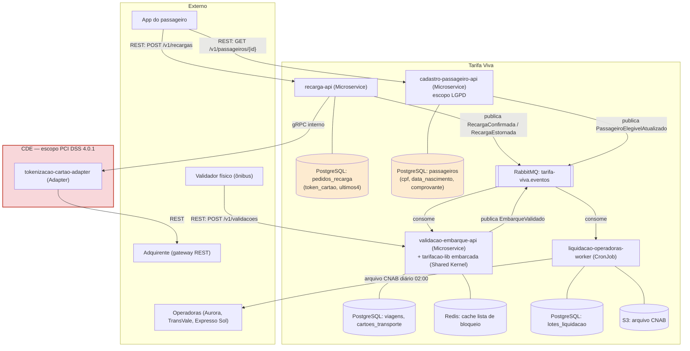

# Diagrama de Arquitetura — Tarifa Viva

Deployables candidatos (DDD §5) e onde cada um se encaixa na infraestrutura descrita no TRD: serviços em Go, gRPC interno, REST externo, RabbitMQ para eventos, PostgreSQL por serviço, Redis como cache no validador, e o CronJob de liquidação gerando arquivo CNAB em S3.

## Leitura

- O retângulo vermelho é o **CDE** (Cardholder Data Environment): só `tokenizacao-cartao-adapter` manipula PAN/CVV, isolado por uma chamada gRPC de `recarga-api`.
- As duas tabelas em destaque (`pedidos_recarga` e `passageiros`) concentram, respectivamente, o recorte PCI (token de cartão) e o recorte LGPD (CPF, data de nascimento, comprovante).
- `tarifacao-lib` não aparece como caixa própria porque roda embarcada no processo de `validacao-embarque-api` (Shared Kernel, sem deploy nem rede própria).
