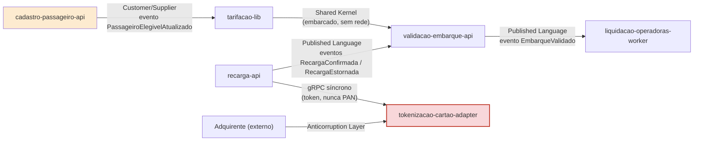

# Diagrama de Dependências — Tarifa Viva

Relações extraídas do context map (`docs/product/ddd/context-map/README.md`): Shared Kernel, Published Language, Customer/Supplier e Anticorruption Layer.

## Leitura

- **Shared Kernel** (`tarifacao-lib` → `validacao-embarque-api`): mesmo processo, sem chamada de rede — mudança na lib exige recompilar/deploy de `validacao-embarque-api`.
- **Published Language** (eventos via RabbitMQ): `recarga-api` → `validacao-embarque-api` e `validacao-embarque-api` → `liquidacao-operadoras-worker`. Acoplamento fraco, assíncrono.
- **Customer/Supplier**: `cadastro-passageiro-api` é fornecedor de elegibilidade para `tarifacao-lib` — mudança de contrato do evento `PassageiroElegivelAtualizado` deve ser negociada com o consumidor.
- **Anticorruption Layer**: `tokenizacao-cartao-adapter` isola o domínio Recarga do modelo/protocolo da adquirente externa.
- A única dependência síncrona entre módulos internos é `recarga-api` → `tokenizacao-cartao-adapter` (gRPC); é também a fronteira do CDE de PCI DSS.
- Não há dependência direta de `validacao-embarque-api` ou `liquidacao-operadoras-worker` com dados pessoais (`cadastro-passageiro-api`) nem com dados de cartão (`tokenizacao-cartao-adapter`) — o isolamento de compliance nasce da própria topologia de dependências, não apenas de controle de acesso.
