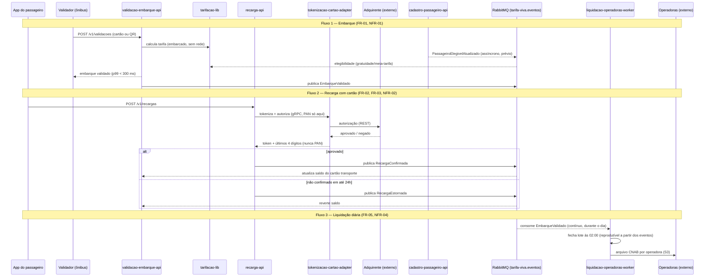

# Diagrama de Integração — Tarifa Viva

Sequência dos três fluxos críticos do FRD: embarque (FR-01), recarga com estorno (FR-02/FR-03) e liquidação diária (FR-05), incluindo os pontos externos (adquirente e operadoras).

## Leitura

- O fluxo de embarque depende de `tarifacao-lib` já ter recebido a elegibilidade do passageiro antes do momento da validação — por isso o consumo de `PassageiroElegivelAtualizado` é assíncrono e prévio, não uma chamada síncrona no caminho crítico dos 300 ms.
- No fluxo de recarga, o PAN nunca sai do trecho `App → recarga-api → tokenizacao-cartao-adapter → Adquirente`; a partir da resposta da adquirente, tudo que circula internamente é token.
- O estorno (FR-03) reusa o mesmo canal de eventos (`RecargaEstornada`) que a confirmação, dando a `validacao-embarque-api` uma única forma de saber o estado do saldo — sem chamada direta a `recarga-api`.
- A liquidação nunca consulta `validacao-embarque-api` diretamente: reconstrói o lote inteiramente a partir dos eventos `EmbarqueValidado` já publicados, o que satisfaz o requisito de auditabilidade (NFR-04).
